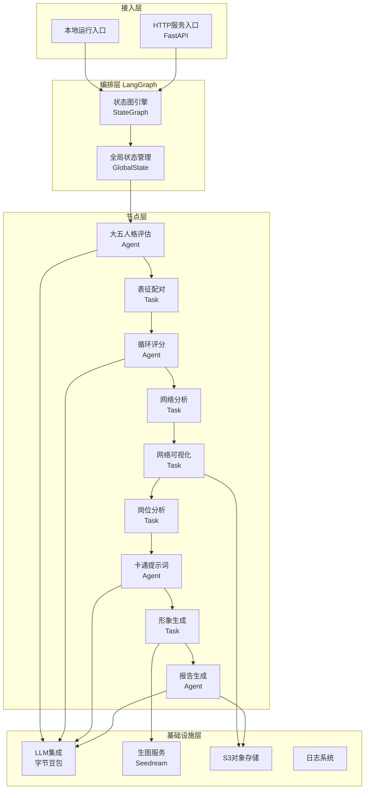

本页面将帮助您快速了解「未来自我画像职业规划工作流」项目的整体情况，包括项目定位、核心价值、技术架构和主要功能模块。本项目是一个基于 **LangGraph** 编排的多智能体协作系统，通过整合心理测评、网络分析、市场搜索和AI生成能力，为用户生成个性化的职业规划报告。

## 项目定位与核心价值

「未来自我画像职业规划工作流」是一个创新的AI辅助职业规划工具。它突破了传统职业测评的局限，将心理学的大五人格评估与复杂网络分析相结合，通过多维度数据融合，为用户呈现一幅生动的「未来自我画像」。

系统核心价值体现在三个层面：
1. **科学测评**：基于中国大五人格简式量表（CBF-PI-B）进行客观人格评估，确保测评结果的信效度
2. **深度洞察**：通过表征网络分析技术，挖掘用户内在特质之间的协同与冲突关系
3. **行动导向**：结合实时市场趋势数据，提供具体的岗位推荐和学习路径建议

Sources: [AGENTS.md](AGENTS.md#L1-L10)

## 技术架构总览

本项目采用 **状态图编排架构**，基于 LangGraph 构建工作流，实现了可观测、可中断、可扩展的AI应用程序。



架构设计遵循「**单一职责**」原则，每个节点专注于特定任务，通过全局状态实现数据流转，确保系统的可维护性和可扩展性。

Sources: [src/main.py](src/main.py#L1-L667), [src/graphs/graph.py](src/graphs/graph.py#L1-L83)

## 项目结构概览

项目采用模块化设计，目录结构清晰，便于开发和维护。

```text
E:\FUTURESELF
├── config/              # LLM配置文件（按节点独立配置）
├── scripts/             # 运行和部署脚本
├── src/                 # 源代码目录
│   ├── agents/          # Agent实现
│   ├── graphs/          # 工作流编排核心
│   │   ├── nodes/       # 所有业务节点实现
│   │   ├── graph.py     # 主工作流定义
│   │   ├── loop_graph.py
│   │   └── state.py     # 全局状态定义
│   ├── storage/         # 存储抽象层
│   │   ├── memory/      # 内存存储
│   │   ├── database/    # 数据库操作
│   │   └── s3/          # S3对象存储
│   ├── tools/           # 工具库
│   ├── utils/           # 通用工具函数
│   │   ├── error/       # 错误处理
│   │   ├── log/         # 日志系统
│   │   ├── messages/    # 消息协议
│   │   ├── openai/      # OpenAI兼容层
│   │   └── runnable/    # 可运行组件
│   └── main.py          # 程序主入口
├── assets/              # 静态资源
├── pyproject.toml       # 项目配置
├── requirements.txt     # Python依赖
└── uv.lock              # 依赖锁定文件
```

项目采用 **依赖倒置** 原则，存储层通过统一接口抽象，便于在不同环境中切换后端。

Sources: [README.md](README.md#L1-L13)

## 核心功能模块

系统包含 **5个核心处理阶段** 和 **10个功能节点**，每个节点都有明确的职责边界。

| 处理阶段 | 包含节点 | 主要输出 | 技术特点 |
|---------|---------|---------|---------|
| **人格评估** | big_five_assessment | 大五人格评分与分析报告 | 基于CBF-PI-B量表，40题正向化处理 |
| **网络分析** | representation_pairing<br/>loop_scoring<br/>network_analysis<br/>network_visualization | 表征互补性/冲突性评分<br/>网络结构图 | 批次评分优化，力导向布局可视化 |
| **岗位推荐** | job_analysis | 市场趋势分析<br/>岗位推荐列表 | 实时联网搜索，多维度匹配 |
| **形象生成** | cartoon_prompt_analysis<br/>cartoon_image_generation | 卡通风格未来自我画像 | 多特征融合提示词工程 |
| **报告整合** | chart_generation<br/>report_generation | 完整Markdown/PDF报告<br/>雷达图等可视化图表 | 报告重新编排，PDF导出 |

每个节点可独立运行和调试，支持本地单节点测试和完整工作流运行两种模式。

Sources: [AGENTS.md](AGENTS.md#L12-L32)

## 工作流执行流程

工作流采用 **线性执行 + 状态流转** 模式，从用户输入到最终报告生成形成完整闭环。


**蓝色节点** 表示需要调用大语言模型的Agent节点，其他为纯任务处理节点。整个工作流支持 **流式响应** 和 **执行取消**，提供良好的用户体验。

Sources: [src/graphs/graph.py](src/graphs/graph.py#L45-L80)

## 输入与输出

### 系统输入

系统接收用户的多维度信息作为输入：

| 输入类型 | 说明 | 示例 |
|---------|-----|-----|
| 基本信息 | 姓名、性别、学历、专业 | 张三、男、本科、计算机科学 |
| 表征选择 | 用户从预设列表中选择最多25个表征 | 创新、领导力、团队协作... |
| 个性化问题 | 3个开放性问题回答 | 职业/学习/生活三方面的关切 |
| 大五人格问卷 | 40道题的五点量表回答 | N1-N8（神经质）、E1-E8（外向性）等 |

### 系统输出

系统生成丰富的输出内容：

| 输出类型 | 格式 | 说明 |
|---------|-----|-----|
| 职业规划报告 | Markdown / PDF | 完整的个性化报告文档 |
| 卡通形象画像 | 图片URL | 基于人格特征生成的视觉化形象 |
| 网络分析图 | 图片URL | 表征互补性/冲突性网络图 |
| 数据图表 | 图片URL | 大五人格雷达图等可视化图表 |
| 分析数据 | JSON | 各项量化评分和原始数据 |

Sources: [src/graphs/state.py](src/graphs/state.py#L76-L100)

## 下一步

完成项目概览后，建议您按照以下路径继续学习：

1. **环境配置**：前往 [环境配置与安装](2-huan-jing-pei-zhi-yu-an-zhuang) 了解如何搭建开发环境
2. **快速体验**：参考 [本地运行流程](3-ben-di-yun-xing-liu-cheng) 运行您的第一个工作流
3. **深入架构**：阅读 [工作流总览](6-gong-zuo-liu-zong-lan) 理解工作流内部机制

如果您希望直接开始使用HTTP服务，可直接跳转至 [HTTP服务启动](4-httpfu-wu-qi-dong)。