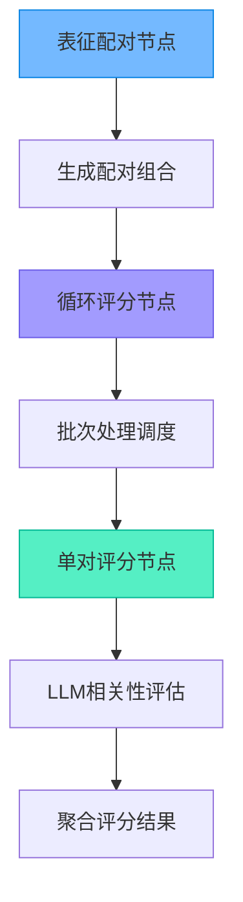
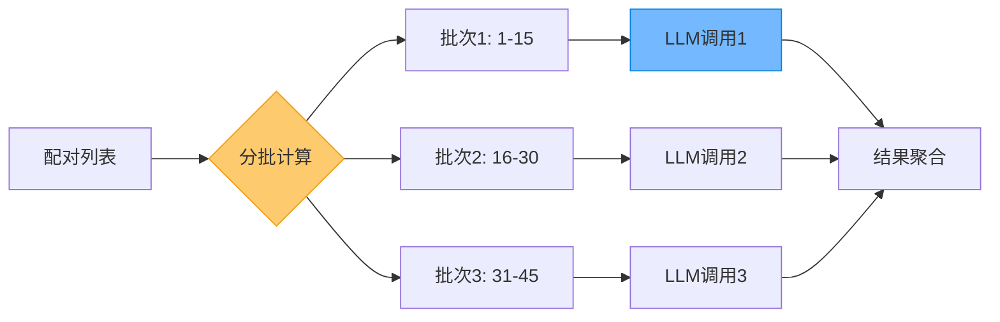
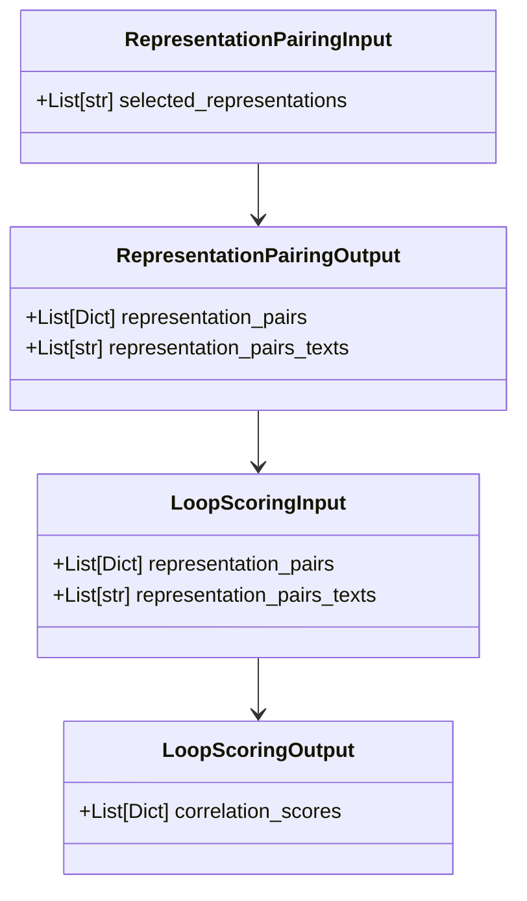

表征配对与评分模块是未来自我画像系统的核心计算引擎，负责将用户选择的个人特质表征转化为量化的相关性网络数据。该模块通过智能配对算法和LLM批量评分机制，为后续的网络分析与可视化提供数据基础。

## 模块架构设计

表征配对与评分模块采用"配对-评分"二阶段架构，通过三个节点协同工作完成数据处理流程：



该设计将组合计算与智能评估分离，通过批次优化显著降低API调用成本，同时保持评分质量的一致性。

Sources: [representation_pairing_node.py](src/graphs/nodes/representation_pairing_node.py#L1-L49), [loop_scoring_node.py](src/graphs/nodes/loop_scoring_node.py#L1-L154), [single_pair_scoring_node.py](src/graphs/nodes/single_pair_scoring_node.py#L1-L99)

## 表征配对节点

表征配对节点是评分流程的起点，负责将用户选择的表征列表转化为完整的两两配对集合。

### 配对算法逻辑

节点采用组合数学算法生成不重复的配对组合：

```python
n = len(representations)
for i in range(n):
    for j in range(i + 1, n):
        pair = {
            'rep1': representations[i],
            'rep2': representations[j]
        }
```

该算法确保每对表征仅被评估一次，避免重复计算。对于n个表征，共生成 n×(n-1)/2 个配对。例如：
- 10个表征 → 45个配对
- 20个表征 → 190个配对
- 25个表征 → 300个配对

### 输入输出数据结构

| 数据流向 | 字段 | 类型 | 说明 |
|---------|------|------|------|
| 输入 | `selected_representations` | `List[str]` | 用户选择的表征列表 |
| 输出 | `representation_pairs` | `List[Dict]` | 两两配对字典列表 |
| 输出 | `representation_pairs_texts` | `List[str]` | 配对文本，用于LLM提示词 |

Sources: [representation_pairing_node.py](src/graphs/nodes/representation_pairing_node.py#L13-L48), [state.py](src/graphs/state.py#L113-L121)

## 循环评分节点

循环评分节点实现了批次优化的批量评分机制，是整个模块的性能优化核心。

### 批次处理策略

节点采用**每15组配对**为一批次的优化策略，通过单次LLM调用完成多对表征的评分，大幅降低API调用次数和延迟：



### 批次构建机制

`_build_batch_input` 函数将多个配对格式化为结构化的提示词输入：

```markdown
## 表征对 1
表征1：创新思维
表征2：数据分析
说明：请评估这两个表征之间的相关性。

## 表征对 2
表征1：领导力
表征2：团队协作
说明：请评估这两个表征之间的相关性。
```

### 错误处理与降级

当某一批次处理失败时，系统自动使用**中性评分(0)**作为降级方案，确保整体流程不中断：

```python
except Exception as e:
    for pair in batch_pairs:
        correlation_scores.append({
            "rep1": pair["rep1"],
            "rep2": pair["rep2"],
            "correlation_score": 0
        })
```

Sources: [loop_scoring_node.py](src/graphs/nodes/loop_scoring_node.py#L19-L101), [loop_scoring_node.py](src/graphs/nodes/loop_scoring_node.py#L104-L152)

## 单对评分节点

单对评分节点负责执行具体的相关性评估逻辑，是评分质量的核心保障。

### 5点量表评分标准

系统采用心理学领域标准的5点量表进行相关性评估：

| 评分 | 语义标签 | 含义 |
|------|---------|------|
| +2 | 非常有帮助 | 两个表征相互促进，能够显著增强彼此的效果 |
| +1 | 有帮助 | 两个表征存在正向关联，能够相互支持 |
| 0 | 中性 | 两个表征之间没有明显的相互影响 |
| -1 | 有害 | 两个表征存在一定冲突，可能相互削弱 |
| -2 | 非常有害 | 两个表征严重冲突，相互排斥 |

### LLM提示词工程

节点使用Jinja2模板动态渲染提示词，结合专业的系统提示确保评分一致性：

```python
user_prompt_content = up_tpl.render({
    "rep1": state.rep1,
    "rep2": state.rep2,
    "pair_text": state.pair_text
})
```

系统提示词将LLM定位为"专业的心理学家和职业规划专家"，确保评分离专业视角而非主观判断。

### 结果解析容错机制

节点实现了多层级的结果解析策略，确保即使LLM输出格式不规范也能提取有效评分：

1. **JSON解析**：首选尝试解析标准JSON格式响应
2. **正则提取**：JSON解析失败时，使用正则提取数字
3. **范围约束**：强制将评分限制在[-2, +2]范围内

Sources: [single_pair_scoring_node.py](src/graphs/nodes/single_pair_scoring_node.py#L18-L98), [scoring_llm_cfg.json](config/scoring_llm_cfg.json#L1-L11)

## 评分配置管理

评分模块的LLM配置独立管理，支持灵活调整模型参数和提示词模板。

### 核心配置参数

| 参数 | 默认值 | 说明 |
|------|--------|------|
| `model` | `doubao-seed-1-8-251228` | 使用的大模型名称 |
| `temperature` | 0.3 | 低温度确保评分一致性 |
| `top_p` | 0.9 | 核采样参数 |
| `max_completion_tokens` | 2000 | 批次模式下需要更长输出 |
| `thinking` | `disabled` | 禁用思维链，提高效率 |

### 提示词模板结构

```json
{
  "sp": "专业系统提示词，定义角色和评估标准",
  "up": "用户提示词模板，包含批次变量占位符"
}
```

Sources: [scoring_llm_cfg.json](config/scoring_llm_cfg.json#L1-L11)

## 数据流转规范

表征配对与评分模块严格遵循类型化的状态数据流转机制：



### 评分结果格式

每个评分结果包含完整的溯源信息：

```python
{
    "rep1": "表征名称1",
    "rep2": "表征名称2",
    "correlation_score": 1  // -2, -1, 0, 1, 2
}
```

Sources: [state.py](src/graphs/state.py#L113-L148)

## 性能与质量权衡

表征配对与评分模块在性能优化与评分质量之间实现了精细权衡：

| 策略 | 优势 | 潜在风险 | 缓解措施 |
|------|------|---------|---------|
| 批次评分 | API调用次数减少93%，延迟降低 | 批次内评分可能相互干扰 | 提示词明确要求独立评估 |
| 15组/批次 | 平衡上下文长度与效率 | 极端情况下超出上下文 | 动态调整批次大小 |
| 中性降级 | 保证流程完整性 | 部分数据准确性下降 | 记录失败批次便于重试 |
| 低temperature | 提高评分一致性 | 缺乏必要的创造性 | 针对创造性任务单独配置 |

## 下一步

完成表征配对与评分后，评分结果将输入到 [网络分析与可视化节点](11-wang-luo-fen-xi-yu-ke-shi-hua-jie-dian) 进行图论分析和可视化呈现，最终生成表征网络图谱。