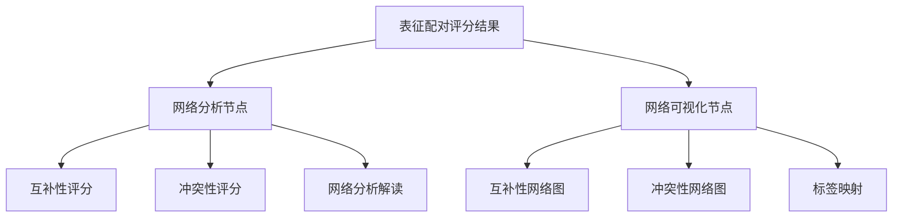
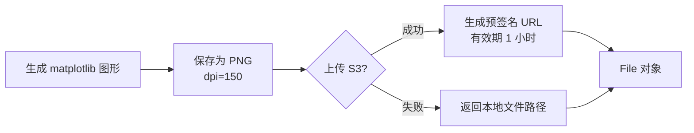
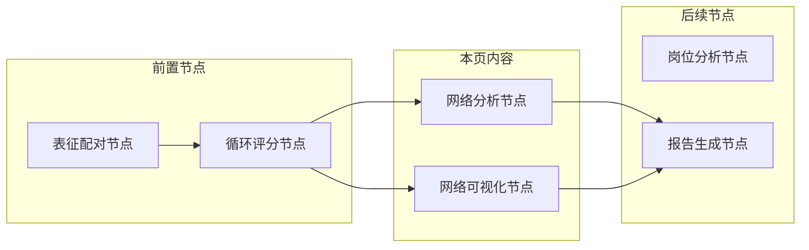

本页面详细介绍未来自我画像系统中的**网络分析节点**和**网络可视化节点**。这两个节点负责对用户选择的表征特质进行关系网络分析，并以可视化的方式呈现表征间的互补性与冲突性。

## 模块架构概述

网络分析与可视化模块由两个独立节点组成，分别负责量化计算和图形呈现，形成从数据到洞察的完整闭环。



**数据流转关系**：两个节点都接收来自[表征配对与评分节点](10-biao-zheng-pei-dui-yu-ping-fen-jie-dian)的输出作为输入，并行执行计算任务。

Sources: [state.py](src/graphs/state.py#L151-L184)

---

## 网络分析节点

### 核心功能

网络分析节点接收表征配对的相关性评分，计算两项核心指标并生成个性化的网络分析解读文本。

| 计算指标 | 计算公式 | 数值范围 | 含义说明 |
|---------|---------|---------|---------|
| **互补性评分** | 正相关分数总和 / 总配对数 | 0 ~ 2.0 | 值越高表示表征间协同效应越强 |
| **冲突性评分** | 负相关分数绝对值总和 / 总配对数 | 0 ~ 2.0 | 值越高表示表征间张力越大 |

Sources: [network_analysis_node.py](src/graphs/nodes/network_analysis_node.py#L38-L44)

### 评分算法实现

```python
# 互补性评分计算（正关系评分平均值）
positive_sum = sum(score.get("correlation_score", 0) 
                   for score in correlation_scores 
                   if score.get("correlation_score", 0) > 0)
complementarity_score = positive_sum / total_pairs

# 冲突性评分计算（负关系评分绝对值平均值）
negative_sum = sum(abs(score.get("correlation_score", 0)) 
                   for score in correlation_scores 
                   if score.get("correlation_score", 0) < 0)
conflict_score = negative_sum / total_pairs
```

Sources: [network_analysis_node.py](src/graphs/nodes/network_analysis_node.py#L38-L44)

### 网络类型分类

根据互补性评分与冲突性评分的对比，系统将用户的表征网络划分为三种类型：

| 网络类型 | 判断条件 | 特征描述 |
|---------|---------|---------|
| **协同发展型** | 互补性评分 > 冲突性评分 | 表征特质相互促进，形成正向循环 |
| **张力平衡型** | 冲突性评分 > 0 且 ≥ 互补性评分 | 特质间存在一定张力，可转化为成长动力 |
| **和谐统一型** | 冲突性评分 = 0 | 表征特质高度和谐，无内在矛盾 |

Sources: [network_analysis_node.py](src/graphs/nodes/network_analysis_node.py#L97-L102)

### 解读生成逻辑

网络分析解读包含四个层次的内容：
1. **整体概述**：基于评分对比确定网络类型
2. **核心协同关系**：提取 Top 3 最强正相关配对
3. **张力关注点**：提取 Top 3 最强负相关配对
4. **发展建议**：针对不同网络类型提供个性化建议

Sources: [network_analysis_node.py](src/graphs/nodes/network_analysis_node.py#L93-L126)

---

## 网络可视化节点

### 核心功能

网络可视化节点使用 `networkx` 库生成 **Gephi 风格**的力导向网络图，分别展示表征间的互补性关系和冲突性关系。

| 图表类型 | 颜色主题 | 边的含义 |
|---------|---------|---------|
| 互补性网络图 | 绿色 (#4CAF50) | 表示两表征相互促进 |
| 冲突性网络图 | 红色 (#F44336) | 表示两表征存在张力 |

Sources: [network_visualization_node.py](src/graphs/nodes/network_visualization_node.py#L72-L86)

### 图布局算法

采用**力导向布局（Force-directed Layout）**模拟网络结构：

```python
pos = nx.spring_layout(
    G,
    k=2.5,              # 节点间距控制因子
    iterations=100,     # 迭代次数
    seed=42,            # 随机种子确保可复现
    weight='weight'     # 边权重影响布局
)
```

**布局参数设计原则**：
- `k=2.5`：确保节点间距适中，避免标签重叠
- `seed=42`：固定随机种子，保证相同输入生成相同布局
- `weight` 参数：使强相关节点在空间上更接近

Sources: [network_visualization_node.py](src/graphs/nodes/network_visualization_node.py#L112-L118)

### 视觉样式规范

| 视觉元素 | 样式配置 | 设计考量 |
|---------|---------|---------|
| **节点** | 黑色圆点，大小与度数正相关 | 度数越高的节点（连接越多）越大 |
| **标签** | 16号加粗黑体，带白色圆角黑边文本框 | 确保中文清晰可读，背景框提升对比度 |
| **强边** | 实线，线宽 2.5-4.5，透明度 0.8 | 相关性 > 1 使用实线强调 |
| **弱边** | 虚线，线宽 1.5-2.0，透明度 0.5 | 相关性 ≤ 1 使用虚线弱化 |

Sources: [network_visualization_node.py](src/graphs/nodes/network_visualization_node.py#L120-L193)

### 图像输出与存储



**文件处理流程**：
1. 生成 18×16 英寸高分辨率图像
2. 使用 dpi=150 控制输出文件大小
3. 通过 `S3SyncStorage` 上传到对象存储
4. 失败回退机制：返回本地文件路径

Sources: [network_visualization_node.py](src/graphs/nodes/network_visualization_node.py#L210-L250)

---

## 输入输出数据结构

### 网络分析节点 I/O

```python
# 输入
class NetworkAnalysisInput(BaseModel):
    correlation_scores: List[Dict[str, Any]]  # 每对表征的相关性评分
    representation_pairs: List[Dict[str, str]]  # 表征两两配对列表

# 输出
class NetworkAnalysisOutput(BaseModel):
    complementarity_score: float  # 互补性评分
    conflict_score: float  # 冲突性评分
    correlation_scores: List[Dict[str, Any]]  # 原始评分（透传）
    network_analysis_interpretation: str  # 网络分析解读文本
```

Sources: [state.py](src/graphs/state.py#L151-L163)

### 网络可视化节点 I/O

```python
# 输入
class NetworkVisualizationInput(BaseModel):
    correlation_scores: List[Dict[str, Any]]  # 每对表征的相关性评分
    selected_representations: List[str]  # 用户选择的表征列表

# 输出
class NetworkVisualizationOutput(BaseModel):
    network_graph: File  # 互补性网络密度图
    conflict_graph: File  # 冲突性网络密度图
    label_mapping: List[Dict[str, str]]  # 节点标签映射
```

Sources: [state.py](src/graphs/state.py#L166-L183)

---

## 在工作流中的位置

网络分析与可视化节点位于工作流的**中间处理阶段**，承接表征配对评分的结果，为后续的[报告生成节点](14-bao-gao-sheng-cheng-jie-dian)提供量化数据和可视化素材。



**执行顺序**：网络分析节点和网络可视化节点**并行执行**，不相互依赖，都只依赖于循环评分节点的输出结果。

Sources: [graph.py](src/graphs/graph.py)（请参考[图编排机制](8-tu-bian-pai-ji-zhi)了解完整执行流程）

---

## 技术依赖与配置

| 依赖库 | 用途 | 关键版本 |
|-------|------|---------|
| `networkx` | 图数据结构与布局算法 | 3.x |
| `matplotlib` | 图形渲染 | 3.7+ |
| `numpy` | 数值计算 | - |

**中文字体配置**：
```python
plt.rcParams['font.sans-serif'] = [
    'WenQuanYi Zen Hei', 
    'WenQuanYi Micro Hei', 
    'DejaVu Sans'
]
plt.rcParams['axes.unicode_minus'] = False
```

Sources: [network_visualization_node.py](src/graphs/nodes/network_visualization_node.py#L35-L36)

---

## 下一步

- 了解网络分析结果如何整合到最终报告：[报告生成节点](14-bao-gao-sheng-cheng-jie-dian)
- 查看完整的工作流编排逻辑：[图编排机制](8-tu-bian-pai-ji-zhi)
- 了解前置的评分计算过程：[表征配对与评分节点](10-biao-zheng-pei-dui-yu-ping-fen-jie-dian)