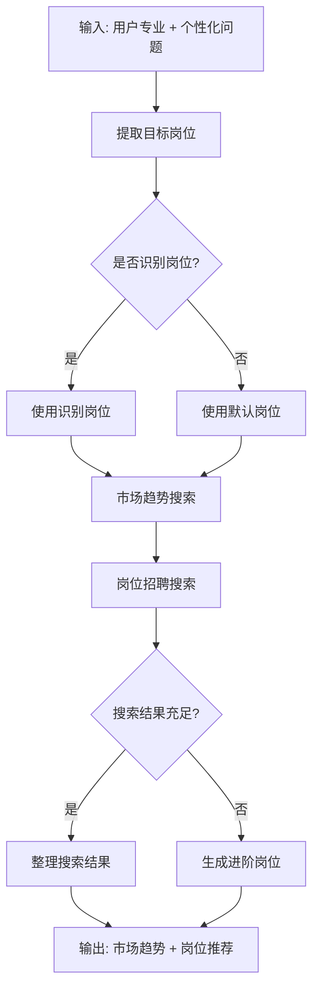
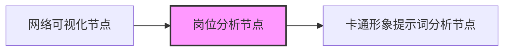
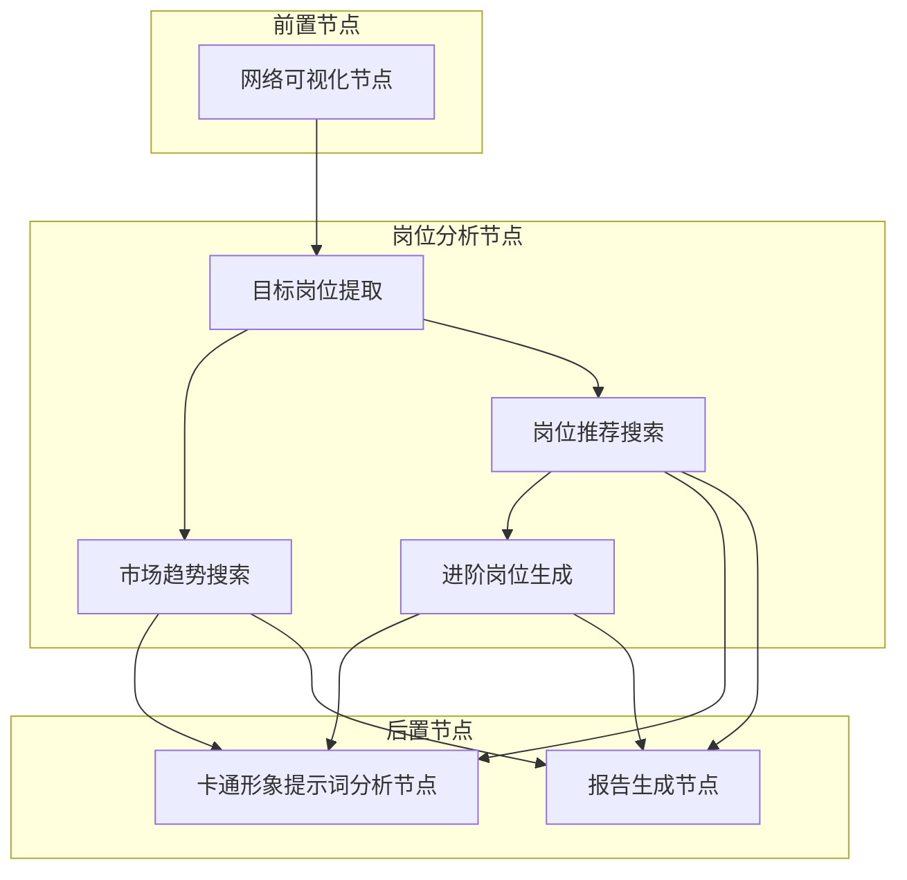

岗位分析节点（Job Analysis Node）是工作流中的核心功能模块，负责基于用户的个性化问题回答和专业背景，通过联网搜索提供**市场趋势分析**与**岗位推荐**，为用户的职业发展提供数据驱动的决策参考。该节点位于[工作流总览](6-gong-zuo-liu-zong-lan)的第3阶段，承接网络可视化节点之后，卡通形象分析节点之前。

## 核心架构与工作流

岗位分析节点基于联网搜索能力，结合用户专业与目标岗位，输出市场趋势分析与岗位推荐。



Sources: [job_analysis_node.py](src/graphs/nodes/job_analysis_node.py#L16-L47)

## 输入输出数据模型

### 输入模型 (JobAnalysisInput)

岗位分析节点接收以下输入参数：

| 字段名 | 类型 | 必填 | 说明 |
|--------|------|------|------|
| user_name | str | 是 | 用户姓名 |
| user_gender | str | 是 | 用户性别 |
| user_education | str | 否 | 用户学历 |
| user_major | str | 否 | 用户专业 |
| selected_representations | List[str] | 是 | 用户选择的表征列表 |
| personal_question_1 | str | 是 | 个性化问题1回答（职业发展关注点） |

Sources: [state.py](src/graphs/state.py#L187-L195)

### 输出模型 (JobAnalysisOutput)

岗位分析节点输出以下结果：

| 字段名 | 类型 | 说明 |
|--------|------|------|
| market_trend | str | 市场趋势分析，包含行业发展、需求变化、薪资水平 |
| recommended_jobs | List[Dict[str, Any]] | 推荐岗位列表，每个岗位包含：岗位名称、公司、薪资范围、要求 |

Sources: [state.py](src/graphs/state.py#L197-L203)

## 工作流中的位置

岗位分析节点在[图编排机制](8-tu-bian-pai-ji-zhi)中的执行位置：



执行顺序：
1. 大五人格评估节点
2. 表征配对节点
3. 循环评分节点
4. 网络分析节点
5. 网络可视化节点
6. **岗位分析节点** ← 当前位置
7. 卡通形象提示词分析节点
8. 卡通形象生成节点
9. 图表生成节点
10. 报告生成节点

Sources: [graph.py](src/graphs/graph.py#L63-L79)

## 核心功能实现

### 1. 目标岗位提取

节点首先从用户的个性化问题回答中提取目标岗位关键词，使用预定义的岗位关键词列表进行匹配：

```python
position_keywords = [
    "CTO", "首席技术官", "技术总监", "技术VP",
    "CMO", "首席营销官", "市场总监", "营销VP",
    "CEO", "首席执行官", "总经理",
    # ... 更多高管和管理岗位
]
```

**匹配逻辑**：遍历关键词列表，检查是否出现在用户回答中，返回第一个匹配的关键词。如果未匹配失败，使用默认使用"嵌入式"作为默认岗位进行市场趋势搜索。

Sources: [job_analysis_node.py](src/graphs/nodes/job_analysis_node.py#L50-L71)

### 2. 市场趋势搜索

使用 SearchClient 进行联网搜索，构建包含以下信息的综合查询：

- 用户专业
- 目标岗位（或默认岗位）
- 市场趋势、发展前景、薪资水平
- 年份（2024）

**结果处理**：
- 优先使用 AI 摘要结果
- 如果无摘要，则汇总搜索结果片段
- 附加数据来源标注和可信度说明
- 异常处理机制确保搜索失败时的优雅降级

Sources: [job_analysis_node.py](src/graphs/nodes/job_analysis_node.py#L74-L109)

### 3. 岗位推荐搜索

搜索目标岗位的招聘信息，从搜索结果中提取：

| 提取字段 | 提取方式 |
|----------|----------|
| 岗位名称 | 基于搜索词 |
| 公司名称 | 站点名称 |
| 薪资范围 | 正则表达式匹配（万、k、K、千元、元） |
| 岗位要求 | 搜索结果前200字符 |
| 链接 | 原始URL |

**薪资匹配正则模式**：
- `(\d+[-—]\d+)万` → 转换为"万/年"格式
- `(\d+[-—]\d+)k` / `(\d+[-—]\d+)K` → 保留k单位
- `(\d+[-—]\d+)元/月` → 直接使用

Sources: [job_analysis_node.py](src/graphs/nodes/job_analysis_node.py#L112-L180)

### 4. 进阶岗位生成

当搜索结果不足3个时，系统会基于用户专业自动生成进阶岗位推荐：

| 专业类别 | 进阶路径 |
|----------|----------|
| 嵌入式 | 高级嵌入式工程师 → 嵌入式开发经理 → 技术总监 |
| 计算机 | 高级软件工程师 → 技术经理 → 技术总监 |
| 电子 | 高级电子工程师 → 研发经理 → 技术总监 |
| 机械 | 高级机械工程师 → 研发经理 → 技术总监 |
| 软件 | 高级软件工程师 → 技术经理 → 技术总监 |
| 通信 | 高级通信工程师 → 研发经理 → 技术总监 |
| 自动化 | 高级自动化工程师 → 研发经理 → 技术总监 |

对于未匹配的专业，使用通用模式：`高级{专业}工程师` → `{专业}开发经理` → 技术总监

Sources: [job_analysis_node.py](src/graphs/nodes/job_analysis_node.py#L183-L226)

## 依赖与集成

### 外部依赖

| 依赖项 | 用途 | 说明 |
|--------|------|------|
| SearchClient | 联网搜索 | 来自 coze_coding_dev_sdk |
| Context | 运行时上下文 | 来自 coze_coding_utils |
| Runtime | LangGraph运行时 | 来自 langgraph.runtime |
| RunnableConfig | 运行配置 | 来自 langchain_core.runnables |

Sources: [job_analysis_node.py](src/graphs/nodes/job_analysis_node.py#L6-L13)

### 错误处理

节点实现了完善的异常处理机制：

1. **市场趋势搜索异常：返回错误信息，建议参考行业权威报告
2. **岗位搜索异常**：降级使用预定义的进阶岗位推荐
3. **结果数量控制**：推荐岗位数量限制在3-5个之间

Sources: [job_analysis_node.py](src/graphs/nodes/job_analysis_node.py#L108-L109, L171-L177)

## 与其他节点的关系



岗位分析结果最终会传递给：
- [卡通形象生成节点](13-qia-tong-xing-xiang-sheng-cheng-jie-dian)：用于形象提示词分析
- [报告生成节点](14-bao-gao-sheng-cheng-jie-dian)：用于最终报告整合

Sources: [graph.py](src/graphs/graph.py#L73-L79)

## 下一步

了解岗位分析节点后，建议继续阅读：

- [卡通形象生成节点](13-qia-tong-xing-xiang-sheng-cheng-jie-dian)：了解如何基于岗位分析结果生成未来自我卡通形象
- [报告生成节点](14-bao-gao-sheng-cheng-jie-dian)：了解所有节点结果如何整合为最终报告
- [节点开发规范](25-jie-dian-kai-fa-gui-fan)：了解如何开发类似的自定义节点