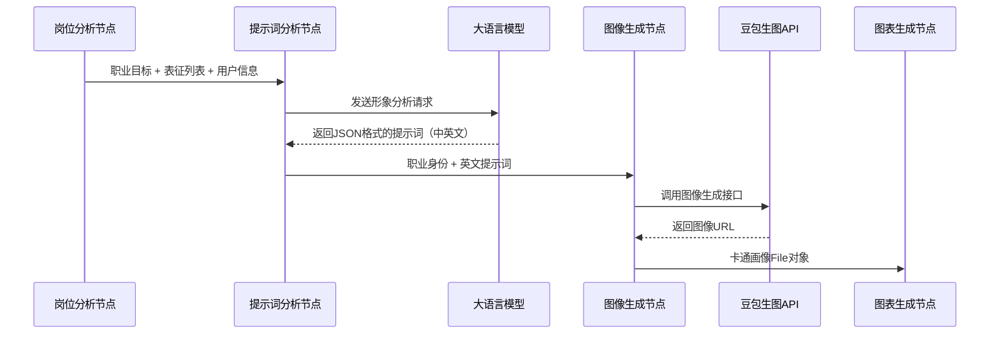
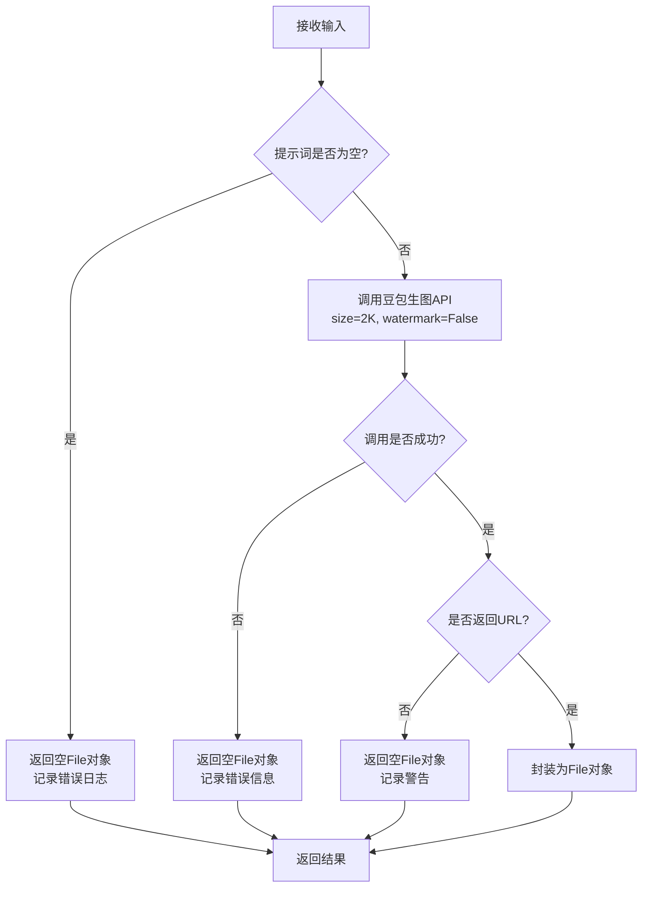
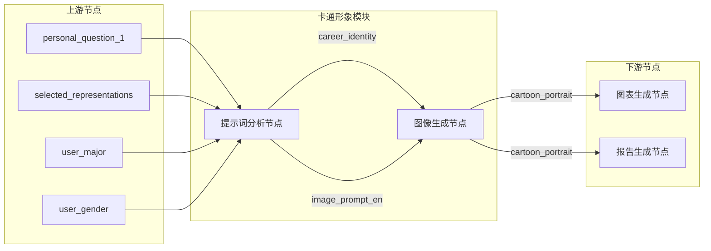

本页面详细介绍卡通形象生成模块，包括**提示词分析节点**和**图像生成节点**。该模块基于用户基础信息、职业目标和自我表征，通过大语言模型生成专业的形象描述，再调用图像生成API创建卡通风格的未来自我画像。

## 模块架构

卡通形象生成是工作流的第4阶段，位于岗位分析之后、图表生成之前。整个模块采用两阶段设计：先分析再生成。

**工作流调用顺序**：

Sources: [graph.py](src/graphs/graph.py#L7-L83)

## 节点一：卡通形象提示词分析

### 功能说明

提示词分析节点负责将抽象的用户信息转化为具体的视觉描述。它接收用户基础信息、职业目标和自我表征列表，通过大语言模型推理生成精准的卡通形象生成提示词。

### 输入输出模型

| 字段 | 类型 | 说明 |
|------|------|------|
| **输入** | | |
| user_name | str | 用户姓名 |
| user_gender | str | 用户性别 |
| user_education | str | 用户学历 |
| user_major | str | 用户专业 |
| selected_representations | List[str] | 用户选择的表征列表 |
| personal_question_1 | str | 职业发展目标问题回答 |
| **输出** | | |
| portrait_prompt | str | 完整的提示词描述（中文） |
| career_identity | str | 职业身份定位 |
| image_prompt_en | str | 英文图像生成提示词 |

Sources: [state.py](src/graphs/state.py#L221-L244)

### 核心处理流程

1. **配置加载**：读取 `cartoon_prompt_analysis_llm_cfg.json` 中的 LLM 配置参数
2. **信息整合**：将用户信息、职业目标和表征列表构建为结构化描述
3. **模板渲染**：使用 Jinja2 模板渲染用户提示词
4. **LLM 调用**：发送 System + Human 消息组合请求分析
5. **结果解析**：从响应中提取 JSON 格式的职业身份和英文提示词
6. **异常降级**：解析失败时构建基础提示词作为 fallback

Sources: [cartoon_prompt_analysis_node.py](src/graphs/nodes/cartoon_prompt_analysis_node.py#L1-L111)

### 配置参数

| 参数 | 值 | 说明 |
|------|-----|------|
| model | doubao-seed-1-8-251228 | 使用的大语言模型 |
| temperature | 0.7 | 采样温度，控制创造性 |
| top_p | 0.9 | 核采样参数 |
| max_completion_tokens | 1500 | 最大生成长度 |
| thinking | disabled | 关闭思考模式 |

Sources: [cartoon_prompt_analysis_llm_cfg.json](config/cartoon_prompt_analysis_llm_cfg.json#L1-L11)

## 节点二：卡通形象生成

### 功能说明

图像生成节点接收提示词分析节点的输出，调用豆包生图大模型生成 2K 分辨率的卡通风格画像。该节点实现了完善的异常处理和降级机制。

### 输入输出模型

| 字段 | 类型 | 说明 |
|------|------|------|
| **输入** | | |
| career_identity | str | 职业身份定位 |
| image_prompt_en | str | 英文图像生成提示词 |
| **输出** | | |
| cartoon_portrait | File | 生成的卡通画像文件对象 |

Sources: [state.py](src/graphs/state.py#L247-L256)

### 核心处理流程

Sources: [cartoon_image_generation_node.py](src/graphs/nodes/cartoon_image_generation_node.py#L1-L89)

### 异常处理机制

节点实现了多层异常捕获，确保流程稳定性：

| 异常类型 | 处理策略 | 日志级别 |
|----------|----------|----------|
| ValueError | 返回空 File，记录参数错误 | ERROR |
| ConnectionError | 返回空 File，记录网络错误 | ERROR |
| TimeoutError | 返回空 File，记录超时信息 | ERROR |
| Exception（兜底） | 返回空 File，记录完整异常栈 | ERROR + exc_info |

**降级策略**：无论图像生成是否成功，节点始终返回有效的 `File` 对象（URL 可能为空），确保下游节点不会因类型错误而中断流程。

Sources: [cartoon_image_generation_node.py](src/graphs/nodes/cartoon_image_generation_node.py#L53-L83)

### 图像生成参数

| 参数 | 值 | 说明 |
|------|-----|------|
| prompt | image_prompt_en | 英文提示词（生图模型优化） |
| size | "2K" | 高分辨率输出，适配报告展示 |
| watermark | False | 无水印模式 |

## 数据流转说明

卡通形象生成模块在整个工作流中的数据传递路径：

Sources: [graph.py](src/graphs/graph.py#L60-L70)

## 设计要点

### 1. 提示词语言选择

系统采用**英文提示词**进行图像生成，主要考虑：
- 豆包生图模型对英文提示的理解更精准
- 艺术风格描述在英文语境下表达更丰富
- 减少中文翻译带来的语义损失

### 2. 两阶段架构优势

将提示词分析与图像生成分离的设计带来以下好处：
- **可调试性**：提示词生成结果可独立检查和优化
- **可缓存性**：相同用户特征可复用提示词
- **可扩展性**：支持替换不同的图像生成后端
- **容错性**：某一阶段失败不影响另一阶段

### 3. 空值安全设计

所有异常分支均返回结构化对象而非 `None`，确保下游节点：
- 无需进行多重空值检查
- 类型一致性得到保证
- 流程不会因单一节点失败而中断

## 下一步

完成卡通形象生成后，工作流将进入[图表生成节点](8-tu-bian-pai-ji-zhi)进行雷达图等可视化图表的生成，最终所有结果将在[报告生成节点](14-bao-gao-sheng-cheng-jie-dian)中整合为完整的职业规划报告。