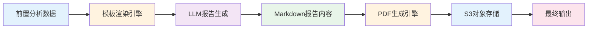
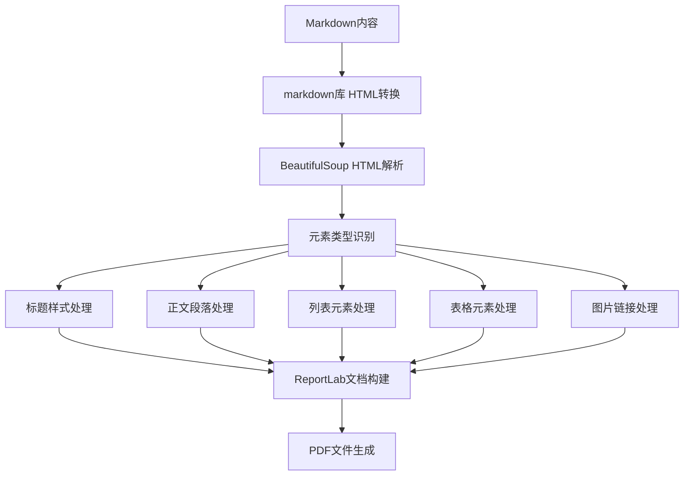

报告生成节点是未来自我画像工作流的**最终输出节点**，负责整合所有前置节点的分析成果，通过大语言模型生成个性化的职业规划报告，并将其转换为PDF格式进行存储和分发。该节点承担着将复杂分析数据转化为用户可读文档的关键角色。

## 节点功能架构

报告生成节点采用**LLM驱动 + 文档渲染**的双层架构设计。先通过大模型进行内容创作，再通过文档引擎进行格式转换。



Sources: [report_generation_node.py](src/graphs/nodes/report_generation_node.py#L34-L126)

## 输入输出数据模型

报告生成节点接收工作流中所有关键分析结果作为输入，输出结构化的报告文档。

| 类别 | 字段类型 | 主要内容 |
|------|----------|----------|
| **用户基础信息** | `ReportGenerationInput` | 姓名、性别、学历、专业 |
| **人格评估结果** | `ReportGenerationInput` | 大五人格评分、特质描述 |
| **网络分析结果** | `ReportGenerationInput` | 互补性评分、冲突性评分、网络解读 |
| **岗位分析结果** | `ReportGenerationInput` | 市场趋势、推荐岗位、技能差距 |
| **可视化资源** | `ReportGenerationInput` | 网络图、雷达图、柱状图、卡通形象 |
| **报告输出** | `ReportGenerationOutput` | Markdown报告文本、PDF文件对象 |

Sources: [state.py](src/graphs/state.py#L276-L318)

## 核心处理流程

### 1. 提示词模板渲染

节点使用 **Jinja2 模板引擎** 将所有分析数据注入到用户提示词模板中，为大语言模型提供完整的上下文信息。模板渲染包含 20+ 个数据字段，涵盖用户画像到分析结果的全维度数据。

```python
up_tpl = Template(up)
user_prompt_content = up_tpl.render({
    "user_name": state.user_name,
    "user_gender": state.user_gender,
    "user_education": state.user_education,
    "user_major": state.user_major,
    "selected_representations": state.selected_representations,
    # ... 共计 22 个数据字段
})
```

Sources: [report_generation_node.py](src/graphs/nodes/report_generation_node.py#L55-L80)

### 2. LLM 报告生成

节点调用配置的大语言模型（默认为 `doubao-seed-1-8-251228`）进行报告内容创作。系统提示词定义了报告结构和专业角色，用户提示词注入了具体分析数据。

| 配置项 | 默认值 | 说明 |
|--------|--------|------|
| model | doubao-seed-1-8-251228 | 大语言模型标识 |
| temperature | 0.7 | 创造性控制参数 |
| top_p | 0.9 | 核采样参数 |
| max_completion_tokens | 10000 | 最大输出token数 |

Sources: [report_generation_llm_cfg.json](config/report_generation_llm_cfg.json#L1-L8)

### 3. 响应内容安全提取

节点实现了**多格式响应兼容**处理，能够应对不同LLM返回的多种数据格式：

- **字符串格式**：直接使用响应内容
- **列表格式**：遍历提取 `type="text"` 的文本片段
- **其他格式**：安全转换为字符串

这种设计确保了在不同LLM版本或配置变化时，节点仍能稳定工作。

Sources: [report_generation_node.py](src/graphs/nodes/report_generation_node.py#L99-L112)

## PDF 生成与存储

### 文档渲染引擎

节点使用 **ReportLab** 库将 Markdown 格式的报告转换为专业的 PDF 文档。渲染流程如下：



Sources: [report_generation_node.py](src/graphs/nodes/report_generation_node.py#L184-L331)

### 样式系统设计

PDF 生成采用**分级样式体系**，确保文档具有专业的视觉层次：

| 样式名称 | 字号 | 颜色 | 用途 |
|----------|------|------|------|
| CustomTitle | 24px | #1a5490 | 一级标题（居中） |
| CustomHeading | 18px | #2c5282 | 二级标题 |
| CustomSubHeading | 14px | #4a5568 | 三级及以下标题 |
| CustomBody | 11px | 默认 | 正文段落 |
| CustomLink | 10px | #0066cc | 超链接文本 |

Sources: [report_generation_node.py](src/graphs/nodes/report_generation_node.py#L212-L253)

### 对象存储集成

生成的 PDF 文件通过 **S3 兼容对象存储** 进行持久化存储：

1. **文件命名**：采用 `future_self_portrait_{用户名}_{时间戳}.pdf` 格式
2. **本地缓存**：先生成到 `/tmp/` 临时目录
3. **上传存储**：使用 `S3SyncStorage` 上传到配置的存储桶
4. **访问链接**：生成有效期为 24 小时的预签名 URL

```python
file_key = storage.upload_file(
    file_content=file_content,
    file_name=pdf_filename,
    content_type="application/pdf"
)
s3_url = storage.generate_presigned_url(key=file_key, expire_time=86400)
```

Sources: [report_generation_node.py](src/graphs/nodes/report_generation_node.py#L156-L177)

## 错误处理机制

节点在 PDF 生成和上传过程中实现了**异常捕获与日志记录**机制：

- 捕获所有异常类型，确保工作流不因报告生成失败而中断
- 记录详细的错误堆栈信息，便于问题排查
- 异常情况下返回空字符串 URL，由上层逻辑进行处理

Sources: [report_generation_node.py](src/graphs/nodes/report_generation_node.py#L179-L181)

## 与其他节点的依赖关系

报告生成节点是工作流的**汇集节点**，依赖以下所有前置节点的输出：

- [大五人格评估节点](9-da-wu-ren-ge-ping-gu-jie-dian) - 人格评分数据
- [表征配对与评分节点](10-biao-zheng-pei-dui-yu-ping-fen-jie-dian) - 相关性评分数据
- [网络分析与可视化节点](11-wang-luo-fen-xi-yu-ke-shi-hua-jie-dian) - 网络分析与图表
- [岗位分析节点](12-gang-wei-fen-xi-jie-dian) - 市场与岗位分析
- [卡通形象生成节点](13-qia-tong-xing-xiang-sheng-cheng-jie-dian) - 可视化画像

## 下一步

报告生成节点完成后，整个工作流执行完毕。开发者可继续了解：

- 了解存储系统的实现细节，请阅读 [S3对象存储集成](17-s3dui-xiang-cun-chu-ji-cheng)
- 学习如何配置大语言模型，请阅读 [LLM配置管理](18-llmpei-zhi-guan-li)
- 进行定制化开发，请参考 [扩展与定制开发](29-kuo-zhan-yu-ding-zhi-kai-fa)