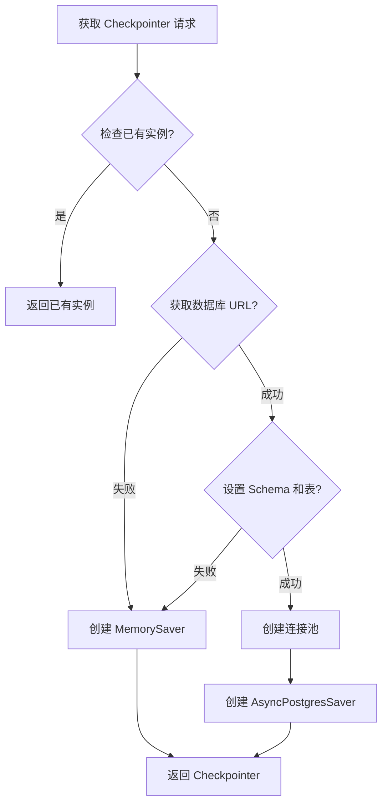
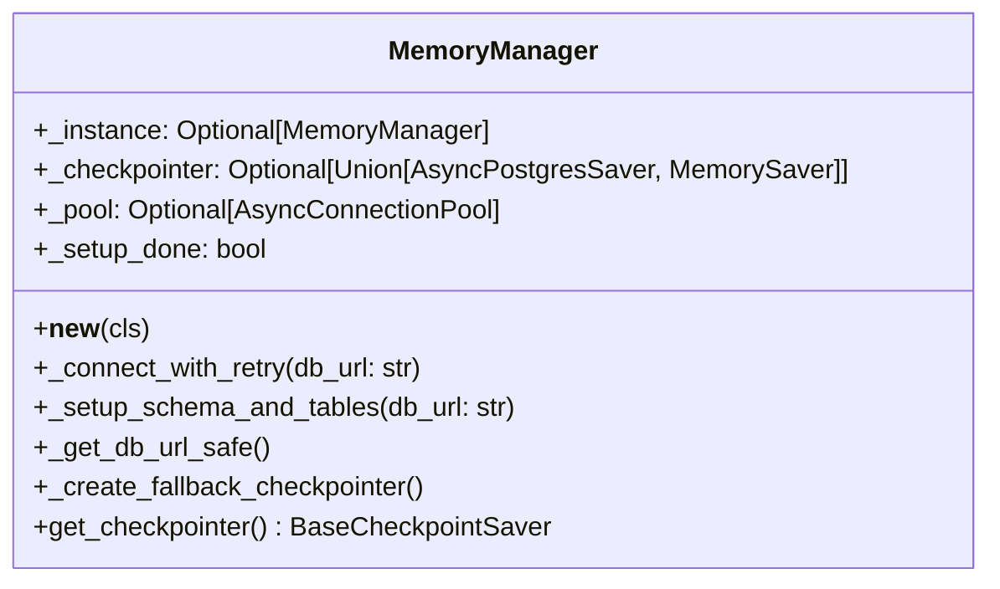
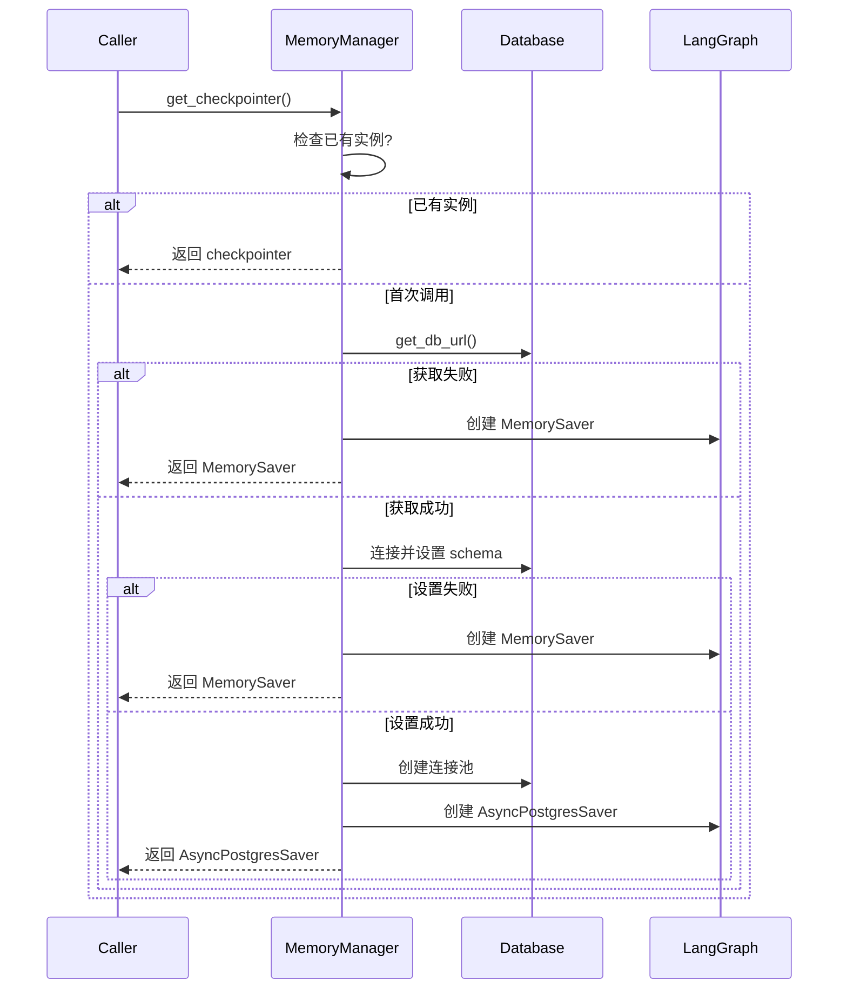

本页面详细介绍 FutureSelf 项目中的内存存储检查点机制实现。该模块基于 LangGraph 的 CheckpointSaver 体系，提供 Postgres 持久化存储与内存兜底方案的智能切换能力，确保工作流状态的可靠保存与恢复。

## 架构设计

### 核心设计理念

内存存储模块采用**优雅降级策略**：优先尝试使用 PostgreSQL 作为持久化检查点存储，当数据库不可用时自动回退到内存存储方案。这种设计确保了系统在不同部署环境下的可用性。



**设计特点：**
- **单例模式**：确保全局唯一的存储管理器实例
- **惰性初始化**：仅在首次调用时进行初始化
- **自动降级**：数据库不可用时自动切换到内存存储
- **连接重试**：数据库连接失败时带重试机制
- **日志追踪**：完整记录每一步的状态和决策

Sources: [memory_saver.py](src/storage/memory/memory_saver.py#L18-L134)

## MemoryManager 单例类

### 类结构

`MemoryManager` 是整个内存存储系统的核心，采用单例模式确保全局唯一实例。



### 单例实现

通过重写 `__new__` 方法实现严格的单例模式，确保全局只有一个 MemoryManager 实例。

```python
class MemoryManager:
    """Memory Manager 单例类"""
    _instance: Optional['MemoryManager'] = None
    _checkpointer: Optional[Union[AsyncPostgresSaver, MemorySaver]] = None
    _pool: Optional[AsyncConnectionPool] = None
    _setup_done: bool = False

    def __new__(cls):
        if cls._instance is None:
            cls._instance = super().__new__(cls)
        return cls._instance
```

Sources: [memory_saver.py](src/storage/memory/memory_saver.py#L18-L29)

## 数据库连接机制

### 带重试的连接策略

数据库连接采用**指数退避重试**机制，每次连接超时 15 秒，最多重试 2 次。

```python
def _connect_with_retry(self, db_url: str) -> Optional[psycopg.Connection]:
    """带重试的数据库连接，每次 15 秒超时，共尝试 2 次"""
    last_error = None
    for attempt in range(1, DB_MAX_RETRIES + 1):
        try:
            logger.info(f"Attempting database connection (attempt {attempt}/{DB_MAX_RETRIES})")
            conn = psycopg.connect(db_url, autocommit=True, connect_timeout=DB_CONNECTION_TIMEOUT)
            logger.info(f"Database connection established on attempt {attempt}")
            return conn
        except Exception as e:
            last_error = e
            logger.warning(f"Database connection attempt {attempt} failed: {e}")
            if attempt < DB_MAX_RETRIES:
                time.sleep(1)  # 重试前短暂等待
    logger.error(f"All {DB_MAX_RETRIES} database connection attempts failed, last error: {last_error}")
    return None
```

**常量配置：**

| 常量名称 | 值 | 说明 |
|---------|-----|------|
| DB_CONNECTION_TIMEOUT | 15 | 单次连接超时时间（秒） |
| DB_MAX_RETRIES | 2 | 最大连接重试次数 |

Sources: [memory_saver.py](src/storage/memory/memory_saver.py#L13-L46)

### Schema 自动设置

系统自动创建 `memory` schema 并调用 LangGraph 内置的 `PostgresSaver.setup()` 方法创建必要的检查点表结构。

```python
def _setup_schema_and_tables(self, db_url: str) -> bool:
    """同步创建 schema 和表（只执行一次），返回是否成功"""
    if self._setup_done:
        return True
    conn = self._connect_with_retry(db_url)
    if conn is None:
        return False
    try:
        with conn.cursor() as cur:
            cur.execute("CREATE SCHEMA IF NOT EXISTS memory")
        conn.execute("SET search_path TO memory")
        PostgresSaver(conn).setup()
        self._setup_done = True
        logger.info("Memory schema and tables created")
        return True
    except Exception as e:
        logger.warning(f"Failed to setup schema/tables: {e}")
        return False
    finally:
        conn.close()
```

Sources: [memory_saver.py](src/storage/memory/memory_saver.py#L48-L69)

## 优雅降级机制

### 数据库 URL 获取

系统优先从环境变量或 Coze 工作负载身份服务获取数据库连接 URL。

```python
def _get_db_url_safe(self) -> Optional[str]:
    """安全获取 db_url，失败时返回 None"""
    try:
        from storage.database.db import get_db_url
        db_url = get_db_url()
        if db_url and db_url.strip():
            return db_url
        logger.warning("db_url is empty, will fallback to MemorySaver")
        return None
    except Exception as e:
        logger.warning(f"Failed to get db_url: {e}, will fallback to MemorySaver")
        return None
```

Sources: [memory_saver.py](src/storage/memory/memory_saver.py#L71-L82)

### 内存兜底方案

当数据库不可用时，系统自动创建 `MemorySaver` 作为兜底方案。**注意：内存存储模式下数据不会在重启后持久化**。

```python
def _create_fallback_checkpointer(self) -> MemorySaver:
    """创建内存兜底 checkpointer"""
    self._checkpointer = MemorySaver()
    logger.warning("Using MemorySaver as fallback checkpointer (data will not persist across restarts)")
    return self._checkpointer
```

Sources: [memory_saver.py](src/storage/memory/memory_saver.py#L84-L88)

## Checkpointer 获取流程

### 完整初始化流程

`get_checkpointer()` 方法是对外暴露的核心接口，实现完整的初始化流程。



Sources: [memory_saver.py](src/storage/memory/memory_saver.py#L90-L124)

### 连接池配置

PostgreSQL 连接池采用以下优化配置：

| 配置项 | 值 | 说明 |
|-------|-----|------|
| timeout | 15 | 获取连接超时时间（秒） |
| min_size | 1 | 最小空闲连接数 |
| max_idle | 300 | 最大空闲时间（秒） |

```python
self._pool = AsyncConnectionPool(
    conninfo=db_url,
    timeout=DB_CONNECTION_TIMEOUT,
    min_size=1,
    max_idle=300,
)
self._checkpointer = AsyncPostgresSaver(self._pool)
```

Sources: [memory_saver.py](src/storage/memory/memory_saver.py#L111-L119)

## 对外接口

### get_memory_saver() 工厂函数

模块级别的工厂函数，确保全局唯一的 checkpointer 实例。

```python
_memory_manager: Optional[MemoryManager] = None

def get_memory_saver() -> BaseCheckpointSaver:
    """获取 checkpointer，优先使用 PostgresSaver，db_url 不可用或连接失败时退化为 MemorySaver"""
    global _memory_manager
    if _memory_manager is None:
        _memory_manager = MemoryManager()
    return _memory_manager.get_checkpointer()
```

Sources: [memory_saver.py](src/storage/memory/memory_saver.py#L126-L134)

## 与数据库模块的集成

内存存储模块依赖 [数据库操作规范](16-shu-ju-ku-cao-zuo-gui-fan) 中的 `get_db_url()` 函数获取数据库连接信息：

```python
def get_db_url() -> str:
    """Build database URL from environment."""
    url = os.getenv("PGDATABASE_URL") or ""
    if url is not None and url != "":
        return url
    from coze_workload_identity import Client
    try:
        client = Client()
        env_vars = client.get_project_env_vars()
        client.close()
        for env_var in env_vars:
            if env_var.key == "PGDATABASE_URL":
                url = env_var.value.replace("'", "'\\''")
                return url
    except Exception as e:
        logger.error(f"Error loading PGDATABASE_URL: {e}")
        raise e
    return url
```

Sources: [db.py](src/storage/database/db.py#L17-L37)

## 注意事项

### 生产环境部署

1. **必须配置 PGDATABASE_URL 环境变量**：确保状态持久化
2. **数据库权限要求**：数据库用户需要具备 CREATE SCHEMA 和 CREATE TABLE 权限
3. **Schema 隔离**：检查点表存储在独立的 `memory` schema 中，与业务数据隔离

### 开发环境注意

- 未配置数据库时，系统自动使用 MemorySaver
- 内存模式下重启服务会丢失所有工作流状态
- 日志会显式警告使用兜底存储方案

### 与 LangGraph 集成

本模块完全兼容 LangGraph 的 CheckpointSaver 接口规范，可直接用于图编译：

```python
from storage.memory.memory_saver import get_memory_saver

# 编译图时指定 checkpointer
main_graph = builder.compile(checkpointer=get_memory_saver())
```

## 下一步

- 了解数据持久化方案：[数据库操作规范](16-shu-ju-ku-cao-zuo-gui-fan)
- 了解对象存储集成：[S3对象存储集成](17-s3dui-xiang-cun-chu-ji-cheng)
- 了解图编排机制：[图编排机制](8-tu-bian-pai-ji-zhi)