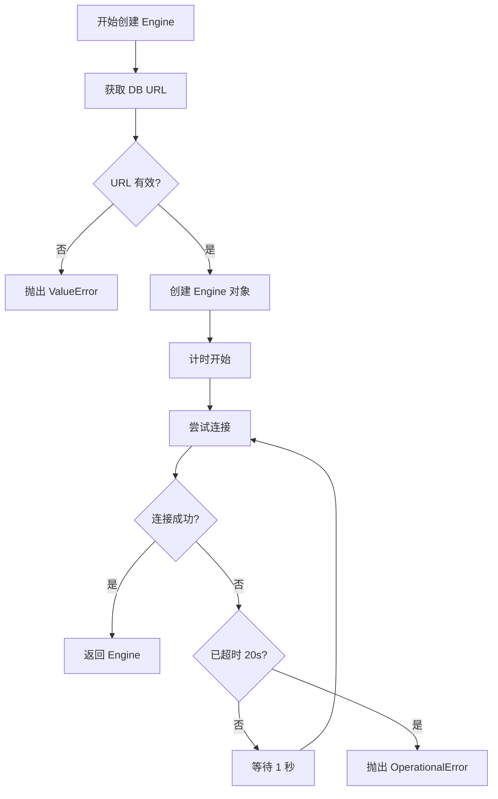
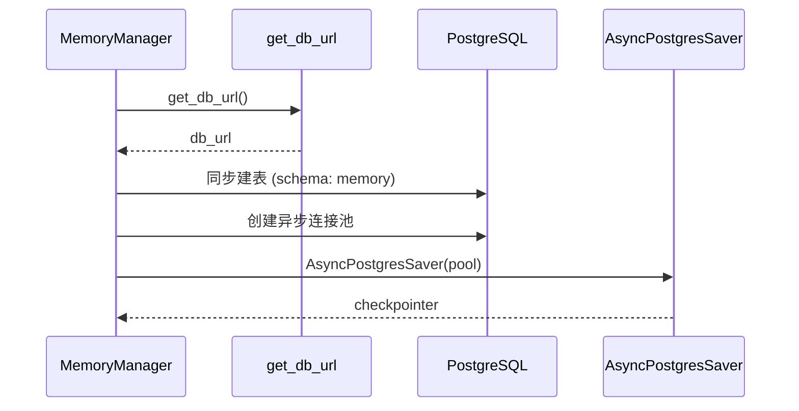

本页面详细描述 futureself 项目中数据库操作的设计规范、连接管理、使用方式和最佳实践，面向高级开发者。数据库模块基于 SQLAlchemy ORM 框架构建，采用单例模式管理连接资源，支持 PostgreSQL 作为底层存储引擎。

## 核心架构设计

数据库操作层采用分层架构设计，主要包含连接管理模块和数据模型定义两部分，整体架构如下：

```mermaid
graph TD
    A[应用层] --> B[get_session() 接口]
    A --> C[get_engine() 接口]
    B --> D[Session 单例管理]
    C --> E[Engine 单例管理]
    E --> F[连接重试机制]
    F --> G[SQLAlchemy Engine]
    G --> H[连接池配置]
    H --> I[(PostgreSQL 数据库)]
    D --> G
    J[环境变量] --> K[get_db_url()]
    K --> E
    L[coze_workload_identity] --> K
    M[Base 数据模型] --> N[业务表定义]
```

数据库模块通过惰性初始化和单例模式确保全局唯一的连接资源，避免重复创建数据库连接带来的性能开销。

Sources: [db.py](src/storage/database/db.py#L1-L95)

## 连接管理规范

### 连接字符串获取

数据库连接字符串的获取遵循优先级顺序：

1. **环境变量优先**：首先尝试从环境变量 `PGDATABASE_URL` 读取连接字符串
2. **身份认证 fallback**：环境变量为空时，通过 `coze_workload_identity` 客户端获取项目环境变量
3. **错误处理**：两种方式均失败时记录错误日志并抛出异常

**代码调用示例**：
```python
from storage.database.db import get_db_url
db_url = get_db_url()  # 自动处理环境变量和身份认证
```

> **重要**：生产环境必须配置 `PGDATABASE_URL` 环境变量以避免依赖 `coze_workload_identity` 的额外开销。

Sources: [db.py](src/storage/database/db.py#L17-L37)

### 连接池配置参数

数据库连接池采用以下固定配置，确保高并发场景下的稳定性：

| 配置参数 | 值 | 说明 |
|---------|-----|------|
| `pool_size` | 100 | 连接池保持的最大空闲连接数 |
| `max_overflow` | 100 | 连接池可创建的额外连接数上限 |
| `pool_recycle` | 1800 秒 | 连接回收时间（30分钟），防止连接超时 |
| `pool_timeout` | 30 秒 | 获取连接的超时等待时间 |
| `pool_pre_ping` | True | 启用连接健康检查 |

总计最大并发连接数为 `pool_size + max_overflow = 200`，满足高并发业务场景需求。

Sources: [db.py](src/storage/database/db.py#L46-L57)

### 连接重试机制

数据库连接建立采用带超时的重试机制，确保网络不稳定环境下的可用性：



- **最大重试时间**：20 秒
- **重试间隔**：1 秒（动态调整以确保总时长不超过上限）
- **健康检查**：执行 `SELECT 1` SQL 语句验证连接有效性

Sources: [db.py](src/storage/database/db.py#L41-L72)

## 核心 API 规范

### 引擎获取接口

`get_engine()` 函数提供全局唯一的 SQLAlchemy Engine 实例，采用双重检查锁定的单例模式：

```python
def get_engine():
    global _engine
    if _engine is None:
        _engine = _create_engine_with_retry()
    return _engine
```

**使用规范**：
- 直接调用即可，无需额外参数
- 首次调用会触发数据库连接，可能存在阻塞
- 线程安全，可在多线程环境下使用

Sources: [db.py](src/storage/database/db.py#L74-L78)

### 会话工厂接口

`get_sessionmaker()` 返回预配置的会话工厂对象：

```python
def get_sessionmaker():
    global _SessionLocal
    if _SessionLocal is None:
        _SessionLocal = sessionmaker(
            autocommit=False,
            autoflush=False,
            bind=get_engine()
        )
    return _SessionLocal
```

**关键配置**：
- `autocommit=False`：禁用自动提交，强制事务边界控制
- `autoflush=False`：禁用自动刷新，避免不必要的数据库操作

Sources: [db.py](src/storage/database/db.py#L80-L84)

### 会话获取接口

`get_session()` 是最常用的便捷接口，直接返回可用的数据库会话：

```python
def get_session():
    return get_sessionmaker()()
```

**标准使用模式**：
```python
session = get_session()
try:
    # 执行数据库操作
    result = session.query(Model).filter(...)
    session.commit()
except Exception:
    session.rollback()
    raise
finally:
    session.close()
```

> **强制规范**：所有数据库操作必须包含 try-except-finally 结构，确保异常时回滚和会话关闭。

Sources: [db.py](src/storage/database/db.py#L86-L87)

## 数据模型定义规范

所有数据库模型必须继承自 `Base` 基类，该基类继承自 SQLAlchemy 的 `DeclarativeBase`：

```python
from sqlalchemy.orm import DeclarativeBase

class Base(DeclarativeBase):
    pass
```

**模型开发规范**：
1. 所有模型类必须放在 `shared/model.py` 或对应模块的 model 文件中
2. 模型类必须显式定义 `__tablename__` 属性
3. 主键字段统一使用 `BigInteger` 类型
4. 时间戳字段建议使用 `DateTime(timezone=True)`
5. JSON 数据使用 `JSON` 类型存储
6. 重要查询字段必须创建索引

**标准模型示例**：
```python
from sqlalchemy import BigInteger, DateTime, JSON, String
from sqlalchemy.orm import Mapped, mapped_column
import datetime

class ExampleModel(Base):
    __tablename__ = "example_table"
    
    id: Mapped[int] = mapped_column(BigInteger, primary_key=True)
    name: Mapped[str] = mapped_column(String(255), index=True)
    data: Mapped[dict] = mapped_column(JSON)
    created_at: Mapped[datetime.datetime] = mapped_column(
        DateTime, 
        default=datetime.datetime.utcnow
    )
```

Sources: [model.py](src/storage/database/shared/model.py#L1-L8)

## 内存检查点数据库集成

系统使用 LangGraph 的 `AsyncPostgresSaver` 作为工作流检查点存储，与业务数据库共享同一连接配置：



**降级机制**：数据库连接失败时自动降级为 `MemorySaver`，此时数据不具备持久化能力，服务重启后会丢失。生产环境必须确保数据库可用。

Sources: [memory_saver.py](src/storage/memory/memory_saver.py#L18-L124)

## 错误处理规范

### 异常类型

| 异常类型 | 触发场景 | 处理建议 |
|---------|---------|---------|
| `ValueError` | 数据库 URL 未配置 | 检查环境变量 |
| `OperationalError` | 数据库连接失败 | 检查网络或数据库状态 |
| 其他 Exception | 身份认证失败 | 检查 coze_workload_identity 配置 |

### 日志规范

所有数据库相关操作必须记录完整日志：
- **INFO** 级别：连接成功、初始化完成
- **WARNING** 级别：重试过程、降级处理
- **ERROR** 级别：最终失败、配置缺失

## 性能最佳实践

1. **会话生命周期管理**
   - 按需创建会话，使用后立即关闭
   - 避免在会话中执行耗时操作
   - 禁止跨请求共享会话对象

2. **连接池优化**
   - 默认配置已针对高并发优化，不建议随意修改
   - 监控连接池使用率，接近上限时考虑扩容
   - `pool_recycle` 设为 30 分钟，与 PostgreSQL `idle_in_transaction_session_timeout` 配合

3. **查询优化**
   - 使用 `selectinload` 代替 `joinedload` 处理关联查询
   - 大数据量操作使用 `yield_per` 分批处理
   - 避免 N+1 查询问题，必要时使用 `select_related`

## 与其他模块交互

数据库模块为上层业务提供透明的连接管理，相关模块参考：

- [内存存储实现](15-nei-cun-cun-chu-shi-xian)：检查点存储的数据库集成实现
- [状态数据模型](7-zhuang-tai-shu-ju-mo-xing)：业务数据结构定义
- [图编排机制](8-tu-bian-pai-ji-zhi)：工作流与检查点存储交互

如需了解存储系统的其他组件，请参考对应模块文档。