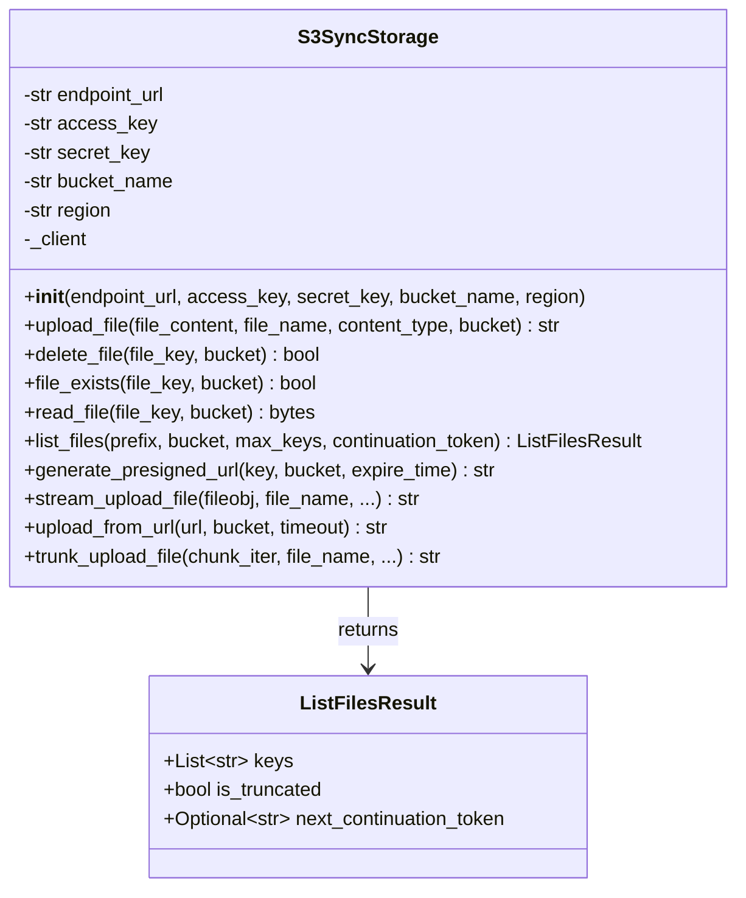
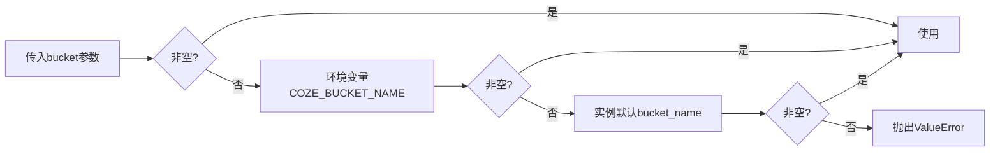

本页面详细介绍 `S3SyncStorage` 类的架构设计与使用方法，该模块为系统提供S3兼容对象存储能力，支持字节上传、流式上传、分片上传、预签名URL生成等核心功能。

## 架构设计

`S3SyncStorage` 基于 `boto3` SDK 构建，针对 Coze 平台环境进行了深度适配，支持动态凭证注入与环境变量配置。



**核心设计原则**：
- **惰性初始化**：客户端连接在首次操作时创建，避免不必要的资源占用
- **多配置源**：优先使用环境变量，其次是构造参数，支持 Coze 平台动态注入
- **错误可追溯**：所有异常捕获时提取 `x-tt-logid` 头，便于故障排查
- **命名规范**：严格的对象键命名校验，确保跨平台兼容性

Sources: [s3_storage.py](src/storage/s3/s3_storage.py#L1-L425)

## 初始化与配置

### 构造函数参数

| 参数名 | 类型 | 必填 | 默认值 | 说明 |
|--------|------|------|--------|------|
| `endpoint_url` | Optional[str] | 否 | None | S3服务端点，优先级低于环境变量 `COZE_BUCKET_ENDPOINT_URL` |
| `access_key` | str | 是 | - | 访问密钥ID |
| `secret_key` | str | 是 | - | 秘密访问密钥 |
| `bucket_name` | str | 是 | - | 默认存储桶名称 |
| `region` | str | 否 | `"cn-beijing"` | 服务区域 |

### Coze 平台集成

在 Coze 平台环境中，`S3SyncStorage` 会自动通过 `coze_workload_identity` 客户端获取项目环境变量和访问令牌：
1. 动态获取 `COZE_BUCKET_ENDPOINT_URL` 配置
2. 注册 `before-call.s3` 钩子，在每次请求前注入 `x-storage-token` 头
3. 实现无密钥配置的安全访问

Sources: [s3_storage.py](src/storage/s3/s3_storage.py#L26-L84)

## 对象键命名规范

系统实施严格的对象键校验，确保跨平台兼容性和安全性。

### 校验规则

| 规则 | 约束条件 | 错误示例 |
|------|----------|----------|
| 长度限制 | UTF-8 编码后 1–1024 字节 | 超长文件名 |
| 字符集 | 仅允许 `[A-Za-z0-9._\-/]` | `file name.pdf`（含空格） |
| 边界约束 | 不以 `/` 开头或结尾 | `/report.pdf`、`images/` |
| 连续分隔符 | 不包含 `//` | `images//photo.png` |

### 自动命名生成

上传操作会自动生成唯一对象键，格式为：
```
{原始文件名}_{8位UUID十六进制}{后缀名}
```

示例：`report_2025_a1b2c3d4.pdf`

Sources: [s3_storage.py](src/storage/s3/s3_storage.py#L14-L90#L113-L141)

## 核心操作方法

### 字节上传

适用于小文件，将完整字节内容一次性上传。

```python
storage = S3SyncStorage(access_key="...", secret_key="...", bucket_name="my-bucket")
file_key = storage.upload_file(
    file_content=b"Hello, World!",
    file_name="greeting.txt",
    content_type="text/plain"
)
```

**参数说明**：
- `file_content`: bytes - 文件二进制内容
- `file_name`: str - 原始文件名（用于校验和生成对象键）
- `content_type`: str - MIME类型，默认 `application/octet-stream`
- `bucket`: Optional[str] - 指定桶名，默认使用实例配置

Sources: [s3_storage.py](src/storage/s3/s3_storage.py#L142-L154)

### 流式上传

适用于大文件，支持文件对象和网络流。

```python
with open("large_report.pdf", "rb") as f:
    key = storage.stream_upload_file(
        fileobj=f,
        file_name="large_report.pdf",
        content_type="application/pdf",
        multipart_chunksize=5 * 1024 * 1024,
        multipart_threshold=5 * 1024 * 1024,
        max_concurrency=1,
        use_threads=False
    )
```

**关键参数**：
- `multipart_chunksize`: 分片大小（默认5MB），适配代理层限制
- `max_concurrency`: 并发分片数（默认1），避免代理层节流

Sources: [s3_storage.py](src/storage/s3/s3_storage.py#L291-L332)

### 从URL直接上传

支持从HTTP URL流式下载并直接上传到S3，无需本地缓存。

```python
key = storage.upload_from_url(
    url="https://example.com/report.pdf",
    timeout=30
)
```

Sources: [s3_storage.py](src/storage/s3/s3_storage.py#L334-L363)

### 分片迭代器上传

适用于自定义字节流场景，内部自动累积分片。

```python
def generate_chunks():
    for i in range(10):
        yield b"chunk " + str(i).encode()

key = storage.trunk_upload_file(
    chunk_iter=generate_chunks(),
    file_name="streamed_data.bin",
    part_size=5 * 1024 * 1024
)
```

**异常处理**：分片上传失败时自动调用 `abort_multipart_upload` 清理未完成的上传任务。

Sources: [s3_storage.py](src/storage/s3/s3_storage.py#L365-L425)

### 文件读取与删除

```python
# 读取文件
content = storage.read_file(file_key="report_a1b2c3d4.pdf")

# 检查存在性
exists = storage.file_exists(file_key="report_a1b2c3d4.pdf")

# 删除文件
success = storage.delete_file(file_key="report_a1b2c3d4.pdf")
```

Sources: [s3_storage.py](src/storage/s3/s3_storage.py#L155-L200)

### 分页列举对象

支持前缀过滤和分页遍历。

```python
result = storage.list_files(
    prefix="reports/",
    max_keys=100,
    continuation_token=None  # 用于翻页
)

# 返回结构
# {
#     "keys": ["reports/report1.pdf", "reports/report2.pdf"],
#     "is_truncated": True,
#     "next_continuation_token": "token_for_next_page"
# }
```

Sources: [s3_storage.py](src/storage/s3/s3_storage.py#L201-L231)

### 预签名URL生成

通过 S3 Proxy 生成带时效的访问签名URL。

```python
url = storage.generate_presigned_url(
    key="report_a1b2c3d4.pdf",
    expire_time=1800  # 30分钟
)
```

**实现机制**：调用 Coze 存储代理服务的 `/sign-url` 接口，传入 `bucket_name`、`path`、`expire_time` 参数。

Sources: [s3_storage.py](src/storage/s3/s3_storage.py#L233-L289)

## 错误处理与日志

所有操作方法统一实现错误处理模式：

```python
try:
    # 操作逻辑
except Exception as e:
    logger.error(self._error_msg("操作描述", e))
    raise e
```

`_error_msg` 方法会从 `ClientError` 中提取 `x-tt-logid` 响应头，生成可追溯的错误信息：

```
Error uploading file to S3: AccessDenied (x-tt-logid: 1234567890abcdef)
```

**调试建议**：错误日志中的 `x-tt-logid` 可用于向存储服务提供商追溯具体请求详情。

Sources: [s3_storage.py](src/storage/s3/s3_storage.py#L92-L104)

## 桶名解析优先级

所有支持 `bucket` 参数的方法遵循以下解析顺序：



Sources: [s3_storage.py](src/storage/s3/s3_storage.py#L106-L111)

## 相关文档

- 存储系统总览，请参考 [内存存储实现](15-nei-cun-cun-chu-shi-xian) 和 [数据库操作规范](16-shu-ju-ku-cao-zuo-gui-fan)
- 节点开发中使用存储，请参考 [节点开发规范](25-jie-dian-kai-fa-gui-fan)
- 配置文件管理，请参考 [配置文件编写指南](26-pei-zhi-wen-jian-bian-xie-zhi-nan)