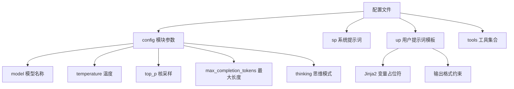
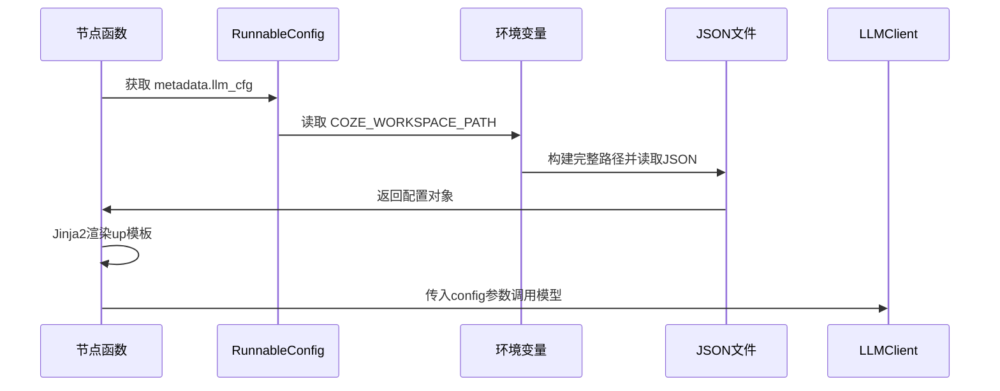

LLM配置管理系统为项目中的各个工作流节点提供统一、灵活的大语言模型调用配置机制。该系统采用**文件化配置**与**运行时动态加载**相结合的架构，支持每个节点独立定义模型参数、提示词模板和工具集合，实现了配置与业务逻辑的解耦。

## 配置文件架构

LLM配置系统采用标准JSON格式存储，每个业务节点对应独立的配置文件。配置文件包含模型参数、系统提示词、用户提示词模板三大核心模块。



Sources: [config/big_five_assessment_llm_cfg.json](config/big_five_assessment_llm_cfg.json)

## 配置文件结构

每个配置文件遵循统一的JSON结构规范，如下表所示：

| 字段 | 类型 | 必填 | 说明 |
|------|------|------|------|
| `config` | Object | 是 | 模型核心参数配置 |
| `config.model` | String | 是 | 调用的模型标识 |
| `config.temperature` | Number | 是 | 采样温度，范围0.0-2.0 |
| `config.top_p` | Number | 是 | 核采样概率，范围0.0-1.0 |
| `config.max_completion_tokens` | Number | 是 | 最大生成token数 |
| `config.thinking` | String | 是 | 思维模式：`disabled`/`enabled` |
| `sp` | String | 是 | System Prompt，系统角色定义 |
| `up` | String | 是 | User Prompt，支持Jinja2模板语法 |
| `tools` | Array | 否 | 工具调用配置集合 |

### 配置文件示例

```json
{
    "config": {
        "model": "doubao-seed-1-8-251228",
        "temperature": 0.7,
        "top_p": 0.9,
        "max_completion_tokens": 2000,
        "thinking": "disabled"
    },
    "tools": [],
    "sp": "# 角色定义\n你是专业的心理学分析师...",
    "up": "请分析用户的大五人格特质。\n\n{{answers}}"
}
```

Sources: [config/big_five_assessment_llm_cfg.json](config/big_five_assessment_llm_cfg.json)
[config/report_generation_llm_cfg.json](config/report_generation_llm_cfg.json)

## 配置文件清单

项目共包含5个节点的LLM配置文件，分别对应不同的业务场景：

| 配置文件 | 对应节点 | 用途说明 |
|----------|----------|----------|
| `big_five_assessment_llm_cfg.json` | 大五人格评估节点 | 基于问卷数据分析人格特质 |
| `cartoon_portrait_analysis_llm_cfg.json` | 卡通形象分析节点 | 生成职业形象视觉描述 |
| `cartoon_prompt_analysis_llm_cfg.json` | 卡通提示词分析节点 | 生成图片生成prompt |
| `report_generation_llm_cfg.json` | 报告生成节点 | 生成完整职业规划报告 |
| `scoring_llm_cfg.json` | 表征配对评分节点 | 进行表征相似度评分 |

Sources: [config/](config/)

## 运行时加载机制

配置文件在节点执行时动态加载，通过`config['metadata']['llm_cfg']`元数据字段指定配置文件路径。加载流程如下：



### 核心加载代码

```python
# 读取模型配置
cfg_file = os.path.join(os.getenv("COZE_WORKSPACE_PATH"), config['metadata']['llm_cfg'])
with open(cfg_file, 'r', encoding='utf-8') as fd:
    _cfg = json.load(fd)

llm_config = _cfg.get("config", {})
sp = _cfg.get("sp", "")
up = _cfg.get("up", "")
```

Sources: [src/graphs/nodes/big_five_assessment_node.py](src/graphs/nodes/big_five_assessment_node.py#L103-L109)
[src/graphs/nodes/report_generation_node.py](src/graphs/nodes/report_generation_node.py#L43-L50)

## 提示词模板系统

提示词模板采用**Jinja2模板引擎**，支持变量注入、条件判断和循环等高级语法。模板系统的核心优势是实现了提示词与代码的分离，便于维护和优化。

### 模板变量注入

用户提示词模板中的变量在运行时通过节点状态数据进行填充：

```python
from jinja2 import Template

up_tpl = Template(up)
user_prompt_content = up_tpl.render({
    "user_name": state.user_name,
    "user_gender": state.user_gender,
    "user_education": state.user_education,
    "selected_representations": state.selected_representations,
    "big_five_scores": state.big_five_scores,
    # ... 更多变量
})
```

Sources: [src/graphs/nodes/report_generation_node.py](src/graphs/nodes/report_generation_node.py#L52-L73)

### 模板变量规范

每个节点的提示词模板应根据其输入状态定义相应的变量。常见的变量包括：

| 变量名 | 类型 | 说明 |
|--------|------|------|
| `{{answers}}` | String | 问卷回答数据 |
| `{{user_name}}` | String | 用户姓名 |
| `{{user_info}}` | Object | 用户完整信息 |
| `{{selected_representations}}` | List | 用户选择的表征列表 |
| `{{big_five_scores}}` | Object | 大五人格评分结果 |

## 模型参数配置规范

### temperature 参数建议

| 业务场景 | 推荐值 | 理由 |
|----------|--------|------|
| 人格评估 | 0.7 | 保持分析的一致性，允许适度的表达多样性 |
| 报告生成 | 0.7-0.8 | 个性化报告需要一定的创造性 |
| 评分计算 | 0.0-0.3 | 需要高度确定性的数值结果 |
| 创意生成 | 0.8-1.0 | 卡通形象等需要创造性的场景 |

### max_completion_tokens 配置原则

| 输出类型 | 推荐值 |
|----------|--------|
| JSON结构化输出 | 1000-2000 |
| 段落式分析 | 2000-4000 |
| 完整报告 | 8000-10000 |

Sources: [config/big_five_assessment_llm_cfg.json](config/big_five_assessment_llm_cfg.json#L3-L7)
[config/report_generation_llm_cfg.json](config/report_generation_llm_cfg.json#L3-L7)

## 配置与LLMClient集成

配置参数最终通过`LLMClient`传递给底层模型服务。调用方式支持两种模式：**构造函数传参**和**invoke方法传参**。

### 构造函数传参模式

```python
llm_client = LLMClient(
    model=llm_config.get("model", "doubao-seed-1-8-251228"),
    temperature=llm_config.get("temperature", 0.7),
    max_tokens=llm_config.get("max_completion_tokens", 2000),
    thinking=llm_config.get("thinking", "disabled")
)
```

Sources: [src/graphs/nodes/big_five_assessment_node.py](src/graphs/nodes/big_five_assessment_node.py#L201-L206)

### invoke方法传参模式

```python
resp = client.invoke(
    messages=messages,
    model=llm_config.get("model", "doubao-pro-32k"),
    temperature=llm_config.get("temperature", 0.7),
    top_p=llm_config.get("top_p", 0.9),
    max_completion_tokens=llm_config.get("max_completion_tokens", 4000),
    thinking=llm_config.get("thinking", "disabled")
)
```

Sources: [src/graphs/nodes/report_generation_node.py](src/graphs/nodes/report_generation_node.py#L78-L86)

## 配置最佳实践

### 1. 提示词分层设计

系统提示词（`sp`）应包含：
- **角色定义**：明确AI的专业身份和能力边界
- **知识背景**：提供必要的领域知识
- **约束条件**：输出格式、内容限制、安全要求

用户提示词（`up`）应包含：
- **任务目标**：清晰的执行指令
- **输入数据**：使用模板变量注入
- **输出格式**：明确的返回格式要求

### 2. 版本管理建议

- 配置文件应纳入版本控制系统
- 重大提示词变更应记录变更日志
- 可通过文件名后缀区分版本（如 `_v2`）

### 3. 测试与验证

- 每个配置变更后应进行端到端测试
- 验证输出格式是否符合预期
- 检查模型调用是否成功并返回正确结构

## 下一步

完成LLM配置管理的理解后，建议继续阅读以下内容：
- [配置文件编写指南](26-pei-zhi-wen-jian-bian-xie-zhi-nan) - 学习如何编写和维护配置文件
- [节点开发规范](25-jie-dian-kai-fa-gui-fan) - 了解节点如何集成LLM配置
- [OpenAI兼容层实现](22-openaijian-rong-ceng-shi-xian) - 深入了解LLM调用的底层实现