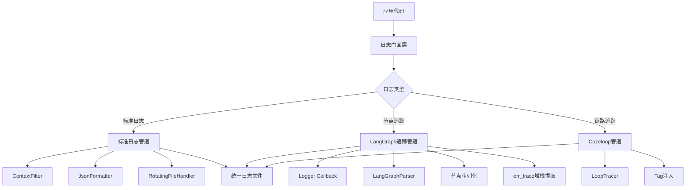
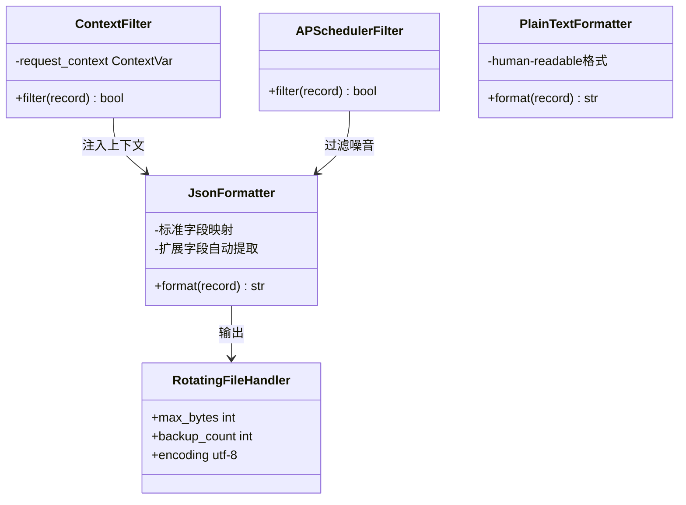
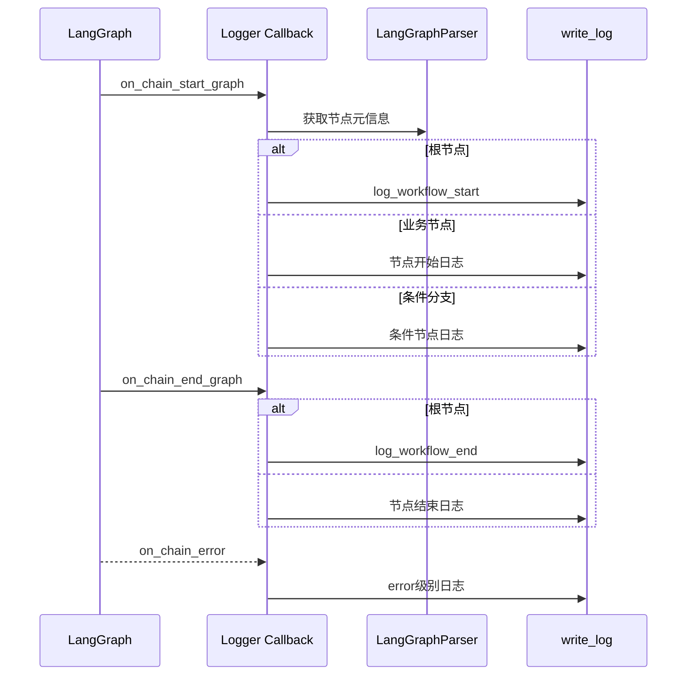
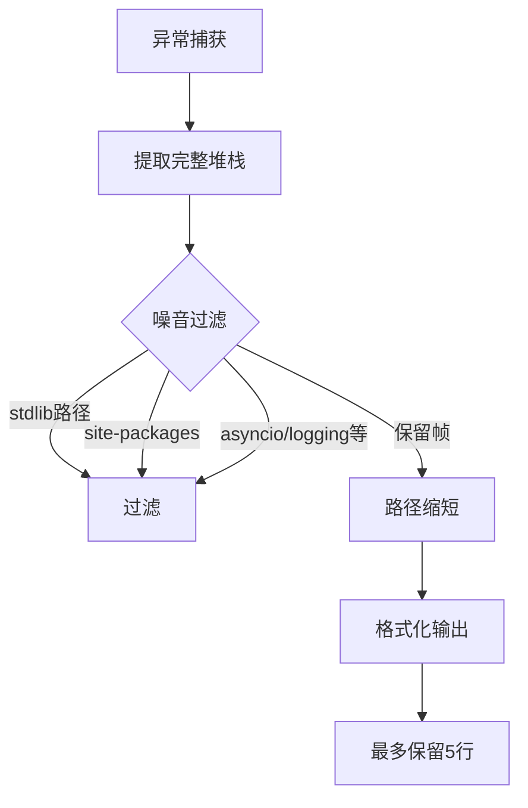

本页详细阐述 FutureSelf 项目的日志系统架构。该系统采用**分层设计**，同时支持标准结构化日志与 LangGraph 节点级追踪，具备上下文自动注入、智能错误过滤、分布式追踪关联等核心能力。

## 整体架构

日志系统采用模块化分层设计，各模块职责明确且松耦合：



日志系统核心分为三大管道：标准日志管道处理普通业务日志，LangGraph追踪管道专用于工作流节点执行轨迹，Cozeloop管道用于分布式链路追踪。三管道共享上下文但格式独立，满足不同维度的可观测性需求。

Sources: [write_log.py](src/utils/log/write_log.py#L1-L186), [node_log.py](src/utils/log/node_log.py#L1-L488), [loop_trace.py](src/utils/log/loop_trace.py#L1-L73)

## 核心配置机制

系统采用环境变量驱动的配置模式，核心参数可灵活调整：

| 配置项 | 环境变量 | 默认值 | 说明 |
|--------|----------|--------|------|
| 日志级别 | `LOG_LEVEL` | `INFO` | 全局日志级别，支持 DEBUG/INFO/WARN/ERROR |
| 日志目录 | `COZE_LOG_DIR` | `/tmp/app/work/logs/bypass` | 日志文件存储路径，自动降级机制 |
| 环境标识 | `COZE_PROJECT_ENV` | 空 | 控制生产/测试行为差异 |
| 空间ID | `COZE_PROJECT_SPACE_ID` | `YOUR_SPACE_ID` | Cozeloop 链路追踪配置 |

系统具备**自动降级容错机制**：当配置的日志目录无写入权限时，自动回退到 `/tmp/work/logs/bypass` 目录，确保日志系统在异常环境下仍能正常工作。日志文件命名为 `app.log`，采用轮转策略，单文件最大 100MB，保留 5 个备份。

Sources: [config.py](src/utils/log/config.py#L1-L11), [write_log.py](src/utils/log/write_log.py#L98-L116), [node_log.py](src/utils/log/node_log.py#L37-L53)

## 标准日志管道

标准日志管道基于 Python `logging` 模块构建，通过扩展机制实现结构化和上下文注入：



**ContextFilter** 是日志管道的核心，利用 Python 的 `contextvars` 机制自动从请求上下文中提取 `log_id`、`run_id`、`space_id`、`project_id` 等追踪字段，并注入到每条日志记录中。这实现了日志的**隐式上下文关联**，业务代码无需显式传递追踪参数。

Sources: [write_log.py](src/utils/log/write_log.py#L14-L41)

### 结构化日志格式

系统支持 JSON 和 Plain Text 两种输出格式：

**JSON 格式**（文件输出默认）：
```json
{
  "message": "日志消息内容",
  "timestamp": "2024-01-01 12:00:00",
  "level": "INFO",
  "logger": "模块名",
  "log_id": "请求追踪ID",
  "run_id": "执行实例ID",
  "space_id": "空间ID",
  "project_id": "项目ID",
  "method": "调用方法",
  "lineno": 123,
  "funcName": "函数名",
  "exc_info": "异常堆栈(如有)"
}
```

JSON 格式支持**任意扩展字段**，Formatter 会自动提取 LogRecord 中非标准属性并加入输出，便于业务代码添加自定义维度。

Sources: [write_log.py](src/utils/log/write_log.py#L42-L93)

## LangGraph 节点追踪

节点追踪是日志系统最具特色的部分，通过 LangChain Callback 机制实现工作流执行的全链路透明化：



**Logger** 类继承自 `BaseCallbackHandler`，作为 LangGraph 的执行钩子拦截所有节点生命周期事件。核心能力包括：

1. **节点元数据解析**：通过 `LangGraphParser` 从编译后的图中提取节点 ID、类型、标题等信息
2. **执行时序关联**：利用 `run_id` 映射表关联节点的开始与结束事件
3. **数据自动序列化**：递归序列化节点输入输出，支持 Pydantic 模型等复杂类型
4. **错误分类处理**：区分普通异常与 `CancelledError`，正确标记取消事件

Sources: [node_log.py](src/utils/log/node_log.py#L231-L418)

### 节点日志字段

节点级日志包含丰富的执行上下文：

| 字段 | 说明 | 来源 |
|------|------|------|
| `node_id` | LangGraph 内部节点标识 | 图编译元数据 |
| `node_name` | 节点函数名 | 函数反射 |
| `node_title` | 节点可读标题 | Docstring 解析 |
| `node_type` | 节点类型分类 | metadata 推断 |
| `input` / `output` | 节点输入输出数据 | 递归序列化 |
| `latency` | 节点执行耗时 | 时间差计算 |
| `execution_id` | 工作流执行实例 | 运行时上下文 |
| `token` / `cost` | 资源消耗统计 | 回调数据 |

为防止日志体积膨胀，输入输出字段**超过 1MB 时会自动截断**，保证系统稳定性。

Sources: [node_log.py](src/utils/log/node_log.py#L86-L143)

## 智能错误堆栈提取

`err_trace` 模块提供**智能堆栈过滤**能力，从完整异常栈中提取对调试有价值的核心帧：



该模块的核心价值在于解决异步框架中堆栈过长、噪音过多的问题。过滤规则包括：标准库路径、第三方包（site-packages）、框架内部调用（asyncio/logging/importlib 等）。过滤后保留最近 5 个业务相关帧，大幅提升错误定位效率。

Sources: [err_trace.py](src/utils/log/err_trace.py#L1-L88)

## Cozeloop 链路集成

系统原生集成 Cozeloop 分布式追踪，形成完整的可观测性闭环：

```python
# 追踪初始化流程
cozeloopTracer = cozeloop.new_client(
    workspace_id=space_id,
    api_token=api_token,
    api_base_url=base_url,
)

# 配置回调链
config = RunnableConfig(
    callbacks=[
        Logger(graph, ctx),           # 本地文件日志
        LoopTracer.get_callback_handler(...)  # 分布式链路
    ]
)
```

双追踪机制并行工作：`Logger` 负责本地文件持久化，`LoopTracer` 负责上报到 Cozeloop 平台。通过 `get_node_tags` 函数将节点元信息转化为追踪标签，实现节点维度的聚合分析。

Sources: [loop_trace.py](src/utils/log/loop_trace.py#L1-L73)

## 模块调用关系

日志系统各模块职责划分清晰，形成层次化调用结构：

| 模块 | 核心职责 | 依赖 |
|------|----------|------|
| `config.py` | 环境配置加载 | 无 |
| `common.py` | 环境判断辅助 | 无 |
| `write_log.py` | 标准日志管道初始化 | config |
| `parser.py` | LangGraph 结构解析 | 无 |
| `node_log.py` | 节点追踪实现 | write_log, parser, err_trace |
| `loop_trace.py` | Cozeloop 集成 | node_log |
| `err_trace.py` | 智能堆栈提取 | 无 |

典型的初始化流程为：应用调用 `setup_logging()` 配置标准管道 → 工作流启动时创建 `Logger` callback → 注入到 `RunnableConfig` → LangGraph 执行时自动触发各类日志事件。

Sources: [__init__.py](src/utils/log/__init__.py#L1)

## 生产环境注意事项

1. **生产环境日志静默**：`node_log.py` 中的 `write_log` 函数在生产环境（`COZE_PROJECT_ENV=PROD`）下默认跳过文件写入，需具备日志清理能力后再启用。

2. **性能权衡**：JSON 格式化、递归序列化、堆栈过滤都有一定 CPU 开销，高并发场景下建议调整 `LOG_LEVEL` 至 `WARNING` 以上。

3. **上下文泄露风险**：`request_context` 使用 `ContextVar`，需确保在异步任务边界正确传递上下文。

参阅 [调试与日志分析](27-diao-shi-yu-ri-zhi-fen-xi) 了解日志分析实践。