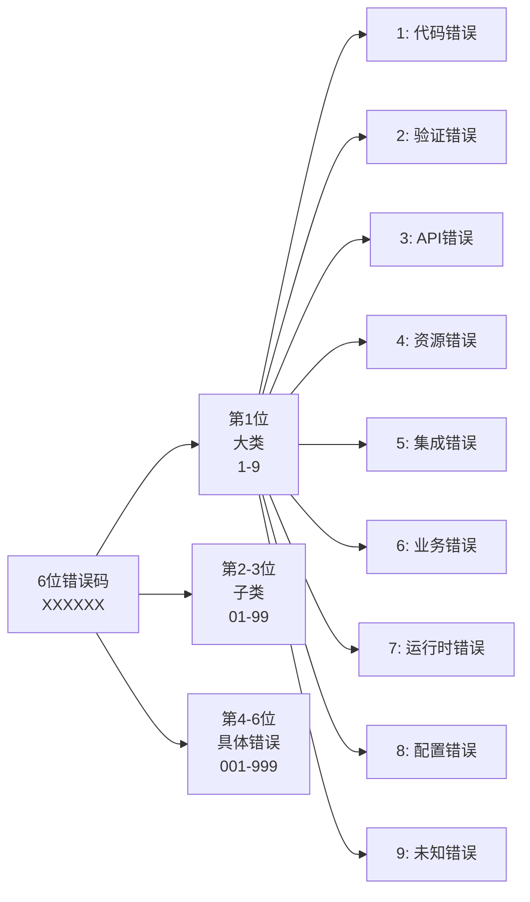
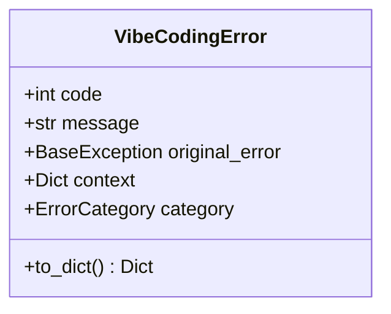
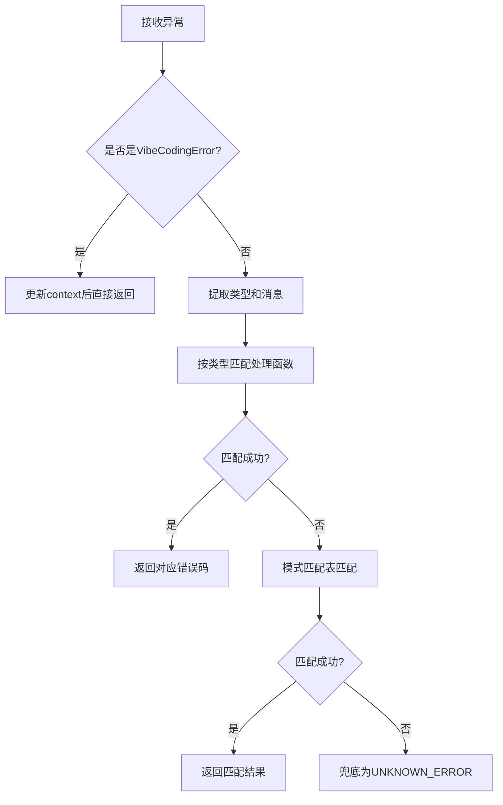
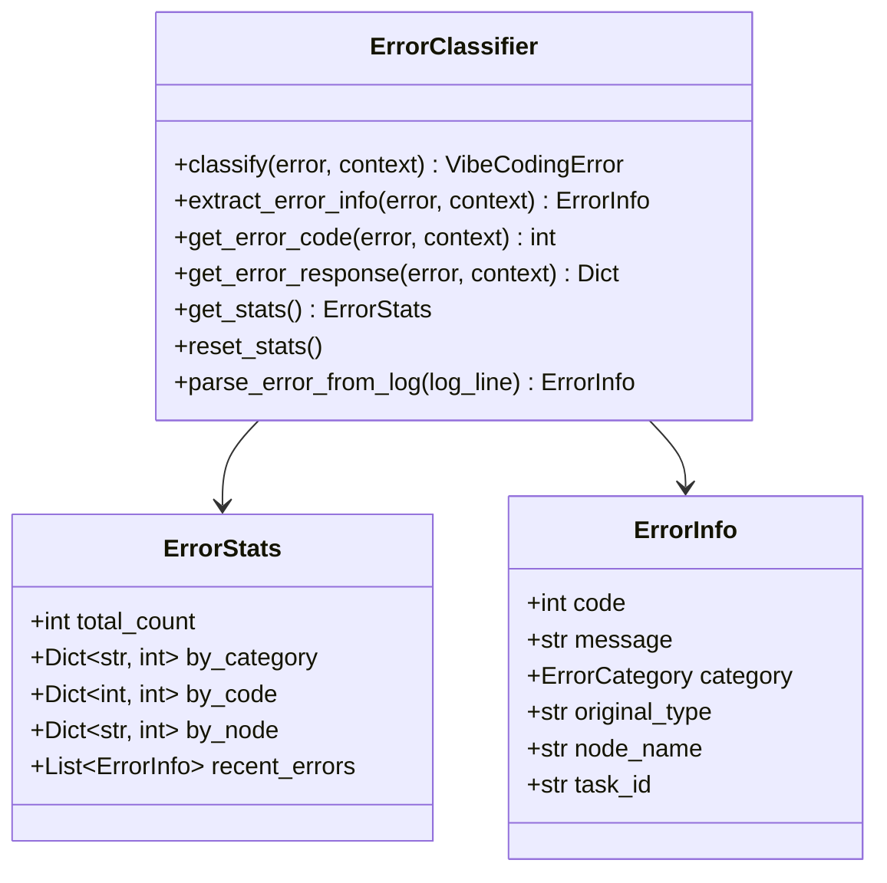

本系统设计了一套**6位数字分层错误码体系**，实现对各类异常的精确识别、分类和统计分析。该系统能够自动识别超过100种不同类型的错误，支持模式匹配、上下文追踪、统计分析等功能。

## 体系架构

### 6位错误码设计

系统采用三层结构的错误码，便于分层识别和快速定位：



| 错误大类 | 代码 | 说明 | 典型场景 |
|---------|------|------|---------|
| 代码语法/类型错误 | 1xxxxx | 代码层面的语法、类型、属性访问错误 | AttributeError、TypeError、SyntaxError |
| 输入验证错误 | 2xxxxx | 数据验证失败、格式错误、约束违反 | Pydantic ValidationError、JSON解析错误 |
| 外部API错误 | 3xxxxx | 第三方服务调用失败、网络问题 | LLM API、图片生成API、网络超时 |
| 资源/文件错误 | 4xxxxx | 文件操作、存储服务、媒体处理失败 | 文件不存在、S3上传失败、图像处理错误 |
| 集成服务错误 | 5xxxxx | 企业集成服务、数据库连接失败 | 飞书API、数据库连接、微信集成 |
| 业务逻辑错误 | 6xxxxx | 业务规则违反、工作流异常 | 节点执行失败、资源点不足、配额超限 |
| 运行时错误 | 7xxxxx | 执行环境问题、异步任务异常 | 超时、取消、内存不足、递归超限 |
| 配置错误 | 8xxxxx | 环境配置、API Key、浏览器配置缺失 | API Key缺失、环境变量未配置 |
| 未知错误 | 9xxxxx | 无法分类的异常兜底 | 新类型异常、未匹配模式 |

Sources: [codes.py](src/utils/error/codes.py#L1-L361)

## 核心组件

### 1. 错误码定义模块

**ErrorCode 枚举** 定义了所有预定义的错误码，采用 `{大类}_{子类}_{具体错误}` 的命名规则。配合 `ERROR_DESCRIPTIONS` 字典提供每个错误码的中文描述。

```python
from utils.error.codes import ErrorCode, ErrorCategory, get_error_description

# 获取错误码
code = ErrorCode.API_LLM_REQUEST_FAILED  # 301001

# 获取错误描述
desc = get_error_description(code)  # "LLM请求失败"

# 获取错误大类
category = ErrorCategory(code // 100000)  # ErrorCategory.API_ERROR
```

Sources: [codes.py](src/utils/error/codes.py#L18-L361)

### 2. 统一异常基类 VibeCodingError

**VibeCodingError** 是系统中所有异常的统一封装，提供了一致的错误表示和序列化能力。



**核心属性和方法：**

- `code`: 6位错误码，用于精确识别
- `message`: 人类可读的错误消息
- `original_error`: 原始异常对象，保留完整堆栈信息
- `context`: 上下文字典，包含 task_id、node_name 等追踪信息
- `category`: 自动计算的错误大类
- `to_dict()`: 转换为字典格式，便于API响应输出

Sources: [exceptions.py](src/utils/error/exceptions.py#L15-L64)

### 3. 错误分类函数 classify_error

**classify_error** 函数是系统的核心入口，将任意 Python 异常转换为标准化的 VibeCodingError。分类流程如下：



**分类优先级（从高到低）：**

1. **异常类型精确匹配** - 如 `AttributeError`, `TypeError`, `ValidationError` 等
2. **错误模式表匹配** - `ERROR_PATTERNS` 中的关键词规则
3. **回溯模式匹配** - Traceback 中的异常类型
4. **自定义异常匹配** - 业务自定义错误消息
5. **兜底分类** - 标记为未知错误

Sources: [exceptions.py](src/utils/error/exceptions.py#L67-L440)

### 4. 错误分类器 ErrorClassifier

**ErrorClassifier** 提供高层API，支持错误分析、统计和日志解析。采用单例模式，通过 `get_classifier()` 获取全局实例。



**核心功能：**

- **异常分类**: 将任意异常转换为带错误码的标准化异常
- **错误统计**: 按大类、错误码、节点名称统计错误分布
- **日志解析**: 从日志文本中自动识别和解析错误
- **API响应**: 生成标准格式的错误响应

Sources: [classifier.py](src/utils/error/classifier.py#L1-L321)

## 模式匹配机制

### ERROR_PATTERNS 匹配表

系统维护了一个超过800行的模式匹配表，包含100+条匹配规则。每条规则采用 `(关键词列表, 错误码, 消息模板)` 的格式：

```python
ErrorPattern = Tuple[List[str], int, str]

ERROR_PATTERNS: List[ErrorPattern] = [
    # 优先级最高的视频生成错误
    (['视频生成任务创建失败', '404 client error'],
     ErrorCode.API_VIDEO_GEN_NOT_FOUND, "视频生成端点404"),

    # LLM模型未找到
    (['not found model', 'model not found'],
     ErrorCode.API_LLM_MODEL_NOT_FOUND, "模型未找到"),

    # 依赖库缺失
    (['is not installed', 'pip install'],
     ErrorCode.CONFIG_ENV_MISSING, "依赖库未安装"),

    # 更多规则...
]
```

**匹配特点：**

1. **优先级顺序**: 表中靠前的规则优先匹配
2. **关键词匹配**: 默认匹配任一关键词即可触发，支持 `require_all=True` 要求全部匹配
3. **长度截断**: 错误消息自动截断，避免日志过长
4. **正则支持**: 部分模式支持简单的正则匹配逻辑

Sources: [patterns.py](src/utils/error/patterns.py#L1-L952)

## 使用指南

### 基础用法

```python
from utils.error import classify_error, VibeCodingError, ErrorCode

# 1. 捕获异常并分类
try:
    # 可能出错的代码
    raise ValueError("人脸检测失败")
except Exception as e:
    vibe_error = classify_error(e)
    print(f"错误码: {vibe_error.code}")  # 403004
    print(f"错误消息: {vibe_error.message}")  # "未检测到人脸"
    print(f"错误大类: {vibe_error.category.name}")  # RESOURCE_ERROR

# 2. 手动抛出VibeCodingError
raise VibeCodingError(
    code=ErrorCode.API_LLM_RATE_LIMIT,
    message="自定义消息",
    context={"task_id": "123", "node_name": "ai_node"}
)

# 3. 使用分类器获取API响应
from utils.error import get_classifier

classifier = get_classifier()
response = classifier.get_error_response(e)
# 返回: {"error_code": 301002, "error_message": "...", "error_category": "API_ERROR"}
```

Sources: [__init__.py](src/utils/error/__init__.py#L1-L32)

### 错误统计

```python
from utils.error import get_classifier

classifier = get_classifier()

# 分类若干错误后
stats = classifier.get_stats()

print(f"总错误数: {stats.total_count}")
print(f"按大类统计: {dict(stats.by_category)}")
print(f"按节点统计: {dict(stats.by_node)}")

# 重置统计
classifier.reset_stats()
```

Sources: [classifier.py](src/utils/error/classifier.py#L205-L212)

### 日志解析

```python
from utils.error.classifier import ErrorClassifier

log_line = """During task with name 'video_gen_node' and id 'a1b2c3d4', \
caught exception: AttributeError: 'NoneType' object has no attribute 'split'"""

error_info = ErrorClassifier.parse_error_from_log(log_line)
if error_info:
    print(f"节点: {error_info.node_name}")  # video_gen_node
    print(f"错误码: {error_info.code}")      # 101004
    print(f"原类型: {error_info.original_type}")  # AttributeError
```

Sources: [classifier.py](src/utils/error/classifier.py#L214-L266)

## 扩展开发

### 添加新错误码

在 `src/utils/error/codes.py` 中：

1. 在 `ErrorCode` 枚举中添加新错误码，遵循6位编码规则
2. 在 `ERROR_DESCRIPTIONS` 字典中添加中文描述

```python
# 1. 添加枚举
class ErrorCode(IntEnum):
    # ... 现有错误码
    BUSINESS_NEW_RULE = 699001  # 自定义业务错误

# 2. 添加描述
ERROR_DESCRIPTIONS = {
    # ... 现有描述
    ErrorCode.BUSINESS_NEW_RULE: "新业务规则描述",
}
```

Sources: [codes.py](src/utils/error/codes.py#L18-L358)

### 添加匹配模式

在 `src/utils/error/patterns.py` 的 `ERROR_PATTERNS` 列表中：

```python
ERROR_PATTERNS: List[ErrorPattern] = [
    # 放在合适的优先级位置（靠前优先）
    (['自定义关键词1', '自定义关键词2'],
     ErrorCode.BUSINESS_NEW_RULE, "自定义错误消息模板"),
    # ...
]
```

**最佳实践：**

1. **优先级控制**: 更具体的模式放在前面
2. **关键词粒度**: 使用精确的关键词，避免误匹配
3. **大小写无关**: 匹配函数自动转小写，无需关心大小写
4. **组合匹配**: 使用 `require_all=True` 参数要求全部关键词匹配

Sources: [patterns.py](src/utils/error/patterns.py#L844-L935)

## 与其他系统集成

错误分类系统与以下系统紧密配合：

- **[日志系统设计](19-ri-zhi-xi-tong-she-ji)**: 分类器提取的错误码和上下文自动记录到日志系统
- **[流式响应与取消机制](23-liu-shi-xiang-ying-yu-qu-xiao-ji-zhi)**: 取消操作触发 `RUNTIME_CANCELLED` 错误码
- **故障排查手册**: 错误码是排查问题的首要依据，可在手册中按错误码查阅解决方案

> **重要提示**: 当遇到 `UNKNOWN_ERROR (900001)` 时，说明系统遇到了未识别的错误类型。建议将该错误的堆栈信息补充到模式匹配表中，以提升后续分类准确率。