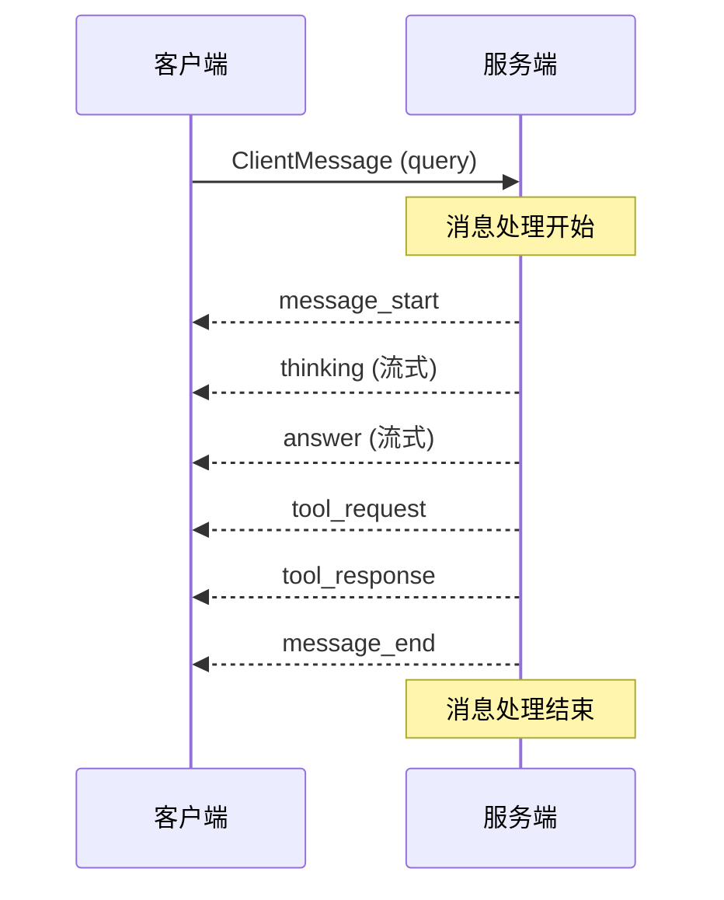
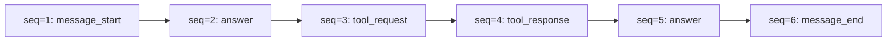

本页面详细定义了 FutureSelf 系统中客户端与服务端之间的通信消息协议。协议采用流式 SSE（Server-Sent Events）机制，支持文本内容、工具调用、思考过程等多种消息类型的实时推送。

## 协议架构总览

系统采用双向数据流模型。客户端通过单一的 `query` 消息发起请求，服务端通过 SSE 流式返回一系列消息，形成完整的会话生命周期。



**消息生命周期**：
1.  `message_start`：服务端接收到请求后立即发送，标记会话开始
2.  主体消息流：`thinking`、`answer`、`tool_request`、`tool_response` 等业务消息
3.  `message_end`：处理完成后发送，标记会话结束
4.  异常情况下：`error` 消息直接终止会话

Sources: [server.py](src/utils/messages/server.py#L1-L174)
[client.py](src/utils/messages/client.py#L1-L49)

## 客户端请求协议

客户端向服务端发送的消息统一使用 `ClientMessage` 数据结构。目前支持的唯一消息类型为 `query`。

### ClientMessage 结构

| 字段 | 类型 | 必填 | 说明 |
|------|------|------|------|
| `type` | `MessageType` | 是 | 消息类型，固定值：`"query"` |
| `project_id` | `str` | 是 | 项目唯一标识 |
| `session_id` | `str` | 是 | 会话 ID，用于多轮对话关联 |
| `local_msg_id` | `str` | 是 | 客户端本地消息 ID，服务端响应时原样带回 |
| `content` | `ClientMessageContent` | 是 | 消息内容容器 |

### PromptBlock 内容块

查询内容支持多种类型的内容块，通过 `PromptBlock.type` 区分：

| 块类型 | 说明 | 内容字段 |
|--------|------|----------|
| `text` | 纯文本内容 | `content.text` |
| `upload_file` | 文件上传 | `content.upload_file` |

```python
# 文本块示例
{
    "type": "text",
    "content": {
        "text": "请分析我的性格特征"
    }
}

# 文件块示例
{
    "type": "upload_file",
    "content": {
        "upload_file": {
            "file_name": "portrait.jpg",
            "file_path": "/local/path",
            "url": "s3://bucket/key"
        }
    }
}
```

Sources: [client.py](src/utils/messages/client.py#L1-L49)

## 服务端响应协议

服务端通过 SSE 流式返回 `ServerMessage`。每条消息通过 `type` 字段标识消息类型，通过 `sequence_id` 保证顺序。

### ServerMessage 结构

| 字段 | 类型 | 说明 |
|------|------|------|
| `type` | `MessageType` | 消息类型枚举 |
| `session_id` | `str` | 关联的会话 ID |
| `query_msg_id` | `str` | 关联的客户端 `local_msg_id` |
| `reply_id` | `str` | 本次回复的唯一 ID |
| `msg_id` | `str` | 单条消息的唯一 ID |
| `sequence_id` | `int` | 消息序号，从 1 开始递增 |
| `finish` | `bool` | 流式消息的结束标记 |
| `content` | `ServerMessageContent` | 消息内容容器 |
| `log_id` | `str` | 日志追踪 ID |

### 消息类型枚举

| 类型常量 | 值 | 说明 |
|----------|-----|------|
| `MESSAGE_TYPE_MESSAGE_START` | `message_start` | 会话开始标记 |
| `MESSAGE_TYPE_MESSAGE_END` | `message_end` | 会话结束标记 |
| `MESSAGE_TYPE_ANSWER` | `answer` | 回答内容（流式） |
| `MESSAGE_TYPE_THINKING` | `thinking` | 思考过程（流式） |
| `MESSAGE_TYPE_TOOL_REQUEST` | `tool_request` | 工具调用请求 |
| `MESSAGE_TYPE_TOOL_RESPONSE` | `tool_response` | 工具执行结果 |
| `MESSAGE_TYPE_ERROR` | `error` | 错误消息 |

Sources: [server.py](src/utils/messages/server.py#L1-L40)

## 消息内容详情

### message_start - 会话开始

标记服务端已接收到请求并开始处理。

```python
MessageStartDetail: {
    "local_msg_id": "client_msg_123",
    "msg_id": "server_msg_456",
    "execute_id": "run_789"
}
```

### message_end - 会话结束

标记请求处理完成，包含执行统计信息。

```python
MessageEndDetail: {
    "code": "0",           # 0=成功, 1=取消
    "message": "",         # 错误描述
    "token_cost": {
        "input_tokens": 100,
        "output_tokens": 200,
        "total_tokens": 300
    },
    "time_cost_ms": 5000   # 总耗时（毫秒）
}
```

结束码定义：
- `MESSAGE_END_CODE_SUCCESS = "0"`：正常完成
- `MESSAGE_END_CODE_CANCELED = "1"`：用户取消

Sources: [server.py](src/utils/messages/server.py#L42-L75)

### answer - 回答内容

AI 生成的最终回答内容。支持流式输出，通过 `finish` 字段标记是否为最后一条。

```python
# 流式片段 1
{
    "type": "answer",
    "sequence_id": 2,
    "finish": false,
    "content": {
        "answer": "根据您的性格画像，"
    }
}

# 流式片段 n（最后一片）
{
    "type": "answer",
    "sequence_id": 5,
    "finish": true,
    "content": {
        "answer": "建议您从事创造性工作。"
    }
}
```

Sources: [agent_helper.py](src/utils/helper/agent_helper.py#L220-L238)

### tool_request - 工具调用

当 AI 需要调用外部工具时发送此消息。

```python
ToolRequestDetail: {
    "tool_call_id": "call_abc",
    "tool_name": "web_search",
    "parameters": {
        "web_search": {
            "query": "大五人格理论"
        }
    }
}
```

**协议特性**：工具调用支持流式 Chunk 合并。当 LLM 分片输出工具调用时，系统会在内部累积 `tool_call_chunks`，直到获得完整的 JSON 参数后才发出 `tool_request` 消息。

Sources: [agent_helper.py](src/utils/helper/agent_helper.py#L316-L359)

### tool_response - 工具结果

工具执行完成后返回的结果。

```python
ToolResponseDetail: {
    "tool_call_id": "call_abc",
    "code": "0",           # 0=成功
    "message": "",
    "result": "{\"results\": [...]}",
    "time_cost_ms": 1200
}
```

Sources: [server.py](src/utils/messages/server.py#L87-L99)

### error - 错误消息

处理过程中发生异常时发送。

```python
ErrorDetail: {
    "local_msg_id": "client_msg_123",
    "code": "INVALID_INPUT",
    "error_msg": "文件格式不支持"
}
```

Sources: [server.py](src/utils/messages/server.py#L77-L82)

## 流式处理机制

### 消息序号与顺序保证

所有服务端消息严格按照 `sequence_id` 递增顺序发送，从 `1` 开始计数。



### 稳定 ID 映射

系统为同一逻辑流的消息分配稳定的 `msg_id`，确保客户端可以正确聚合流式片段。映射键生成规则：

- **answer**：`(MESSAGE_TYPE_ANSWER, chunk.id or group_base)`
- **tool_request**：`(MESSAGE_TYPE_TOOL_REQUEST, tool_call_id)`
- **tool_response**：`(MESSAGE_TYPE_TOOL_RESPONSE, tool_call_id)`
- **其他**：`(type, group_base)`

Sources: [agent_helper.py](src/utils/helper/agent_helper.py#L445-L473)

### Tool Call Chunk 合并机制

由于 LLM 可能以流式分片方式输出工具调用，协议实现了智能合并机制：

1.  **累积阶段**：收集所有 `AIMessageChunk.tool_call_chunks`
2.  **触发刷新**：
    - 收到非 `AIMessageChunk` 类型消息时
    - 收到无 `tool_call_chunks` 的 `AIMessageChunk` 时
    - `chunk_position == "last"` 时
3.  **合并输出**：按 `index` 分组合并 `id`、`name`、`args` 字段

Sources: [agent_helper.py](src/utils/helper/agent_helper.py#L141-L174)
[agent_helper.py](src/utils/helper/agent_helper.py#L325-L359)

## 输入转换与适配

服务端收到 `ClientMessage` 后，通过 `to_stream_input` 函数转换为 LangGraph 兼容的输入格式。

### 文件类型处理

| 文件类型 | 处理方式 |
|----------|----------|
| **图片** | 添加 `image_url` 内容块 |
| **视频** | 添加 `video_url` 内容块 |
| **音频** | 添加音频 URL 文本 |
| **文档** | 提取文本内容并嵌入消息 |

```python
# 图片输入转换结果
{
    "messages": [{
        "role": "user",
        "content": [
            {"type": "text", "text": "s3://bucket/image.jpg"},
            {"type": "image_url", "image_url": {"url": "s3://bucket/image.jpg"}}
        ]
    }]
}
```

Sources: [agent_helper.py](src/utils/helper/agent_helper.py#L36-L76)

## 错误处理协议

错误通过两种机制传递：

1.  **message_end 带错误码**：正常流程结束时报告错误，包含完整的 `token_cost` 和 `time_cost_ms`
2.  **独立 error 消息**：严重异常时直接发送 `error` 类型消息，立即终止流

错误分类与编码规则详见 [错误分类与处理](20-cuo-wu-fen-lei-yu-chu-li)。

Sources: [main.py](src/main.py#L86-L106)
[agent_helper.py](src/utils/helper/agent_helper.py#L552-L581)

## 协议扩展指南

### 添加新消息类型

1.  在 `server.py` 中定义消息类型常量
2.  在 `MessageType` Literal 中注册
3.  创建对应的 Detail 数据类
4.  在 `ServerMessageContent` 中添加可选字段
5.  在 `_item_to_server_messages` 中实现转换逻辑

### 自定义内容块

1.  在 `client.py` 中扩展 `BlockType` Literal
2.  创建对应的 Detail 类
3.  在 `PromptBlockContent` 中添加字段
4.  在 `to_stream_input` 中实现转换逻辑

---

**下一步阅读**：
了解如何在 HTTP 层实现此协议，请参考 [API接口文档](30-apijie-kou-wen-dang)；
了解流式响应的取消机制，请参考 [流式响应与取消机制](23-liu-shi-xiang-ying-yu-qu-xiao-ji-zhi)。