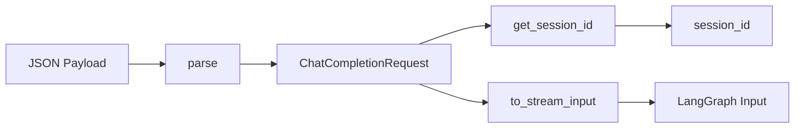
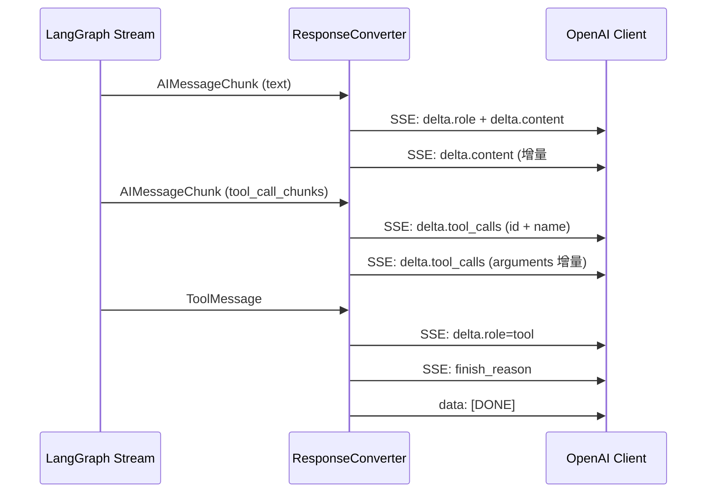
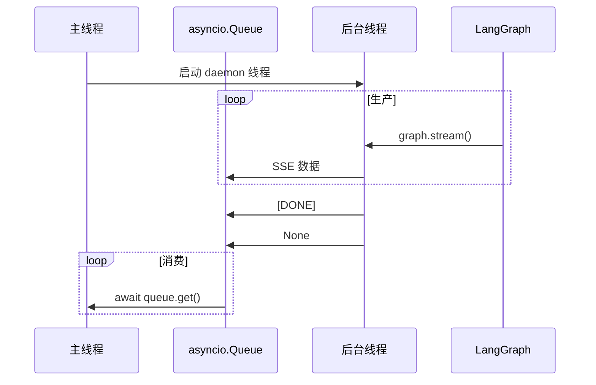

本页面详细介绍系统与 OpenAI Chat Completions API 的兼容层设计与实现。该兼容层允许开发者可直接使用 OpenAI 生态的客户端工具与集成方案，实现与 LangGraph 工作流的无缝对接。

## 架构总览

OpenAI 兼容层采用三层设计，实现了 **OpenAI 标准协议 ↔ 协议转换层 ↔ LangGraph 执行引擎

的完整适配层采用分层架构设计，主要包含三个核心模块：类型定义层负责数据模型，请求转换器负责将 OpenAI 格式请求转换为 LangGraph 输入格式，响应转换器负责将 LangGraph 输出转换为 OpenAI 标准响应格式。

```mermaid
graph TD
    A[OpenAI Client] -->|HTTP Request
    B[OpenAI兼容层] -->|SSE/JSON| A
    C[LangGraph Engine] -->|Message Stream| B
    B -->|Graph Input| C
    
    subgraph B [OpenAI Compatibility Layer
        direction TB
        B1[RequestConverter]
        B2[ResponseConverter]
        B3[OpenAIChatHandler]
    end
    
    B1 -->|parse payload| B3
    B3 -->|stream input| C
    C -->|langgraph stream| B2
    B2 -->|OpenAI format| B3
```

Sources: [handler.py](src/utils/openai/handler.py#L1-L299)

## 数据类型定义

类型定义模块提供完整的 OpenAI Chat Completions API 数据结构，采用 dataclass 实现并提供序列化方法。

### 请求类型

| 类名 | 说明 | 核心字段 |
|------|------|----------|
| `ChatMessage` | 聊天消息 | role, content, tool_calls, tool_call_id |
| `ChatCompletionRequest` | 完成请求 | messages, model, stream, session_id, temperature, max_tokens |

`session_id` 为扩展字段，用于关联 LangGraph 的会话状态。

Sources: [request.py](src/utils/openai/types/request.py#L1-L25)

### 响应类型

响应类型分为流式与非流式两种模式，同时支持工具调用与错误格式：

| 类名 | 说明 | 适用场景 |
|------|------|----------|
| `ChatCompletionChunk` | 流式响应块 | SSE 流式输出 |
| `ChatCompletionResponse` | 非流式响应 | 单次响应模式 |
| `Delta` | 流式增量数据 | 流式内容块内容 |
| `ToolCallChunk` | 工具调用增量 | 流式工具调用参数 |
| `OpenAIErrorResponse` | 错误响应 | 异常处理 |

所有类型均提供 `to_dict()` 方法用于 JSON 序列化。

Sources: [response.py](src/utils/openai/types/response.py#L1-L179)

## 请求转换器

`RequestConverter` 负责将 OpenAI 请求 payload 转换为 LangGraph 可执行的输入格式。

### 核心转换流程



### 多模态内容处理

转换器支持多种内容类型的转换与处理：

| 内容类型 | 处理方式 | 输出格式 |
|----------|----------|----------|
| text | 直接传递 | `{"type": "text", "text": content}` |
| image_url | URL + 文本描述 | text + image_url 双条目 |
| video_url | URL + 文本描述 | text + video_url 双条目 |
| audio_url | URL 文本 | text 类型 |
| file_url | 按文件类型分类处理 | 文本提取或类型映射

文件 URL 处理会自动推断文件类型，并对文档类文件自动提取文本内容，图片/视频文件转换为对应的 media 类型。

Sources: [request_converter.py](src/utils/openai/converter/request_converter.py#L1-L166)

### 会话消息策略

**重要设计决策：兼容层**仅提取最后一条 user 消息**传递给 LangGraph，历史消息由 `session_id` + Checkpointer 机制管理，避免消息重复处理并确保状态一致性。

```python
# 找到最后一条 user 消息
last_user_msg: ChatMessage | None = None
for msg in reversed(request.messages):
    if msg.role == "user":
        last_user_msg = msg
        break
```

Sources: [request_converter.py](src/utils/openai/converter/request_converter.py#L50-L60)

## 响应转换器

`ResponseConverter` 将 LangGraph 的消息流转换为 OpenAI 标准格式，支持流式和非流式两种模式。

### 流式响应处理

流式响应采用 SSE 格式，支持文本增量和工具调用参数流式输出：



### 工具调用流式实现

工具调用参数采用**增量累加模式，每个工具调用的参数逐字符输出，确保与 OpenAI 行为完全一致：

1. **初始块：发送工具调用的 `id` 和 `name`
2. **后续块：仅发送 `arguments` 增量
3. **结束块：发送 `finish_reason="tool_calls"`

内部使用 `_current_tool_calls` 字典维护每个 index 状态，按索引追踪各工具调用的累积参数状态。

Sources: [response_converter.py](src/utils/openai/converter/response_converter.py#L158-L258)

### 非流式响应收集

非流式模式下，转换器会完整收集所有消息，按顺序排列到 `choices` 数组中：

```mermaid
flowchart TD
    A[LangGraph Stream] --> B{消息收集器
    B --> C[assistant 消息累积
    B --> D[tool_calls 累积
    B --> E[ToolMessage 触发 flush]
    C --> F[flush assistant 消息
    E --> F
    F --> G[ChatCompletionResponse]
```

Sources: [response_converter.py](src/utils/openai/converter/response_converter.py#L320-L468)

## 核心处理器

`OpenAIChatHandler` 是兼容层的统一入口，协调请求路由、流式/非流式分支处理、错误处理。

### 处理流程

```mermaid
flowchart TD
    A[Request Payload] --> B[parse request]
    B --> C{session_id 存在?}
    C -->|否| D[返回 400 错误]
    C -->|是| E[转换输入
    E --> F{stream?}
    F -->|是| G[流式处理
    F -->|否| H[非流式处理
    G --> I[StreamingResponse]
    H --> J[JSONResponse]
```

Sources: [handler.py](src/utils/openai/handler.py#L29-L85)

### 异步线程架构

流式响应采用**生产者-消费者模式实现后台线程执行 LangGraph 同步流

主线程维护 asyncio.Queue 实现跨线程数据传递：



关键实现要点：

- 使用 `contextvars.copy_context()` 确保上下文变量跨线程传递

- `loop.call_soon_threadsafe() 线程安全队列操作

- daemon=True 守护线程守护线程不阻塞进程退出

- `asyncio.CancelledError` 处理客户端断开连接

Sources: [handler.py](src/utils/openai/handler.py#L87-L168)

## 错误处理机制

兼容层提供统一的错误分类与格式化机制：

| 错误分类 | OpenAI error_type | HTTP 状态码 |
|-----------|-------------------|-----------|
| Invalid/BadRequest | invalid_request_error | 400 |
| TimeOut | timeout_error | 408 |
| NotFound | not_found_error | 404 |
| 默认 | 其他 | internal_error | 500 |

流式模式下的错误通过 SSE 数据块发送，非流式模式下错误通过 JSON 标准 JSON 响应发送。

Sources: [handler.py](src/utils/openai/handler.py#L237-L273)

## 与系统集成

兼容层与系统其他模块的调用方式：

```python
from utils.openai import OpenAIChatHandler

# 初始化
handler = OpenAIChatHandler(graph_service)

# FastAPI 路由中使用
@app.post("/v1/chat/completions")
async def chat_completions(payload: Dict, ctx: Context):
    return await handler.handle(payload, ctx)
```

相关内容边界说明：

- 参阅 [LLM配置管理](18-llmpei-zhi-guan-li) 配置底层模型参数

- 参阅 [流式响应与取消机制](23-liu-shi-xiang-ying-yu-qu-xiao-ji-zhi) 了解取消处理

- 参阅 [错误分类与处理](20-cuo-wu-fen-lei-yu-chu-li) 系统错误分类体系