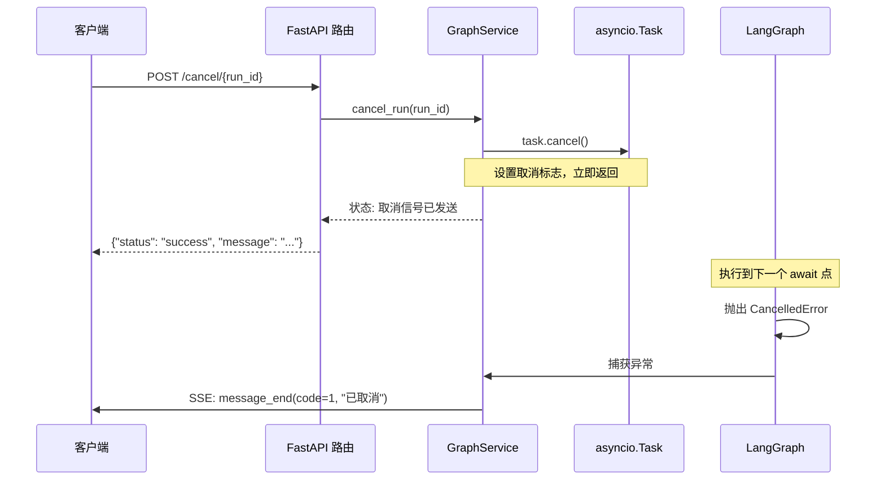
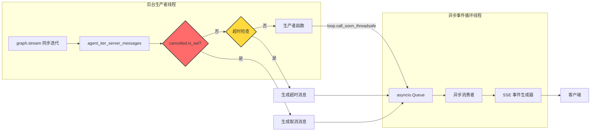

本文档详细阐述 futureself 项目中的流式响应设计与异步任务取消机制，包括架构原理、线程安全实现与协议规范。该机制为长时运行的工作流提供了实时反馈能力和优雅的中断控制。

## 核心架构原理

流式响应与取消机制基于三层架构实现：**任务注册与追踪**、**异步事件驱动**、**标准化消息协议**。系统通过 `running_tasks` 字典维护所有活跃任务的引用，利用 Python `asyncio` 的标准取消机制实现协作式中断，并通过 SSE (Server-Sent Events) 协议向客户端推送实时状态。

```mermaid
flowchart TD
    A[客户端请求] --> B{请求类型}
    B -->|同步| C[/run 端点/]
    B -->|流式| D[/stream_run 端点/]
    
    C --> E[创建 asyncio.Task]
    D --> F[创建 StreamingResponse]
    
    E --> G[注册到 running_tasks]
    F --> H[注册到 running_tasks]
    
    G --> I[graph.ainvoke 执行]
    H --> J[astream 生产者-消费者队列]
    
    K[/cancel/{run_id} 端点/] --> L[查找 running_tasks]
    L --> M{任务是否存在}
    M -->|是| N[task.cancel() 触发 CancelledError]
    M -->|否| O[返回 not_found]
    
    N --> P[在 await 点抛出异常]
    P --> Q[捕获 CancelledError]
    Q --> R[发送 MESSAGE_END 消息]
    
    J --> S[后台线程拉取同步流]
    S --> T[通过 asyncio.Queue 跨线程通信]
    T --> U[转换为 SSE 事件]
    
    style N fill:#ff6b6b,stroke:#333,stroke-width:2px
    style Q fill:#4ecdc4,stroke:#333,stroke-width:2px
    style T fill:#ffe66d,stroke:#333,stroke-width:2px
```

系统采用**协作式取消**而非抢占式中断，这意味着取消操作会在下一个 `await` 点生效，确保资源能够被正确释放。
Sources: [main.py](src/main.py#L44-L220)

## 任务注册与追踪机制

所有可取消任务在启动时必须注册到全局 `running_tasks` 字典中，键为 `run_id`，值为 `asyncio.Task` 对象。该字典由 `GraphService` 维护，支持并发访问。

| 执行模式 | 注册时机 | 取消触发点 | 清理机制 |
|---------|---------|-----------|---------|
| `run` (同步) | 创建 task 后立即注册 | `graph.ainvoke` 内部 await | `finally` 块中移除 |
| `stream_run` (流式) | `cancellable_stream` 协程内 | 异步迭代器的 `__anext__` | `finally` 块中移除 |
| `run_node` (节点) | 内部执行 | 不支持外部取消 | 自动清理 |

**关键实现**：对于流式请求，`StreamingResponse` 在后台运行生成器，因此必须在生成器内部通过 `asyncio.current_task()` 获取当前任务并注册。

```python
async def cancellable_stream():
    task = asyncio.current_task()
    if task:
        service.running_tasks[run_id] = task
    # ... 流式逻辑
```
Sources: [main.py](src/main.py#L450-L476)

## 异步取消协议

取消机制完全基于 Python `asyncio` 标准协议，通过 `task.cancel()` 发送取消信号，目标任务在下一个 `await` 点接收到 `asyncio.CancelledError` 异常。

### 取消流程

1. **触发阶段**：调用 `task.cancel()` 设置任务的取消标志
2. **传递阶段**：任务在下一个 `await` 时检测到标志并抛出 `CancelledError`
3. **处理阶段**：捕获异常，发送取消结束消息，清理资源
4. **确认阶段**：向客户端返回取消确认状态



**取消语义**：`task.cancel()` 是异步非阻塞操作，返回仅表示取消信号已发送，不代表任务已终止。任务实际终止时间取决于内部 `await` 点的分布。
Sources: [main.py](src/main.py#L193-L218)

## 流式响应实现

流式响应采用**生产者-消费者模式**，通过后台线程拉取同步流并通过 `asyncio.Queue` 安全地桥接到异步事件循环。

### 跨线程通信架构

由于 LangGraph 的 `stream()` 方法返回同步迭代器，系统使用独立线程拉取数据，通过 `loop.call_soon_threadsafe()` 实现线程安全的异步队列写入。



### 双路取消机制

流式响应实现了**双路取消**确保完整性：
1. **消费者端**：捕获 `asyncio.CancelledError`，设置 `cancelled` 事件通知生产者
2. **生产者端**：每次迭代前检查 `cancelled` 事件，若已设置则停止拉取并发送取消消息

```python
# 消费者端取消处理
except asyncio.CancelledError:
    cancelled.set()  # 通知生产者停止
    raise

# 生产者端取消检查
for sm in server_msgs_iter:
    if cancelled.is_set():
        # 发送取消结束消息
        return
```
Sources: [main.py](src/main.py#L250-L327)

## 消息协议规范

流式消息遵循标准化的 `ServerMessage` 协议，通过 `type` 字段区分消息类型，`sequence_id` 保证消息顺序。

### 消息类型定义

| 消息类型 | type 值 | 用途 | finish 语义 |
|---------|---------|------|------------|
| 消息开始 | `message_start` | 标识流式响应开始 | 恒为 True |
| 回答内容 | `answer` | 流式输出的文本内容 | True=流结束 |
| 思考过程 | `thinking` | 模型推理的中间思考 | True=思考结束 |
| 工具请求 | `tool_request` | 工具调用请求 | 恒为 True |
| 工具响应 | `tool_response` | 工具执行结果 | 恒为 True |
| 消息结束 | `message_end` | 标识流正常/异常结束 | 恒为 True |
| 错误 | `error` | 执行过程中的错误 | 恒为 True |

### 取消与结束码

| 结束码 | code 值 | 含义 | 触发场景 |
|-------|---------|------|---------|
| 成功 | `"0"` | 正常执行完成 | 工作流无异常结束 |
| 用户取消 | `"1"` | 用户主动取消 | 调用 `/cancel/{run_id}` 端点 |
| 超时 | `"TIMEOUT"` | 执行超时 | 超过 `TIMEOUT_SECONDS` (900秒) |
| 错误 | 错误码字符串 | 执行异常 | 内部错误或异常 |

```python
# 取消消息示例
ServerMessage(
    type=MESSAGE_TYPE_MESSAGE_END,
    content=ServerMessageContent(
        message_end=MessageEndDetail(
            code=MESSAGE_END_CODE_CANCELED,  # "1"
            message="Stream cancelled by user",
            time_cost_ms=1234,
            token_cost=TokenCost(...)
        )
    )
)
```
Sources: [server.py](src/utils/messages/server.py#L1-L174)

## SSE 协议格式

所有流式响应通过 SSE 协议传输，事件类型固定为 `message`，数据为 JSON 序列化的 `ServerMessage` 对象。

### 事件格式

```
event: message
data: {
  "type": "message_end",
  "session_id": "xxx",
  "query_msg_id": "yyy",
  "reply_id": "zzz",
  "sequence_id": 5,
  "finish": true,
  "content": {
    "message_end": {
      "code": "1",
      "message": "Stream cancelled by user",
      "time_cost_ms": 5000,
      "token_cost": {
        "input_tokens": 100,
        "output_tokens": 50,
        "total_tokens": 150
      }
    }
  },
  "log_id": "aaa"
}

```

**重要约定**：客户端必须按 `sequence_id` 顺序处理消息，乱序可能导致状态不一致。每个流式会话的 `reply_id` 保持一致，用于标识同一次响应过程。
Sources: [main.py](src/main.py#L126-L127)

## 超时保护机制

系统实现了**双重超时保护**确保鲁棒性：

| 保护层级 | 实现方式 | 超时阈值 | 触发行为 |
|---------|---------|---------|---------|
| 同步调用 | `asyncio.wait_for` | 900秒 | 取消任务并返回超时响应 |
| 流式调用 | 生产者循环时间检查 | 900秒 | 生成超时结束消息并终止流 |

```python
# 流式超时检查
if time.time() - start_time > TIMEOUT_SECONDS:
    timeout_msg = create_message_end_dict(
        code="TIMEOUT",
        message=f"Execution timeout: exceeded {TIMEOUT_SECONDS} seconds",
        # ...
    )
    loop.call_soon_threadsafe(q.put_nowait, timeout_msg)
    return
```
Sources: [main.py](src/main.py#L43, L286-L299)

## 异常处理与错误分类

取消机制与错误分类系统深度集成，确保取消事件与真实错误能够被正确区分。

| 异常类型 | 处理方式 | 客户端表现 |
|---------|---------|-----------|
| `asyncio.CancelledError` | 捕获并发送取消结束消息 | 收到 `code="1"` 的 message_end |
| `asyncio.TimeoutError` | 取消任务并返回超时状态 | 收到 TIMEOUT 错误码 |
| 其他异常 | 通过 `ErrorClassifier` 分类 | 收到对应错误码的 error 消息 |

**最佳实践**：节点开发中不应捕获 `asyncio.CancelledError` 而不重新抛出，这会破坏取消机制的传播。如需清理资源，应在 `finally` 块中执行。
Sources: [main.py](src/main.py#L343-L374)

---

**下一步参考**：
- 了解消息协议完整定义：[消息协议定义](21-xiao-xi-xie-yi-ding-yi)
- 学习错误分类机制：[错误分类与处理](20-cuo-wu-fen-lei-yu-chu-li)
- 探索 HTTP 服务架构：[HTTP服务启动](4-httpfu-wu-qi-dong)