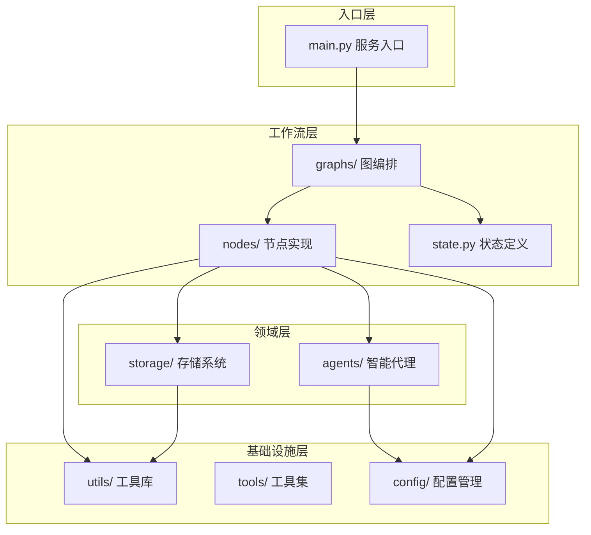
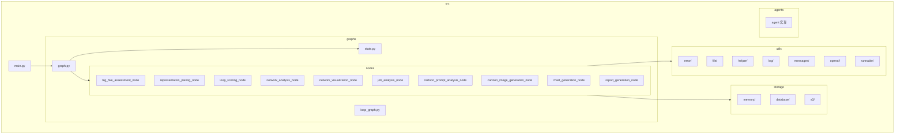
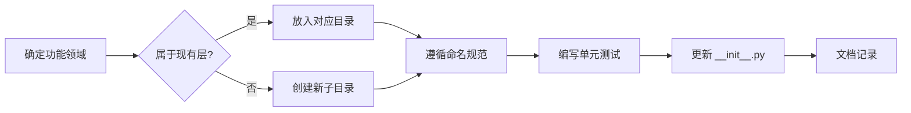

本文档定义了 FutureSelf 项目的标准目录结构、模块组织原则和文件命名规范，为开发人员提供统一的架构参考。本项目采用**领域驱动设计（DDD）**结合**LangGraph 工作流编排**的架构模式，确保代码的可维护性、可扩展性和团队协作效率。

## 整体架构概览

项目采用分层架构设计，遵循"高内聚、低耦合"原则，将不同功能模块清晰分离。



**架构层次说明：**
- **入口层**：HTTP 服务启动、请求路由、生命周期管理
- **工作流层**：LangGraph 图定义、节点编排、状态流转
- **领域层**：业务逻辑核心，包含代理逻辑和数据持久化
- **基础设施层**：通用工具、跨领域功能、配置管理

Sources: [main.py](src/main.py#L1-L667), [graph.py](src/graphs/graph.py#L1-L83)

## 目录结构标准

### 根目录结构

```
.
├── src/                    # 核心源代码目录
├── config/                 # LLM 配置文件目录
├── scripts/                # 运行脚本目录
├── assets/                 # 静态资源目录
├── .zread/wiki/drafts/     # 文档草稿目录
├── pyproject.toml          # 项目依赖配置
├── requirements.txt        # Python 依赖列表
└── README.md               # 项目说明文档
```

**根目录职责划分：**

| 目录/文件 | 职责描述 | 命名规范 |
|---------|---------|---------|
| `src/` | 存放所有 Python 源代码 | 小写字母，下划线分隔 |
| `config/` | 存放 LLM 模型配置、系统参数 | JSON 格式，后缀 `_cfg.json` |
| `scripts/` | 存放启动、部署脚本 | shell/python 脚本 |
| `assets/` | 存放图片、PDF、文档等资源 | 语义化命名 |
| `pyproject.toml` | 现代 Python 项目配置 | 固定名称 |

Sources: [pyproject.toml](pyproject.toml#L1-L171)

### src 源代码目录详解



**src 子目录职责：**

| 目录 | 职责描述 | 关键文件 |
|-----|---------|---------|
| `graphs/` | LangGraph 工作流编排核心 | `graph.py`, `state.py`, `loop_graph.py` |
| `graphs/nodes/` | 工作流节点具体实现 | `*_node.py`（11 个节点） |
| `storage/` | 数据持久化层 | `memory_saver.py`, `db.py`, `s3_storage.py` |
| `utils/` | 跨模块通用工具 | `helper/`, `log/`, `error/`, `openai/` |
| `agents/` | Coze 智能代理实现 | 动态加载的代理模块 |

Sources: [目录结构](src/)

### graphs 工作流目录

工作流层是项目的核心编排引擎，采用 LangGraph 状态图模式。

```
src/graphs/
├── __init__.py          # 包初始化
├── graph.py             # 主工作流图定义
├── loop_graph.py        # 循环图定义（特殊场景）
├── state.py             # 全局状态 & 输入输出定义
└── nodes/               # 节点实现目录
    ├── __init__.py
    ├── big_five_assessment_node.py
    ├── cartoon_image_generation_node.py
    ├── cartoon_prompt_analysis_node.py
    ├── chart_generation_node.py
    ├── job_analysis_node.py
    ├── loop_scoring_node.py
    ├── network_analysis_node.py
    ├── network_visualization_node.py
    ├── report_generation_node.py
    ├── representation_pairing_node.py
    └── single_pair_scoring_node.py
```

**图编排规范：**
1. **文件命名**：主图文件名为 `graph.py`，节点文件后缀为 `_node.py`
2. **状态定义**：统一在 `state.py` 中定义 `GlobalState`、`GraphInput`、`GraphOutput`
3. **节点注册**：在 `graph.py` 中通过 `builder.add_node()` 注册所有节点
4. **边连接**：明确的线性或条件边定义，使用 `builder.add_edge()`

Sources: [graph.py](src/graphs/graph.py#L1-L83), [state.py](src/graphs/state.py#L1-L318)

### utils 工具库目录

工具库采用按功能领域划分的模块化设计，每个子目录专注于单一职责。

```
src/utils/
├── __init__.py
├── error/              # 错误分类与处理
│   ├── classifier.py   # 错误分类器
│   ├── codes.py        # 错误码定义
│   ├── exceptions.py   # 自定义异常
│   └── patterns.py     # 错误模式匹配
├── file/               # 文件操作
│   └── file.py         # File 类定义与操作
├── helper/             # 辅助函数
│   ├── agent_helper.py # 代理相关辅助
│   └── graph_helper.py # 图操作辅助
├── log/                # 日志系统
│   ├── config.py       # 日志配置
│   ├── node_log.py     # 节点日志
│   ├── parser.py       # 日志解析
│   └── write_log.py    # 日志写入
├── messages/           # 消息协议
│   ├── client.py       # 客户端消息
│   └── server.py       # 服务端消息
├── openai/             # OpenAI 兼容层
│   ├── handler.py      # 请求处理
│   ├── converter/      # 请求/响应转换
│   └── types/          # 类型定义
└── runnable/           # 可运行包装
    └── wrapper.py      # Runnable 装饰器
```

**工具模块设计原则：**
- **单一职责**：每个子目录只负责一个特定领域
- **无状态**：工具函数应尽可能无副作用
- **可测试**：错误分类、日志解析等核心逻辑包含单元测试
- **跨模块复用**：所有业务模块均可调用 utils，避免循环依赖

Sources: [graph_helper.py](src/utils/helper/graph_helper.py#L1-L232)

### storage 存储目录

存储系统采用策略模式，支持多种后端实现。

```
src/storage/
├── __init__.py
├── memory/             # 内存存储
│   ├── __init__.py
│   └── memory_saver.py # 内存检查点实现
├── database/           # 数据库存储
│   ├── __init__.py
│   ├── db.py           # 数据库连接与操作
│   └── shared/
│       └── model.py    # 共享数据模型
└── s3/                 # 对象存储
    ├── __init__.py
    └── s3_storage.py   # S3 兼容存储实现
```

**存储架构规范：**
- **统一接口**：所有存储实现遵循相同的操作接口
- **可插拔**：通过配置切换存储后端，无需修改业务代码
- **分层设计**：存储层不包含业务逻辑，仅负责数据持久化

Sources: [storage 目录](src/storage/)

### config 配置目录

配置文件采用标准化 JSON 格式，用于 LLM 调用参数和提示词管理。

```
config/
├── big_five_assessment_llm_cfg.json
├── cartoon_portrait_analysis_llm_cfg.json
├── cartoon_prompt_analysis_llm_cfg.json
├── report_generation_llm_cfg.json
└── scoring_llm_cfg.json
```

**配置文件结构标准：**
```json
{
    "config": {
        "model": "模型名称",
        "temperature": 0.7,
        "top_p": 0.9,
        "max_completion_tokens": 2000
    },
    "tools": [],
    "sp": "系统提示词",
    "up": "用户提示词模板"
}
```

**命名规范**：`{业务场景}_llm_cfg.json`

Sources: [big_five_assessment_llm_cfg.json](config/big_five_assessment_llm_cfg.json#L1-L12)

## 文件命名规范

### Python 模块命名

| 类型 | 命名规范 | 示例 |
|------|---------|------|
| 模块文件 | 小写+下划线（snake_case） | `graph_helper.py`, `node_log.py` |
| 类名 | 大驼峰（PascalCase） | `GraphService`, `ErrorClassifier` |
| 函数名 | 小写+下划线 | `get_graph_instance()`, `stream_sse()` |
| 常量 | 全大写下划线 | `TIMEOUT_SECONDS`, `LOG_FILE` |
| 节点文件 | 语义化名称 + `_node.py` | `big_five_assessment_node.py` |

### 配置与资源文件

| 类型 | 命名规范 | 示例 |
|------|---------|------|
| LLM 配置 | `{场景}_llm_cfg.json` | `report_generation_llm_cfg.json` |
| Shell 脚本 | 小写+下划线 | `local_run.sh`, `setup.sh` |
| 图片资源 | 语义化命名 | `network_structure.png`, `image_20260508234702882.png` |
| 文档 | 中文描述 + 扩展名 | `引导语.docx`, `报告参考.docx` |

## 模块导入规范

### 导入层级原则

按以下顺序组织导入语句：

1. **标准库导入**：Python 内置模块（`json`, `asyncio`, `logging` 等）
2. **第三方库导入**：外部依赖（`fastapi`, `langgraph`, `pydantic` 等）
3. **内部模块导入**：项目内部模块（相对或绝对导入）

**正确示例（源自 main.py）：**
```python
# 标准库
import argparse
import asyncio
import json
import logging

# 第三方库
from fastapi import FastAPI, HTTPException
from langchain_core.runnables import RunnableConfig
from langgraph.graph import StateGraph, END

# 内部模块
from utils.helper import graph_helper
from utils.log.node_log import LOG_FILE
from utils.error import ErrorClassifier
```

Sources: [main.py](src/main.py#L1-L30)

### 跨模块引用规则

1. **禁止循环依赖**：utils 层不应引用 graphs 层或 agents 层
2. **单向依赖**：graphs → utils, storage → utils, agents → utils
3. **显式导入**：避免使用 `from module import *`，明确导入所需对象
4. **类型注解**：使用 `TYPE_CHECKING` 解决运行时循环导入问题

## 新增模块开发流程

当需要新增功能模块时，遵循以下流程：



## 后续建议

掌握项目结构规范后，建议继续阅读：

- [节点开发规范](25-jie-dian-kai-fa-gui-fan)：了解工作流节点的编码标准
- [配置文件编写指南](26-pei-zhi-wen-jian-bian-xie-zhi-nan)：学习 LLM 配置文件格式
- [调试与日志分析](27-diao-shi-yu-ri-zhi-fen-xi)：掌握问题排查方法