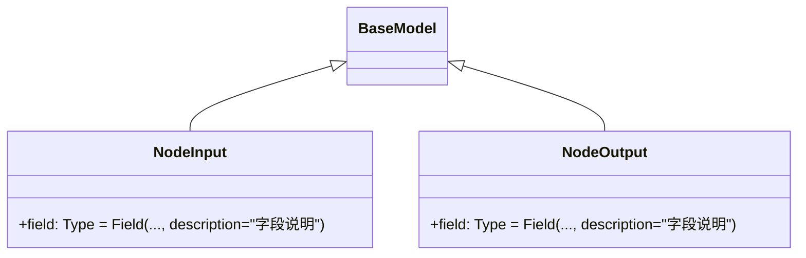

本规范定义了未来自我画像系统中工作流节点的开发标准和最佳实践。所有节点必须遵循统一的架构模式，确保系统的可维护性和可扩展性。

## 节点文件结构

### 目录与命名规范

所有节点文件统一存放于 `src/graphs/nodes/` 目录下，采用以下命名规则：

| 类型 | 命名规则 | 示例 |
|------|----------|------|
| 文件名 | `{功能描述}_node.py`（蛇形命名） | `big_five_assessment_node.py` |
| 主函数名 | 与文件名同名（蛇形命名） | `def big_five_assessment_node(...)` |
| 输入状态类 | `{功能描述}Input`（帕斯卡命名） | `class BigFiveAssessmentInput(BaseModel)` |
| 输出状态类 | `{功能描述}Output`（帕斯卡命名） | `class BigFiveAssessmentOutput(BaseModel)` |

Sources: [big_five_assessment_node.py](src/graphs/nodes/big_five_assessment_node.py#L1)

### 文件结构模板

每个节点文件应包含以下结构：

```python
"""
节点功能描述
详细说明该节点的职责和处理逻辑
"""

# 导入依赖（按顺序：标准库、第三方库、本地模块）
import os
import json
from typing import Dict, Any
from langchain_core.runnables import RunnableConfig
from langgraph.runtime import Runtime
from coze_coding_utils.runtime_ctx.context import Context
from graphs.state import NodeInput, NodeOutput


def node_name(
    state: NodeInput,
    config: RunnableConfig,
    runtime: Runtime[Context]
) -> NodeOutput:
    """
    title: 节点显示名称
    desc: 节点功能描述
    integrations: 依赖的外部服务（如：大语言模型、图像生成API等）
    """
    ctx = runtime.context
    
    # 业务逻辑处理
    
    return NodeOutput(...)


# 私有辅助函数（下划线开头）
def _helper_function():
    """辅助函数说明"""
    pass
```

Sources: [representation_pairing_node.py](src/graphs/nodes/representation_pairing_node.py#L1-L49)

## 函数签名与参数规范

### 标准函数签名

所有节点函数必须遵循统一的三参数签名：

```python
def node_name(
    state: NodeInput,        # 节点输入状态
    config: RunnableConfig,  # LangChain 运行配置
    runtime: Runtime[Context]  # LangGraph 运行时上下文
) -> NodeOutput:
```

### 参数说明

| 参数 | 类型 | 用途 |
|------|------|------|
| `state` | 继承自 `BaseModel` | 包含节点执行所需的所有输入数据 |
| `config` | `RunnableConfig` | 提供运行时元数据，如 LLM 配置路径 |
| `runtime` | `Runtime[Context]` | 提供执行上下文，可获取日志、追踪等 |

Sources: [big_five_assessment_node.py](src/graphs/nodes/big_five_assessment_node.py#L56-L64)

## 文档字符串规范

节点主函数的文档字符串必须包含以下元数据字段，用于图编排系统的可视化展示：

| 字段 | 说明 | 示例 |
|------|------|------|
| `title` | 节点在流程图中显示的名称 | "大五人格评估" |
| `desc` | 节点功能的简短描述 | "基于五点量表评估用户大五人格特质" |
| `integrations` | 依赖的外部服务 | "大语言模型" 或 "无" |

```python
def big_five_assessment_node(...):
    """
    title: 大五人格评估
    desc: 基于五点量表评估用户的大五人格特质，仅输出人格特征分析
    integrations: 大语言模型
    """
```

Sources: [loop_scoring_node.py](src/graphs/nodes/loop_scoring_node.py#L25-L30)

## 输入输出状态定义

### 状态定义位置

所有节点的输入输出状态必须在 `src/graphs/state.py` 中统一定义，使用 Pydantic `BaseModel`。

### 状态定义规范



每个状态字段必须包含：
1. **类型注解**：明确字段的数据类型
2. **默认值**：使用 `...` 表示必填，使用默认值表示可选
3. **description**：字段用途的详细说明

```python
class BigFiveAssessmentInput(BaseModel):
    """大五人格评估节点的输入"""
    user_name: str = Field(..., description="用户姓名")
    big_five_answers: Dict[str, int] = Field(
        default={},
        description="大五人格问卷回答，格式：{'N1': 4, 'N2': 3, ...}"
    )
```

Sources: [state.py](src/graphs/state.py#L265-L280)

## LLM 调用规范

对于需要调用大语言模型的节点，遵循以下规范：

### 配置读取

```python
# 从 config 元数据中读取配置文件路径
cfg_file = os.path.join(os.getenv("COZE_WORKSPACE_PATH"), config['metadata']['llm_cfg'])
with open(cfg_file, 'r') as fd:
    _cfg = json.load(fd)

llm_config = _cfg.get("config", {})
sp = _cfg.get("sp", "")  # System Prompt
up = _cfg.get("up", "")  # User Prompt 模板
```

Sources: [big_five_assessment_node.py](src/graphs/nodes/big_five_assessment_node.py#L73-L82)

### LLM 客户端初始化

```python
llm_client = LLMClient(
    model=llm_config.get("model", "doubao-seed-1-8-251228"),
    temperature=llm_config.get("temperature", 0.7),
    max_tokens=llm_config.get("max_completion_tokens", 2000),
    thinking=llm_config.get("thinking", "disabled")
)
```

### 消息构建与调用

```python
messages = [
    SystemMessage(content=sp),
    HumanMessage(content=prompt)
]

response = llm_client.invoke(messages)
```

### 响应解析与容错

必须处理多种响应格式，并提供降级策略：

```python
try:
    # 解析响应内容（处理多种格式）
    if isinstance(response.content, str):
        analysis_text = response.content.strip()
    elif isinstance(response.content, list):
        # 处理多部分内容
        pass
    
    # 解析 JSON（处理 Markdown 代码块包裹）
    if "```json" in analysis_text:
        json_start = analysis_text.find("```json") + 7
        json_end = analysis_text.find("```", json_start)
        analysis_text = analysis_text[json_start:json_end].strip()
    
    return json.loads(analysis_text)
    
except Exception as e:
    # 降级策略：返回默认值或本地计算结果
    return _get_default_result()
```

Sources: [big_five_assessment_node.py](src/graphs/nodes/big_five_assessment_node.py#L200-L238)

## 错误处理与降级策略

### 异常捕获原则

1. **必须捕获** LLM 调用、文件操作、网络请求等可能失败的操作
2. **必须提供** 降级方案，确保工作流不中断
3. **必须记录** 异常信息，便于问题排查

### 降级策略示例

```python
try:
    return llm_client.invoke(messages)
except Exception as e:
    # 降级：使用基于规则的本地计算
    return {
        dim: {
            "score": data.get("score", 0),
            "level": data.get("level", ""),
            "description": _get_default_description(dim, score)
        }
        for dim, data in big_five_scores.items()
    }
```

Sources: [big_five_assessment_node.py](src/graphs/nodes/big_five_assessment_node.py#L236-L248)

## 辅助函数规范

### 命名与可见性

- **私有辅助函数**：使用下划线前缀命名，如 `_calculate_big_five_scores`
- **公共工具函数**：无下划线前缀，可被外部调用，如 `get_big_five_questionnaire`

### 功能单一原则

每个辅助函数应只负责一项具体功能：

| 函数名 | 职责 |
|--------|------|
| `_calculate_big_five_scores` | 计算大五人格评分 |
| `_generate_personality_analysis` | 调用 LLM 生成分析 |
| `_get_default_description` | 获取默认描述文本 |

Sources: [big_five_assessment_node.py](src/graphs/nodes/big_five_assessment_node.py#L113-L138)

## 节点注册流程

完成节点开发后，需在主图中注册：

### 1. 导入节点

在 `src/graphs/graph.py` 中导入节点函数：

```python
from graphs.nodes.big_five_assessment_node import big_five_assessment_node
```

### 2. 添加节点到图

```python
# 基础节点
builder.add_node("node_key", node_function)

# 需要 LLM 配置的节点
builder.add_node("node_key", node_function, metadata={
    "type": "agent",
    "llm_cfg": "config/node_llm_cfg.json"
})
```

### 3. 添加边连接

```python
# 线性连接
builder.add_edge("previous_node", "current_node")

# 连接到结束节点
builder.add_edge("current_node", END)
```

Sources: [graph.py](src/graphs/graph.py#L16-L76)

## 性能优化建议

### 批次处理

对于需要多次调用 LLM 的场景，采用批次处理减少 API 调用次数：

```python
BATCH_SIZE = 15  # 每批处理数量
num_batches = (total_items + BATCH_SIZE - 1) // BATCH_SIZE

for batch_idx in range(num_batches):
    batch_data = items[batch_idx * BATCH_SIZE : (batch_idx + 1) * BATCH_SIZE]
    # 批次处理逻辑
```

Sources: [loop_scoring_node.py](src/graphs/nodes/loop_scoring_node.py#L37-L45)

### 缓存策略

对于重复计算的结果，可在节点内部进行缓存（需谨慎使用，避免状态不一致）。

## 开发检查清单

开发完成后，请对照以下清单进行检查：

- [ ] 文件命名符合 `*_node.py` 规范
- [ ] 函数签名包含 `state`、`config`、`runtime` 三个参数
- [ ] 文档字符串包含 `title`、`desc`、`integrations` 字段
- [ ] 输入输出状态在 `state.py` 中定义并使用 `Field` 描述
- [ ] LLM 调用有异常捕获和降级策略
- [ ] 私有辅助函数使用下划线前缀
- [ ] 已在 `graph.py` 中导入并注册节点
- [ ] 已添加正确的边连接

## 下一步

完成节点开发后，建议阅读：
- [图编排机制](8-tu-bian-pai-ji-zhi) 了解节点如何组合成工作流
- [配置文件编写指南](26-pei-zhi-wen-jian-bian-xie-zhi-nan) 学习 LLM 配置文件格式
- [调试与日志分析](27-diao-shi-yu-ri-zhi-fen-xi) 掌握节点调试技巧