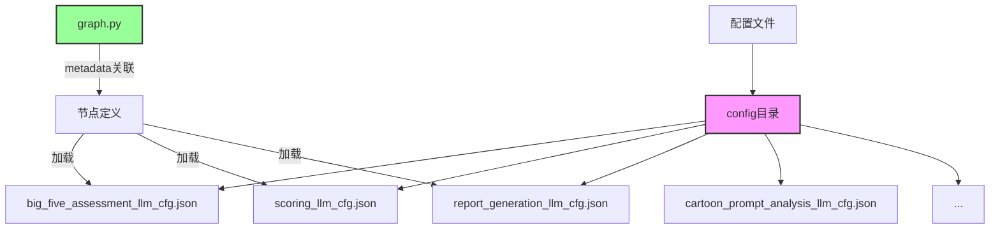
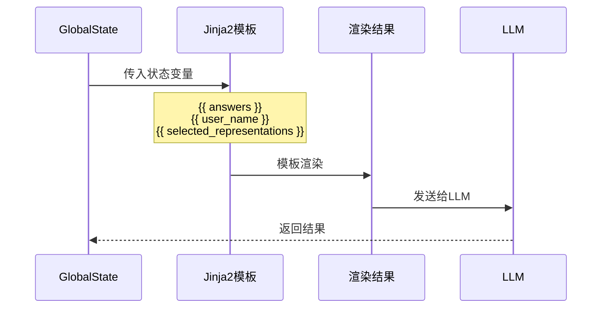

本指南详细介绍 futureself 项目中 LLM 配置文件的编写规范、结构定义和最佳实践。配置文件用于定义各节点的大语言模型行为，是连接业务逻辑与 AI 能力的核心桥梁。

## 配置文件体系概述

futureself 项目采用节点化配置管理模式，每个使用 LLM 的节点对应一个独立的配置文件。这种设计确保了配置的模块化管理，便于针对不同业务场景进行精细化调优。



配置文件统一存放在 `config/` 目录下，通过 graph.py 中的 metadata 属性与具体节点关联。

Sources: [graph.py](src/graphs/graph.py#L17-L50)

## 配置文件结构规范

所有 LLM 配置文件遵循统一的 JSON 结构规范，包含三个核心字段：

| 字段 | 类型 | 必填 | 说明 |
|------|------|------|------|
| `config` | Object | 是 | 模型运行参数配置 |
| `sp` | String | 是 | 系统提示词（System Prompt） |
| `up` | String | 是 | 用户提示词模板（User Prompt） |
| `tools` | Array | 否 | 工具调用配置数组 |

### config - 模型参数配置

`config` 字段定义大语言模型的运行时参数：

```json
{
  "config": {
    "model": "doubao-seed-1-8-251228",
    "temperature": 0.7,
    "top_p": 0.9,
    "max_completion_tokens": 2000,
    "thinking": "disabled"
  }
}
```

| 参数 | 类型 | 推荐值范围 | 业务场景建议 |
|------|------|------------|--------------|
| `model` | String | - | 指定使用的模型标识 |
| `temperature` | Number | 0.1-1.0 | 分析类任务用较低值(0.3)，创作类任务用较高值(0.7) |
| `top_p` | Number | 0.0-1.0 | 通常保持 0.9，控制输出多样性 |
| `max_completion_tokens` | Number | 1000-10000 | 报告生成用较大值(10000)，简单分析用较小值 |
| `thinking` | String | disabled/enabled | 启用思维链模式 |

Sources: [big_five_assessment_llm_cfg.json](config/big_five_assessment_llm_cfg.json#L1-L6)

### sp - 系统提示词

系统提示词定义 AI 的角色定位、专业知识和行为准则。建议包含以下要素：

1. **角色定义**：明确 AI 的身份和专业领域
2. **专业知识**：列出所需的领域知识背景
3. **任务边界**：定义 AI 应该做什么、不应该做什么
4. **输出格式**：指定返回数据的格式要求

**示例**：
```json
{
  "sp": "你是专业的心理学分析师，专注于大五人格特质评估。\n\n# 专业知识\n你熟悉大五人格模型（Big Five Personality Model）的理论基础：\n- **神经质（Neuroticism）**：情绪不稳定、焦虑、敏感、担忧\n- **严谨性（Conscientiousness）**：有条理、负责任、自律\n..."
}
```

Sources: [big_five_assessment_llm_cfg.json](config/big_five_assessment_llm_cfg.json#L8)

### up - 用户提示词模板

用户提示词支持 **Jinja2 模板语法**，通过 `{{ variable_name }}` 引用状态数据。在节点执行时，模板会被实际数据渲染替换。

**模板渲染流程**：


**示例**：
```json
{
  "up": "请分析用户的大五人格特质。\n\n问卷回答（1-5分，已正向化处理）：\n{{answers}}\n\n请输出JSON格式的分析结果..."
}
```

Sources: [report_generation_node.py](src/graphs/nodes/report_generation_node.py#L53-L77)

## 配置文件关联机制

配置文件通过图编排文件与节点进行关联，遵循"配置分离、运行时注入"的设计原则。

### 在 graph.py 中关联配置

在节点注册时，通过 `metadata` 属性指定配置文件路径：

```python
builder.add_node(
    "big_five_assessment", 
    big_five_assessment_node, 
    metadata={"type": "agent", "llm_cfg": "config/big_five_assessment_llm_cfg.json"}
)
```

**metadata 属性说明**：
| 属性 | 说明 | 示例值 |
|------|------|--------|
| `type` | 节点类型标识 | "agent" |
| `llm_cfg` | 配置文件相对路径 | "config/big_five_assessment_llm_cfg.json" |

Sources: [graph.py](src/graphs/graph.py#L28)

### 节点内加载配置

节点内部通过 `config['metadata']['llm_cfg']` 获取配置文件路径，结合环境变量构建完整路径后加载：

```python
def big_five_assessment_node(state, config, runtime):
    # 构建配置文件完整路径
    cfg_file = os.path.join(os.getenv("COZE_WORKSPACE_PATH"), config['metadata']['llm_cfg'])
    
    # 加载配置
    with open(cfg_file, 'r') as fd:
        _cfg = json.load(fd)
    
    # 提取配置项
    llm_config = _cfg.get("config", {})
    sp = _cfg.get("sp", "")
    up = _cfg.get("up", "")
```

Sources: [big_five_assessment_node.py](src/graphs/nodes/big_five_assessment_node.py#L97-L106)

## 场景化配置最佳实践

根据不同节点的业务特性，采用差异化的配置策略可以显著提升输出质量。

### 1. 分析评估类配置（大五人格评估）

**特点**：要求精确、客观、结构化输出

**推荐配置**：
| 参数 | 值 | 理由 |
|------|-----|------|
| temperature | 0.7 | 保持一定创造性但不过度发散 |
| max_completion_tokens | 2000 | 分析内容长度适中 |
| 输出格式 | JSON | 便于后续程序处理 |

Sources: [big_five_assessment_llm_cfg.json](config/big_five_assessment_llm_cfg.json)

### 2. 评分计算类配置（表征评分）

**特点**：要求一致性、可重复性、严格遵循评分标准

**推荐配置**：
| 参数 | 值 | 理由 |
|------|-----|------|
| temperature | 0.3 | 降低随机性，保证评分一致性 |
| max_completion_tokens | 2000 | 评分结果简洁 |
| 输出格式 | JSON数组 | 批量处理结构化输出 |

Sources: [scoring_llm_cfg.json](config/scoring_llm_cfg.json)

### 3. 报告生成类配置（完整报告）

**特点**：要求内容丰富、逻辑连贯、个性化程度高

**推荐配置**：
| 参数 | 值 | 理由 |
|------|-----|------|
| temperature | 0.7 | 保证报告的文采和个性化 |
| max_completion_tokens | 10000 | 报告内容较长，需要充足 token |
| 输出格式 | Markdown | 结构化文档，便于转换为 PDF |

Sources: [report_generation_llm_cfg.json](config/report_generation_llm_cfg.json)

## 模板变量引用规范

用户提示词模板中可引用状态对象中的属性，引用时需遵循以下规范：

### 可用变量列表

| 节点 | 可引用变量 |
|------|-----------|
| 大五人格评估 | `{{ answers }}` |
| 报告生成 | `{{ user_name }}`, `{{ user_gender }}`, `{{ user_education }}`, `{{ user_major }}`, `{{ selected_representations }}`, `{{ big_five_scores }}`, `{{ correlation_scores }}`, `{{ recommended_jobs }}`, `{{ cartoon_portrait }}` 等 |
| 卡通形象分析 | `{{ user_info }}` |

### 模板语法注意事项

1. **变量存在性**：确保引用的变量在节点输入状态中存在
2. **类型匹配**：复杂对象在模板中会自动调用 `__str__` 或 `repr()` 方法
3. **过滤器使用**：Jinja2 过滤器可用，如 `{{ selected_representations | join(", ") }}`
4. **换行处理**：JSON 字符串中的换行使用 `\n` 表示

Sources: [report_generation_node.py](src/graphs/nodes/report_generation_node.py#L53-L77)

## 配置文件校验与调试

### 配置校验清单

在提交新配置文件前，请确认：

- [ ] JSON 格式合法，无语法错误
- [ ] 所有必填字段（`config`, `sp`, `up`）都存在
- [ ] `model` 参数使用正确的模型标识
- [ ] `temperature` 值在 0.1-1.0 合理范围内
- [ ] 模板变量引用与节点输入状态匹配
- [ ] 系统提示词明确定义了角色边界
- [ ] 无多余的 trailing commas

### 调试建议

1. **使用样例数据测试**：将模板变量替换为实际值，直接测试提示词效果
2. **分阶段验证**：先测试短文本输出，再测试复杂结构化输出
3. **边界场景测试**：验证空输入、异常输入时的配置行为
4. **日志追踪**：通过 [日志系统设计](19-ri-zhi-xi-tong-she-ji) 查看实际调用的完整提示词

## 下一步

完成配置文件编写后，建议阅读：
- [节点开发规范](25-jie-dian-kai-fa-gui-fan) 了解如何在节点中使用配置
- [LLM配置管理](18-llmpei-zhi-guan-li) 深入学习配置管理架构
- [调试与日志分析](27-diao-shi-yu-ri-zhi-fen-xi) 掌握配置效果验证方法