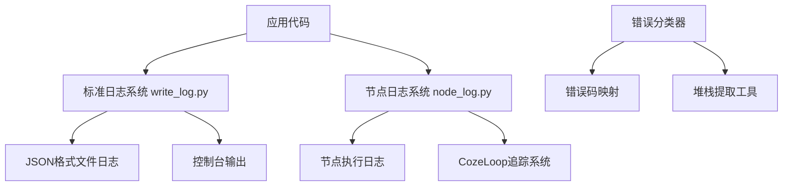
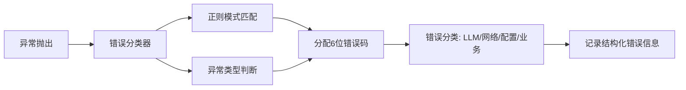
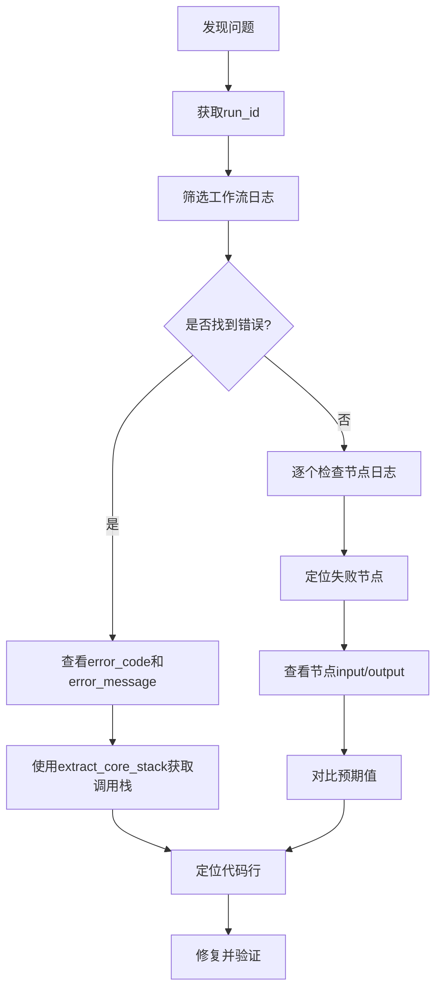

本页面提供系统日志系统的详细使用指南，帮助开发者快速定位和解决运行时问题。本文档面向中级开发者，涵盖日志配置、格式分析、调试技巧和错误追踪等核心内容。

## 日志系统架构

本系统采用**双层日志架构**，同时提供结构化日志记录和执行轨迹追踪能力：



**核心组件说明：**

| 组件 | 功能定位 | 主要用途 |
|------|---------|---------|
| `write_log.py` | 标准Python logging封装 | 应用运行日志、系统级事件记录 |
| `node_log.py` | 工作流节点专用日志 | 节点执行追踪、输入输出快照 |
| `loop_trace.py` | CozeLoop集成 | 可视化执行轨迹分析 |
| `err_trace.py` | 堆栈提取工具 | 过滤噪声，定位业务代码问题 |
| `classifier.py` | 错误分类器 | 自动分配6位错误码，便于统计分析 |

Sources: [write_log.py](src/utils/log/write_log.py#L1-L186)
Sources: [node_log.py](src/utils/log/node_log.py#L1-L488)

## 日志配置

### 环境变量配置

通过以下环境变量控制日志系统行为：

| 环境变量 | 默认值 | 说明 |
|---------|--------|------|
| `LOG_LEVEL` | `INFO` | 日志级别：DEBUG, INFO, WARNING, ERROR |
| `COZE_LOG_DIR` | `/tmp/app/work/logs/bypass` | 日志文件存储目录 |
| `COZE_PROJECT_ENV` | - | 设置为 `PROD` 时生产环境禁用日志 |
| `COZE_LOOP_API_TOKEN` | - | CozeLoop追踪系统API令牌 |
| `COZE_PROJECT_SPACE_ID` | - | CozeLoop工作空间ID |

Sources: [config.py](src/utils/log/config.py#L1-L11)

### 日志初始化

在应用启动时，日志系统会自动初始化：

```python
setup_logging(
    log_file=LOG_FILE,
    max_bytes=100 * 1024 * 1024,  # 单文件最大100MB
    backup_count=5,                # 保留5个备份文件
    log_level=LOG_LEVEL,
    use_json_format=True,          # 生产环境使用JSON格式
    console_output=True            # 同时输出到控制台
)
```

**滚动策略：** 当日志文件达到100MB时自动滚动，最多保留5个历史日志文件（`app.log.1`, `app.log.2` 等）。

Sources: [main.py](src/main.py#L1-L40)

## 日志格式与字段

### JSON日志格式

每条日志记录为独立的JSON行，包含以下核心字段：

```json
{
  "timestamp": "2024-01-01 12:00:00",
  "level": "INFO",
  "logger": "module.name",
  "message": "日志消息内容",
  "log_id": "uuid-string",
  "run_id": "execution-trace-id",
  "space_id": "project-space",
  "project_id": "project-identifier",
  "method": "stream_sse",
  "lineno": 42,
  "funcName": "function_name"
}
```

### 关键字段说明

| 字段 | 说明 | 调试价值 |
|------|------|---------|
| `log_id` | 请求级追踪ID | 关联单次请求的所有日志 |
| `run_id` | 工作流执行ID | 追踪整个工作流生命周期 |
| `node_id` | 节点标识 | 定位问题发生的具体节点 |
| `latency` | 执行耗时(ms) | 性能分析与瓶颈定位 |
| `input`/`output` | 节点输入输出 | 数据流转问题排查 |
| `error_code` | 6位错误码 | 错误分类与统计 |

Sources: [write_log.py](src/utils/log/write_log.py#L44-L88)

## 工作流执行日志

系统为工作流的每个阶段生成详细的执行日志：

### 工作流开始日志

```json
{
  "type": "run_start",
  "message": "Workflow started - Run",
  "project_id": "project-id",
  "execute_mode": "run",
  "input": "{...序列化的输入数据...}",
  "log_id": "...",
  "run_id": "..."
}
```

### 节点执行日志

每个节点的开始和结束都会记录：

```json
{
  "type": "node_start",
  "message": "Node 'big_five_assessment' started",
  "node_id": "node_uuid",
  "node_name": "big_five_assessment",
  "node_type": "agent",
  "node_title": "大五人格评估",
  "input": "..."
}
```

```json
{
  "type": "node_end",
  "message": "Node 'big_five_assessment' ended",
  "latency": 1250,
  "output": "...",
  "token": "3456"
}
```

### 工作流结束日志

```json
{
  "type": "done",
  "message": "Workflow completed - success",
  "latency": 8500,
  "status": "success",
  "token": "15680",
  "output": "..."
}
```

Sources: [node_log.py](src/utils/log/node_log.py#L130-L360)

## 错误日志与追踪

### 错误分类系统

系统内置6位错误码分类器，自动为异常分配错误码：



**错误码结构：**
- `1XXXXX` - LLM调用错误
- `2XXXXX` - 网络与API错误  
- `3XXXXX` - 配置与参数错误
- `4XXXXX` - 业务逻辑错误
- `5XXXXX` - 系统内部错误

### 错误日志格式

发生错误时，日志包含完整的错误上下文：

```json
{
  "level": "error",
  "message": "Workflow node_id ended with error",
  "node_id": "node_uuid",
  "node_name": "big_five_assessment",
  "error_code": "100001",
  "error_message": "LLM API timeout after 30s",
  "type": "error",
  "latency": 30500
}
```

Sources: [classifier.py](src/utils/error/classifier.py#L1-L150)

### 智能堆栈提取

`extract_core_stack()` 函数自动过滤噪声堆栈，只保留业务代码相关的调用栈：

**过滤规则：**
- 移除Python标准库调用
- 移除第三方库（site-packages）调用
- 移除异步框架（asyncio）内部调用
- 保留最近5帧核心调用

```python
from utils.log.err_trace import extract_core_stack

try:
    risky_operation()
except Exception:
    stack_lines = extract_core_stack(lines_num=5)
    for line in stack_lines:
        logger.error(line)
```

**输出示例：**
```
Traceback (most recent call last):
  File "graphs/nodes/assessment.py", line 156, in big_five_assessment
    result = await llm.ainvoke(prompt)
  File "utils/llm/client.py", line 89, in ainvoke
    response = await self._call_api(payload)
LLMTimeoutError: Request timed out after 30s
```

Sources: [err_trace.py](src/utils/log/err_trace.py#L1-L88)

## 调试技巧

### 启用调试日志

临时提升日志级别以获取详细信息：

```bash
# 启动时设置DEBUG级别
LOG_LEVEL=DEBUG python src/main.py
```

### 使用追踪ID定位问题

每个工作流执行有唯一的 `run_id`，可用于筛选关联日志：

```bash
# Linux/Mac: 按run_id筛选日志
grep '"run_id": "execution-123"' /tmp/app/work/logs/bypass/app.log | jq .

# Windows PowerShell
Get-Content app.log | Select-String "execution-123" | ConvertFrom-Json
```

### 节点级调试

通过节点名称筛选日志，分析特定节点的执行情况：

```bash
# 筛选特定节点的日志
grep '"node_name": "big_five_assessment"' app.log | jq '{type, latency, message}'
```

### 性能分析

分析节点执行耗时：

```bash
# 提取所有node_end事件的耗时
grep '"type": "node_end"' app.log | jq -r '[.node_name, .latency] | @tsv' | sort -k2 -rn
```

## 常见问题排查

### 问题1: 日志不写入

**诊断步骤：**
1. 检查目录权限：`ls -ld /tmp/app/work/logs/bypass`
2. 验证 `COZE_PROJECT_ENV` 不是 `PROD`（生产环境默认关闭日志）
3. 查看标准错误输出中是否有日志写入失败信息

**解决方案：**
```python
# 在代码中验证日志路径
from utils.log.config import LOG_DIR
print(f"Log directory: {LOG_DIR}, exists: {LOG_DIR.exists()}")
```

### 问题2: 日志上下文丢失

**现象：** `log_id` 和 `run_id` 字段为空

**原因：** 跨线程/协程时上下文变量未正确传递

**解决方案：**
```python
# 确保在新协程中传递request_context
from utils.log.write_log import request_context

async def background_task(ctx_data):
    request_context.set(ctx_data)
    # 执行任务
```

### 问题3: 日志文件过大

**检查方法：**
```bash
# 查看日志文件大小
ls -lh /tmp/app/work/logs/bypass/

# 分析大字段
grep -o '"input":"[^"]\{1000,\}' app.log | head -5
```

**配置调整：**
- 减小 `max_bytes` 参数
- 在节点日志中移除不必要的大字段
- 生产环境关闭详细输入输出记录

### 问题4: CozeLoop追踪不显示

**检查清单：**
- `COZE_LOOP_API_TOKEN` 是否正确配置
- `COZE_PROJECT_SPACE_ID` 是否匹配
- 网络是否能访问 `COZE_LOOP_BASE_URL`
- 检查日志中是否有LoopTracer初始化信息

Sources: [loop_trace.py](src/utils/log/loop_trace.py#L1-L73)

## 日志分析实战流程

完整的问题排查流程：



**分析脚本示例（Python）：**

```python
import json
from collections import defaultdict

def analyze_workflow(run_id: str, log_file: str):
    """分析指定run_id的执行情况"""
    nodes = defaultdict(dict)
    workflow = {"start": None, "end": None, "status": "unknown"}
    
    with open(log_file) as f:
        for line in f:
            entry = json.loads(line)
            if entry.get("run_id") == run_id:
                if entry.get("type") == "run_start":
                    workflow["start"] = entry["timestamp"]
                elif entry.get("type") in ["done", "error"]:
                    workflow["end"] = entry["timestamp"]
                    workflow["status"] = entry["type"]
                elif entry.get("type") in ["node_start", "node_end"]:
                    node_name = entry["node_name"]
                    nodes[node_name][entry["type"]] = entry
    
    return {"workflow": workflow, "nodes": dict(nodes)}
```

Sources: [main.py](src/main.py#L1-L200)

## 下一步

- 了解错误分类机制，请参考 [错误分类与处理](20-cuo-wu-fen-lei-yu-chu-li)
- 了解流式执行的取消机制，请参考 [流式响应与取消机制](23-liu-shi-xiang-ying-yu-qu-xiao-ji-zhi)
- 遇到运行时问题，查阅 [故障排查手册](32-gu-zhang-pai-cha-shou-ce)
- 需要性能优化建议，请参考 [性能优化建议](28-xing-neng-you-hua-jian-yi)