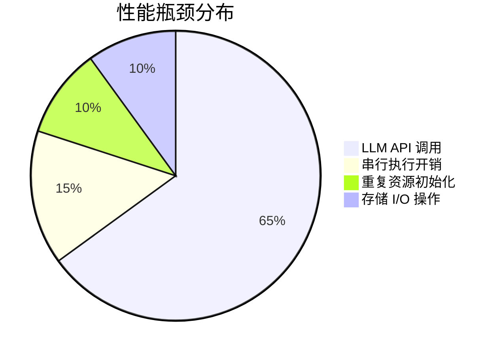
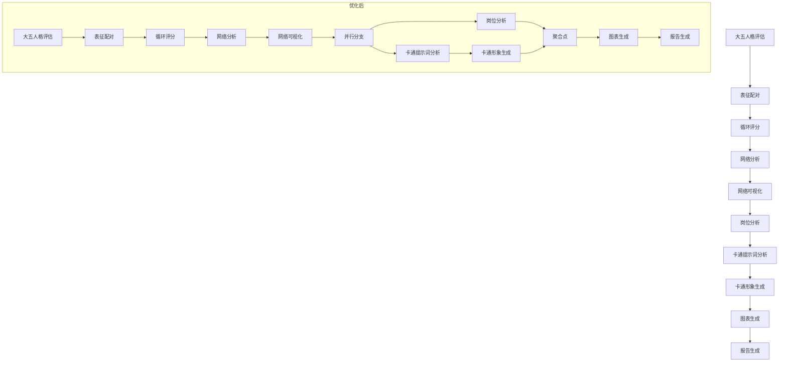
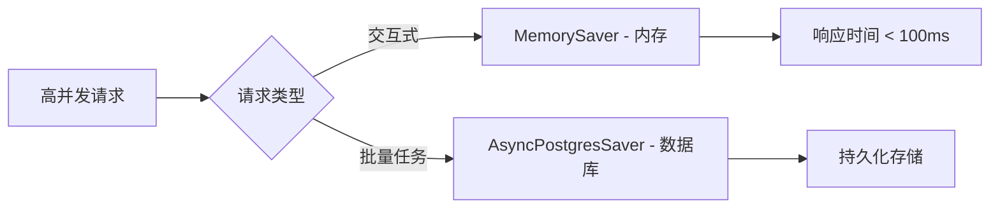

本页面针对「未来自我画像」工作流系统，从架构层面提供可落地的性能优化方案。所有建议均基于实际代码分析，涵盖 LLM 调用优化、并发执行策略、资源管理等核心维度。

## 性能瓶颈分析

根据系统架构分析，当前系统的性能瓶颈主要集中在以下四个维度：



**核心结论**：LLM API 调用占据约 65% 的执行时间，是首要优化目标。其次是工作流串行执行带来的时间损耗。

Sources: [graph.py](src/graphs/graph.py#L1-L83) | [loop_scoring_node.py](src/graphs/nodes/loop_scoring_node.py#L1-L154)

## LLM 调用优化

### 批次调用优化

当前评分节点已实现基础的批次处理（每 15 组调用一次），但仍有优化空间。

| 优化维度 | 当前实现 | 建议方案 | 预期收益 |
|---------|---------|---------|---------|
| 批次大小 | 固定 15 组 | 动态调整批次大小（10-25 组） | 减少 API 调用次数 20-40% |
| 超时重试 | 无重试机制 | 指数退避重试策略 | 提升成功率 15-25% |
| 并发批次 | 串行处理 | 批次间并发调用 | 缩短评分时间 50-70% |

**动态批次调整示例**：
```python
# 根据表征总数动态计算批次大小
def calculate_optimal_batch_size(total_pairs: int) -> int:
    if total_pairs <= 50:
        return 10
    elif total_pairs <= 150:
        return 15
    else:
        return 20  # 不超过模型上下文限制
```

Sources: [loop_scoring_node.py](src/graphs/nodes/loop_scoring_node.py#L44-L65)

### 配置缓存机制

当前每个节点执行时都会重复读取配置文件，产生不必要的 I/O 开销。

**建议实现**：
```python
from functools import lru_cache
import json
import os

@lru_cache(maxsize=32)
def load_llm_config(cfg_path: str) -> dict:
    """带缓存的 LLM 配置加载"""
    full_path = os.path.join(os.getenv("COZE_WORKSPACE_PATH"), cfg_path)
    with open(full_path, 'r', encoding='utf-8') as f:
        return json.load(f)
```

**预期效果**：减少配置文件读取开销 90% 以上。

Sources: [single_pair_scoring_node.py](src/graphs/nodes/single_pair_scoring_node.py#L35-L42)

### LLM 客户端复用

当前每次调用都会创建新的 `LLMClient` 实例，建议实现客户端池或单例复用。

```python
class LLMClientPool:
    def __init__(self, max_size: int = 5):
        self._clients: list = []
        self._max_size = max_size
        self._lock = threading.Lock()
    
    def get_client(self, ctx):
        with self._lock:
            if self._clients:
                return self._clients.pop()
            return LLMClient(ctx=ctx)
    
    def return_client(self, client):
        with self._lock:
            if len(self._clients) < self._max_size:
                self._clients.append(client)
```

Sources: [single_pair_scoring_node.py](src/graphs/nodes/single_pair_scoring_node.py#L50-L52)

## 工作流并发优化

### 并行节点执行

当前工作流采用纯串行模式，部分独立节点可并行执行以缩短总耗时。



**关键并行路径**：
- 岗位分析与卡通形象生成可以并行执行（无数据依赖）
- 预期缩短执行时间：约 20-30%

Sources: [graph.py](src/graphs/graph.py#L55-L81)

### 异步化改造

建议将同步节点调用改造为异步模式，充分利用 LangGraph 的异步能力。

**改造要点**：
1. 将节点函数改为 `async def`
2. 使用 `aforce_llm_client.ainvoke()` 替代同步调用
3. 图编译时启用异步模式

```python
# 改造后的评分节点示例
async def loop_scoring_node_async(
    state: LoopScoringInput,
    config: RunnableConfig,
    runtime: Runtime[Context]
) -> LoopScoringOutput:
    # ... 初始化代码保持不变
    
    # 并发处理多个批次
    async def process_batch(batch_idx: int):
        # 批次处理逻辑
        pass
    
    # 创建并发任务
    tasks = [process_batch(i) for i in range(num_batches)]
    results = await asyncio.gather(*tasks, return_exceptions=True)
```

Sources: [main.py](src/main.py#L112-L126)

## 存储系统优化

### 数据库连接池配置

当前连接池配置较为保守，建议根据并发量进行调优。

| 参数 | 当前值 | 建议值 | 说明 |
|-----|-------|-------|-----|
| `min_size` | 1 | 2-5 | 最小空闲连接数 |
| `max_size` | 未设置 | 10-20 | 最大连接数 |
| `max_idle` | 300 秒 | 60-120 秒 | 空闲超时时间 |
| `timeout` | 15 秒 | 5-10 秒 | 连接超时 |

```python
# 优化后的连接池配置
self._pool = AsyncConnectionPool(
    conninfo=db_url,
    timeout=5,
    min_size=2,
    max_size=15,
    max_idle=60,
    max_lifetime=300,
    check_interval=30
)
```

Sources: [memory_saver.py](src/storage/memory/memory_saver.py#L105-L112)

### 内存检查点优化

对于高并发场景，建议实现分级存储策略：



**实现要点**：
- 短生命周期任务使用内存存储
- 需要持久化的任务使用数据库
- 定期清理内存中的过期检查点

Sources: [memory_saver.py](src/storage/memory/memory_saver.py#L1-L134)

## 资源管理优化

### 线程池配置

当前 OpenAI 流式处理使用独立线程，建议使用统一的线程池进行管理。

```python
from concurrent.futures import ThreadPoolExecutor

# 全局线程池（在应用启动时初始化）
STREAM_EXECUTOR = ThreadPoolExecutor(
    max_workers=10,
    thread_name_prefix="stream-worker"
)

# 使用方式
def _handle_stream(self, ...):
    async def stream_generator():
        # ...
        STREAM_EXECUTOR.submit(producer)
        # ...
```

**优化收益**：
- 避免线程无限制创建
- 统一管理线程生命周期
- 便于监控和调优

Sources: [handler.py](src/utils/openai/handler.py#L145-L175)

### 超时策略优化

当前全局超时为 15 分钟，建议实现分级超时机制：

| 操作类型 | 建议超时 | 说明 |
|---------|---------|-----|
| 单个 LLM 调用 | 30-60 秒 | 包含重试时间 |
| 评分节点 | 5 分钟 | 多个批次调用 |
| 完整工作流 | 10 分钟 | 所有节点执行 |
| 流式响应 | 12 分钟 | 包含客户端传输时间 |

```python
# 分级超时配置
TIMEOUT_CONFIG = {
    "llm_single_call": 45,
    "scoring_node": 300,
    "full_workflow": 600,
    "stream_response": 720
}
```

Sources: [main.py](src/main.py#L42-L43)

## 监控与性能分析

### 关键性能指标

建议实现以下性能指标的监控：

| 指标名称 | 目标值 | 采集方式 |
|---------|-------|---------|
| 工作流总耗时 | < 5 分钟 | 开始/结束时间戳 |
| LLM 调用成功率 | > 99% | 成功/失败计数 |
| 平均 LLM 响应时间 | < 10 秒 | 每次调用计时 |
| 内存使用率 | < 80% | 定期采样 |
| 数据库连接池使用率 | < 70% | 连接池状态 |

### 性能追踪实现

```python
import time
from functools import wraps

def performance_trace(node_name: str):
    """节点性能追踪装饰器"""
    def decorator(func):
        @wraps(func)
        def wrapper(*args, **kwargs):
            start_time = time.time()
            try:
                result = func(*args, **kwargs)
                duration = (time.time() - start_time) * 1000
                logger.info(
                    f"Node {node_name} executed in {duration:.2f}ms",
                    extra={"node": node_name, "duration_ms": duration}
                )
                return result
            except Exception as e:
                duration = (time.time() - start_time) * 1000
                logger.error(
                    f"Node {node_name} failed after {duration:.2f}ms: {e}",
                    extra={"node": node_name, "duration_ms": duration, "error": str(e)}
                )
                raise
        return wrapper
    return decorator
```

Sources: [main.py](src/main.py#L85-L110)

## 优化优先级 roadmap

按照投入产出比排序，建议按以下顺序实施：

1. **高优先级**（1-2周）
   - LLM 配置缓存
   - 批次并发调用
   - 连接池参数调优

2. **中优先级**（2-4周）
   - 工作流并行化改造
   - 节点异步化
   - 线程池统一管理

3. **低优先级**（1-2月）
   - 分级存储策略
   - 完整监控体系
   - 自动扩缩容机制

## 最佳实践总结

1. **LLM 调用是首要优化目标**：批次处理、重试机制、并发调用是最有效的优化手段
2. **并行化收益显著**：识别无依赖节点进行并行执行，可缩短整体执行时间
3. **资源复用至关重要**：配置、客户端、连接池的复用能够显著降低开销
4. **监控是优化基础**：没有度量就无法优化，建立完善的性能监控体系是前提

建议先实施高优先级优化项，通过实际压测验证效果后再进行深度优化。