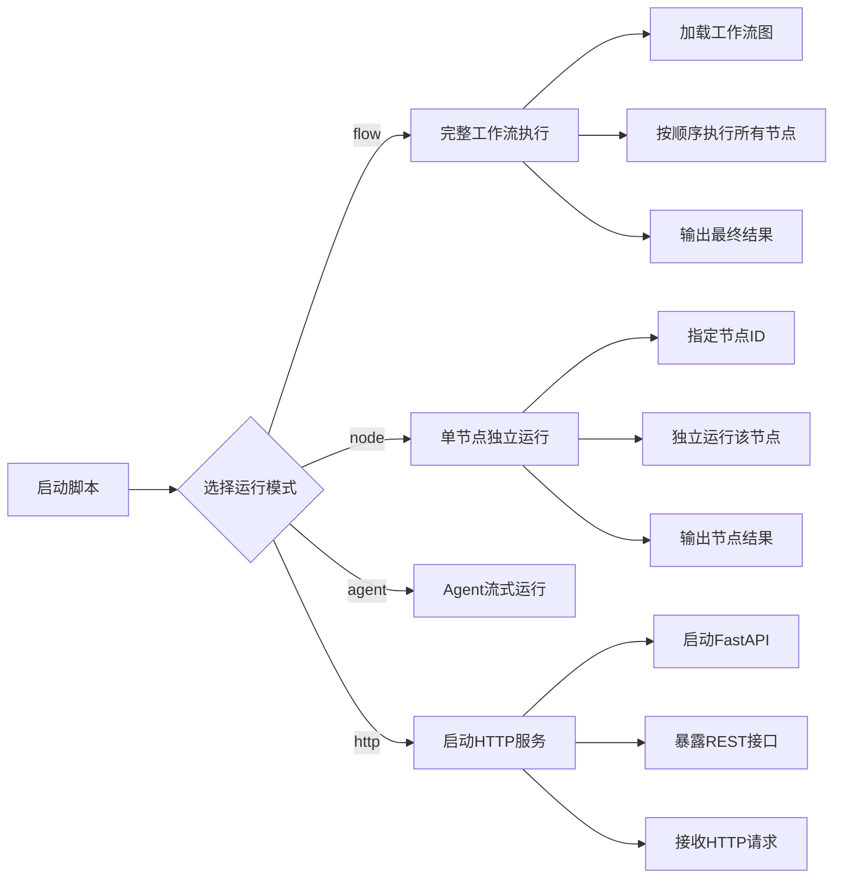
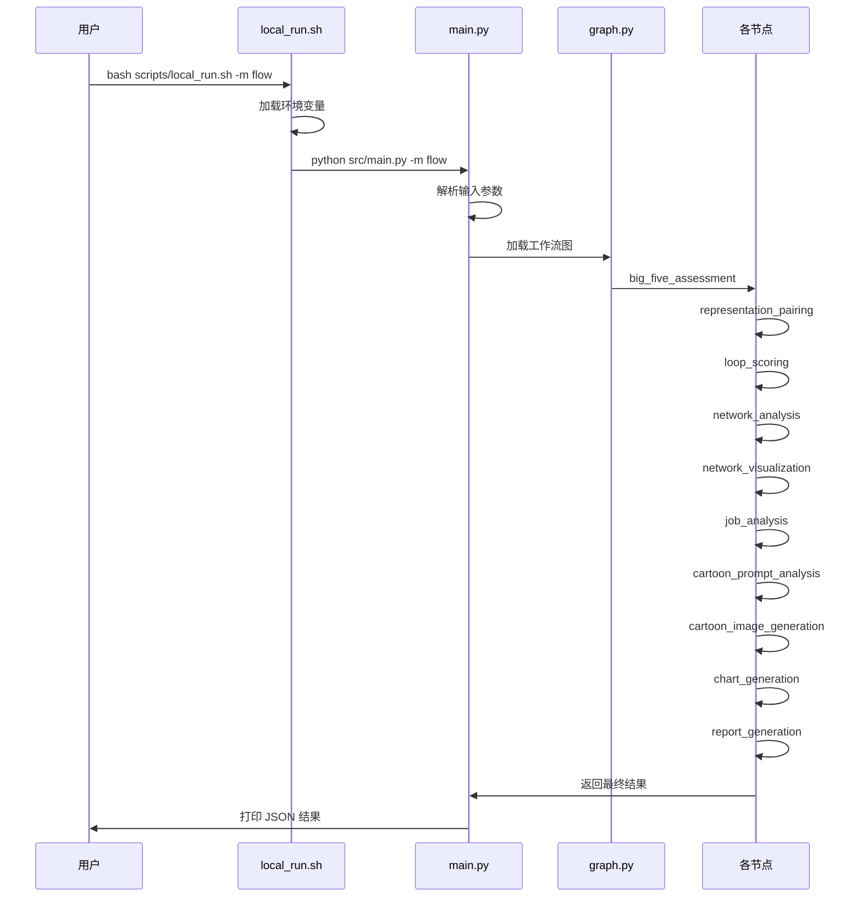

本页面将指导你如何在本地环境中运行"未来自我画像"项目，包括完整工作流执行、单节点调试等多种运行模式。

## 运行模式总览

项目支持四种运行模式，适用于不同的开发和测试场景：

| 模式 | 说明 | 适用场景 |
|------|------|----------|
| `flow` | 完整工作流运行 | 端到端测试、整体功能验证 |
| `node` | 单节点独立运行 | 节点开发调试、单元测试 |
| `agent` | Agent 流式运行 | 多轮对话、工具调用测试 |
| `http` | HTTP 服务模式 | 接口联调、前端对接 |



Sources: [local_run.sh](scripts/local_run.sh#L1-L76)

## 前置准备

在运行项目之前，请确保已完成环境配置：

1. **安装依赖**
   ```bash
   bash scripts/setup.sh
   ```
   
   安装脚本支持两种包管理方式：
   - **优先使用 uv**：如果系统安装了 uv 且存在 `pyproject.toml`，使用 uv 进行依赖管理
   - **回退到 pip**：否则使用 pip 从 `requirements.txt` 安装

2. **配置环境变量**
   运行脚本会自动加载环境变量配置，确保相关 API Key 和配置正确设置。

Sources: [setup.sh](scripts/setup.sh#L1-L35) [load_env.sh](scripts/load_env.sh#L1-L9)

## 完整工作流运行 (flow 模式)

### 使用场景

当你需要验证整个工作流程的正确性，或者进行端到端测试时，使用 flow 模式。

### 运行命令

```bash
# 基础运行（使用默认输入）
bash scripts/local_run.sh -m flow

# 带自定义输入（JSON 格式）
bash scripts/local_run.sh -m flow -i '{"text": "我是一个热爱技术的开发者"}'

# 带自定义输入（纯文本格式）
bash scripts/local_run.sh -m flow -i "我希望了解自己的性格特点"
```

### 执行流程



### 工作流节点顺序


Sources: [main.py](src/main.py#L634-L643) [graph.py](src/graphs/graph.py#L1-L83)

## 单节点独立运行 (node 模式)

### 使用场景

在开发和调试单个节点时，使用 node 模式可以独立运行指定节点，提高开发效率。

### 运行命令

```bash
# 运行指定节点（需要节点ID）
bash scripts/local_run.sh -m node -n node_id -i '{"key": "value"}'

# 示例：运行大五人格评估节点
bash scripts/local_run.sh -m node -n big_five_assessment -i '{"text": "测试输入"}'
```

### 可用节点列表

| 节点ID | 节点名称 | 说明 |
|--------|----------|------|
| `big_five_assessment` | 大五人格评估节点 | 对用户输入进行人格评估 |
| `representation_pairing` | 表征配对节点 | 将人格特质与表征进行配对 |
| `loop_scoring` | 循环评分节点 | 对表征配对结果进行评分 |
| `network_analysis` | 网络分析节点 | 进行社交网络分析 |
| `network_visualization` | 网络可视化节点 | 生成网络可视化图表 |
| `job_analysis` | 岗位分析节点 | 分析适合的岗位类型 |
| `cartoon_prompt_analysis` | 卡通提示词分析节点 | 生成卡通形象提示词 |
| `cartoon_image_generation` | 卡通形象生成节点 | 生成卡通形象图片 |
| `chart_generation` | 图表生成节点 | 生成各类数据图表 |
| `report_generation` | 报告生成节点 | 生成最终分析报告 |

### 执行原理

单节点运行时，系统会：
1. 动态创建一个仅包含目标节点的临时状态图
2. 设置该节点为入口点和出口点
3. 编译并运行临时图
4. 返回节点执行结果

Sources: [main.py](src/main.py#L223-L241) [local_run.sh](scripts/local_run.sh#L1-L76)

## Agent 流式运行 (agent 模式)

### 使用场景

当需要测试 Agent 的多轮对话能力和工具调用功能时，使用 agent 模式。

### 运行特性

- **流式输出**：实时返回每一步的执行结果
- **消息迭代**：按消息序列逐个返回
- **会话保持**：支持跨轮次会话状态保持

### 输出格式

流式运行会返回多种类型的消息：
- 节点执行状态消息
- 中间结果消息
- 工具调用消息
- 最终结束消息

Sources: [main.py](src/main.py#L645-L667)

## 命令行参数详解

### local_run.sh 参数

| 参数 | 必需 | 说明 | 示例 |
|------|------|------|------|
| `-m` | 是 | 运行模式：`http`, `flow`, `node`, `agent` | `-m flow` |
| `-n` | 否 | 节点ID（仅 node 模式需要） | `-n big_five_assessment` |
| `-i` | 否 | 输入数据，支持 JSON 字符串或纯文本 | `-i '{"text": "你好"}'` |
| `-h` | 否 | 显示帮助信息 | `-h` |

### 输入解析规则

1. **JSON 输入**：如果输入是有效的 JSON 字符串，将直接解析为字典
2. **纯文本输入**：如果不是有效的 JSON，将自动包装为 `{"text": "输入内容"}`
3. **默认输入**：如果不提供 `-i` 参数，使用默认值 `{"text": "你好"}`

Sources: [local_run.sh](scripts/local_run.sh#L10-L27) [main.py](src/main.py#L619-L629)

## 运行输出说明

### 输出格式

所有本地运行模式的输出均为格式化的 JSON，便于阅读和后续处理：

```json
{
  "status": "success",
  "result": {
    // 具体结果数据
  },
  "run_id": "xxx",
  "time_cost_ms": 1234
}
```

### 日志输出

运行过程中会同时输出日志到：
- **控制台**：实时显示运行状态和关键信息
- **日志文件**：详细运行日志，便于问题排查

Sources: [main.py](src/main.py#L27-L37)

## 常见问题与排查

### 问题：运行脚本提示"无效选项"

**原因**：参数顺序或格式错误
**解决**：检查参数格式，确保 `-m` 放在最前面
```bash
# 正确
bash scripts/local_run.sh -m flow -i '输入'

# 错误（参数顺序不对）
bash scripts/local_run.sh -i '输入' -m flow
```

### 问题：节点运行提示"node_id not found"

**原因**：节点ID拼写错误或不存在
**解决**：参考[可用节点列表](#可用节点列表)，确认节点ID正确

### 问题：JSON 输入解析失败

**原因**：输入格式不符合 JSON 规范
**解决**：
1. 使用单引号包裹 JSON 字符串
2. 确保引号正确转义
3. 或者直接使用纯文本输入

Sources: [local_run.sh](scripts/local_run.sh#L29-L40)

## 后续步骤

完成本地运行后，建议按以下顺序继续学习：

1. **[HTTP服务启动](4-httpfu-wu-qi-dong)** - 学习如何启动 HTTP 服务进行接口联调
2. **[输入参数说明](5-shu-ru-can-shu-shuo-ming)** - 详细了解各运行模式的输入参数
3. **[工作流总览](6-gong-zuo-liu-zong-lan)** - 深入理解工作流的整体架构
4. **[调试与日志分析](27-diao-shi-yu-ri-zhi-fen-xi)** - 学习如何调试和分析运行问题