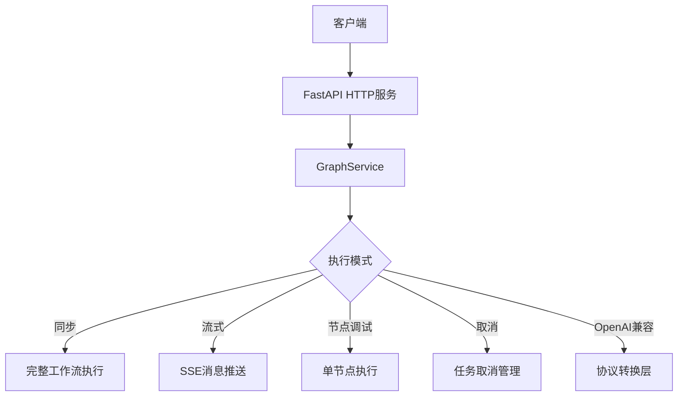

本文档详细介绍了"未来自我画像"系统提供的所有HTTP API接口，包括请求格式、响应格式、参数说明和调用示例。所有接口均基于RESTful规范设计，支持JSON数据格式。

## 接口总览

系统提供以下7个核心API接口，覆盖工作流执行、任务管理、节点调试等场景：

| 接口路径 | 方法 | 功能描述 |
|---------|------|---------|
| `/run` | POST | 同步执行完整工作流 |
| `/stream_run` | POST | 流式执行工作流（SSE格式） |
| `/cancel/{run_id}` | POST | 取消正在执行的任务 |
| `/node_run/{node_id}` | POST | 单独调试执行单个节点 |
| `/v1/chat/completions` | POST | OpenAI Chat Completions兼容接口 |
| `/health` | GET | 服务健康检查 |
| `/graph_parameter` | GET | 获取工作流输入输出Schema |



Sources: [main.py](src/main.py#L1-L667)

## 1. 同步执行工作流接口 `/run`

### 接口说明
同步执行完整的"未来自我画像"工作流，等待所有节点执行完成后返回最终结果。适用于后端服务调用场景。

### 请求格式
```http
POST /run
Content-Type: application/json
```

### 请求参数

| 参数名 | 类型 | 必填 | 说明 |
|-------|------|------|------|
| user_name | string | 是 | 用户姓名或唯一标识 |
| user_gender | string | 是 | 用户性别 |
| user_education | string | 是 | 用户学历 |
| user_major | string | 否 | 用户专业 |
| selected_representations | array[string] | 是 | 用户选择的表征列表（不超过25个） |
| personal_question_1 | string | 是 | 问题1：职业发展关心的问题 |
| personal_question_2 | string | 是 | 问题2：知识学习关心的问题 |
| personal_question_3 | string | 是 | 问题3：生活愿景关心的问题 |
| big_five_answers | object | 否 | 大五人格问卷40题回答 |

### 请求示例
```json
{
  "user_name": "张三",
  "user_gender": "男",
  "user_education": "本科",
  "user_major": "计算机科学",
  "selected_representations": ["创新能力", "团队协作", "领导力", "技术专长", "沟通表达"],
  "personal_question_1": "希望在3-5年内成为技术架构师",
  "personal_question_2": "关注人工智能领域的最新技术发展",
  "personal_question_3": "希望平衡工作与生活，实现自我价值",
  "big_five_answers": {
    "E1": 4, "E2": 3, "E3": 5, "E4": 4, "E5": 3, "E6": 4, "E7": 3, "E8": 4,
    "N1": 2, "N2": 3, "N3": 2, "N4": 3, "N5": 2, "N6": 3, "N7": 2, "N8": 3,
    "O1": 5, "O2": 4, "O3": 5, "O4": 4, "O5": 5, "O6": 4, "O7": 5, "O8": 4,
    "A1": 4, "A2": 4, "A3": 3, "A4": 4, "A5": 4, "A6": 3, "A7": 4, "A8": 4,
    "C1": 5, "C2": 5, "C3": 4, "C4": 5, "C5": 5, "C6": 4, "C7": 5, "C8": 5
  }
}
```

### 响应格式
| 字段名 | 类型 | 说明 |
|-------|------|------|
| final_report | string | 生成的完整职业规划报告（Markdown格式） |
| complementarity_score | float | 表征互补性评分 |
| conflict_score | float | 表征冲突性评分 |
| network_graph | object | 表征互补性网络图文件 |
| conflict_graph | object | 表征冲突性网络图文件 |
| radar_chart | object | 表征能力雷达图文件 |
| bar_chart | object | 岗位适配度柱状图文件 |
| cartoon_portrait | object | 卡通风格未来自我画像文件 |
| run_id | string | 任务执行ID，用于追踪和取消 |

### 错误响应
```json
{
  "detail": {
    "error_code": "VALIDATION_ERROR",
    "error_message": "selected_representations is required",
    "stack_trace": "..."
  }
}
```

Sources: [main.py](src/main.py#L338-L449) [state.py](src/graphs/state.py#L94-L132)

## 2. 流式执行工作流接口 `/stream_run`

### 接口说明
以Server-Sent Events (SSE) 格式流式执行工作流，实时推送执行进度和中间结果。适用于前端页面实时展示执行过程。

### 请求格式
```http
POST /stream_run
Content-Type: application/json
```

### 请求参数
与 `/run` 接口参数完全相同。

### 响应格式
响应采用SSE（Server-Sent Events）流式格式，每条消息格式如下：
```
event: message
data: {"type": "node_start", "node_name": "big_five_assessment", ...}
```

### 消息类型说明

| 消息类型 | 说明 |
|---------|------|
| node_start | 节点开始执行 |
| node_end | 节点执行完成 |
| token | 大模型输出的增量Token |
| tool_call | 工具调用信息 |
| error | 执行错误 |
| end | 执行结束 |

### 执行结束消息示例
```json
{
  "code": "0",
  "message": "success",
  "session_id": "xxx",
  "query_msg_id": "yyy",
  "log_id": "zzz",
  "time_cost_ms": 45230,
  "reply_id": "aaa",
  "sequence_id": 100
}
```

Sources: [main.py](src/main.py#L451-L523)

## 3. 任务取消接口 `/cancel/{run_id}`

### 接口说明
取消正在执行中的任务，使用asyncio标准的任务取消机制。取消信号会在下一个await点生效，实现优雅终止。

### 请求格式
```http
POST /cancel/{run_id}
```

### 路径参数
| 参数名 | 类型 | 说明 |
|-------|------|------|
| run_id | string | 任务执行ID（从/run或/stream_run响应中获取） |

### 响应示例
**取消成功：**
```json
{
  "status": "success",
  "run_id": "run_123456789",
  "message": "Cancellation signal sent, task will be cancelled at next await point"
}
```

**任务已完成：**
```json
{
  "status": "already_completed",
  "run_id": "run_123456789",
  "message": "Task has already completed"
}
```

**任务不存在：**
```json
{
  "status": "not_found",
  "run_id": "run_123456789",
  "message": "No active task found with this run_id"
}
```

Sources: [main.py](src/main.py#L191-L232)

## 4. 单节点执行接口 `/node_run/{node_id}`

### 接口说明
单独执行工作流中的某个节点，用于开发调试或增量执行场景。每个节点有独立的输入输出Schema。

### 请求格式
```http
POST /node_run/{node_id}
Content-Type: application/json
```

### 可用节点列表

| 节点ID | 节点名称 | 功能说明 |
|-------|---------|---------|
| big_five_assessment | 大五人格评估 | 基于问卷进行人格特质分析 |
| representation_pairing | 表征配对 | 将用户选择的表征进行两两配对 |
| loop_scoring | 循环评分 | 对每对表征进行相关性评分 |
| network_analysis | 网络分析 | 计算互补性和冲突性指标 |
| network_visualization | 网络可视化 | 生成表征网络密度图 |
| job_analysis | 岗位分析 | 市场趋势分析和岗位推荐 |
| cartoon_prompt_analysis | 卡通提示词分析 | 生成图像提示词 |
| cartoon_image_generation | 卡通图像生成 | 生成卡通风格画像 |
| chart_generation | 图表生成 | 生成各类统计图表 |
| report_generation | 报告生成 | 整合生成最终报告 |

### 请求示例（以大五人格评估节点为例）
```json
{
  "user_name": "张三",
  "user_gender": "男",
  "user_education": "本科",
  "selected_representations": ["创新能力", "团队协作"],
  "personal_question_1": "成为技术架构师",
  "personal_question_2": "关注AI技术发展",
  "personal_question_3": "平衡工作与生活",
  "big_five_answers": {}
}
```

Sources: [main.py](src/main.py#L525-L568) [graph.py](src/graphs/graph.py#L15-L83)

## 5. OpenAI兼容接口 `/v1/chat/completions`

### 接口说明
提供与OpenAI Chat Completions API兼容的接口，便于使用现有OpenAI SDK进行集成。支持流式和非流式响应。

### 请求格式
```http
POST /v1/chat/completions
Content-Type: application/json
```

### 请求参数
| 参数名 | 类型 | 必填 | 说明 |
|-------|------|------|------|
| model | string | 是 | 模型名称（本系统固定使用"future-self"） |
| messages | array | 是 | 对话消息列表，需包含session_id |
| stream | boolean | 否 | 是否使用流式响应，默认为false |
| temperature | float | 否 | 采样温度 |

### 请求示例
```json
{
  "model": "future-self",
  "messages": [
    {
      "role": "system",
      "content": "session_id=session_123"
    },
    {
      "role": "user",
      "content": "生成我的未来自我画像报告"
    }
  ],
  "stream": true
}
```

### 响应格式
完全兼容OpenAI Chat Completions响应格式。

**非流式响应：**
```json
{
  "id": "chatcmpl-xxx",
  "object": "chat.completion",
  "created": 1699999999,
  "model": "future-self",
  "choices": [
    {
      "index": 0,
      "message": {
        "role": "assistant",
        "content": "您的未来自我画像报告..."
      },
      "finish_reason": "stop"
    }
  ],
  "usage": {
    "prompt_tokens": 100,
    "completion_tokens": 500,
    "total_tokens": 600
  }
}
```

Sources: [main.py](src/main.py#L570-L586) [handler.py](src/utils/openai/handler.py#L1-L299)

## 6. 健康检查接口 `/health`

### 接口说明
检查服务是否正常运行，可用于负载均衡健康检查。

### 请求格式
```http
GET /health
```

### 响应示例
```json
{
  "status": "ok",
  "message": "Service is running"
}
```

Sources: [main.py](src/main.py#L588-L598)

## 7. 工作流参数Schema接口 `/graph_parameter`

### 接口说明
获取工作流完整的输入和输出JSON Schema定义，用于客户端参数校验和类型提示。

### 请求格式
```http
GET /graph_parameter
```

### 响应示例
```json
{
  "input_schema": {
    "type": "object",
    "properties": {
      "user_name": {"type": "string", "description": "用户姓名"},
      "selected_representations": {
        "type": "array",
        "items": {"type": "string"},
        "description": "用户选择的表征列表"
      }
    },
    "required": ["user_name", "user_gender", ...]
  },
  "output_schema": {
    "type": "object",
    "properties": {
      "final_report": {"type": "string"},
      "complementarity_score": {"type": "number"}
    }
  }
}
```

Sources: [main.py](src/main.py#L600-L602)

## 通用说明

### 超时设置
所有接口默认超时时间为 **900秒（15分钟）**。超时后任务会被自动取消并返回超时错误。

### 请求头要求
- `Content-Type: application/json` 对于所有POST请求
- 可自定义请求头用于追踪（如 `X-Request-ID`），会自动记录到日志中

### 错误码说明

| HTTP状态码 | 错误码 | 说明 |
|-----------|--------|------|
| 400 | VALIDATION_ERROR | 请求参数验证失败 |
| 404 | NODE_NOT_FOUND | 指定的节点ID不存在 |
| 500 | INTERNAL_ERROR | 服务器内部错误 |
| 503 | TIMEOUT | 执行超时 |

### 下一步操作
- 了解如何启动HTTP服务，请参考 [HTTP服务启动](4-httpfu-wu-qi-dong)
- 了解输入参数的详细含义，请参考 [输入参数说明](5-shu-ru-can-shu-shuo-ming)
- 了解工作流内部执行流程，请参考 [工作流总览](6-gong-zuo-liu-zong-lan)