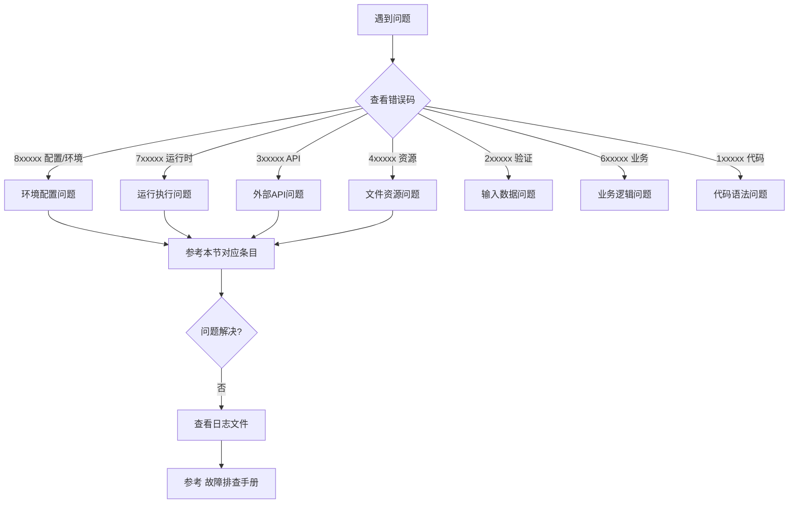

本页汇总了在开发和部署过程中可能遇到的常见问题及其解决方案。所有问题均按照错误分类体系进行编排，每个问题都提供了对应的错误码、可能原因和具体解决步骤。

## 问题分类导航


Sources: [codes.py](src/utils/error/codes.py#L1-L361)

---

## 环境配置问题 (8xxxxx)

### Q1: 依赖库安装失败怎么办？

**错误码**: `CONFIG_ENV_MISSING` / `CODE_NAME_IMPORT_ERROR`

**可能原因**:
- Python 版本不兼容
- uv 工具未安装
- 网络问题导致 PyPI 镜像不可用

**解决方案**:

| 问题现象 | 解决步骤 |
|---------|---------|
| `uv: command not found` | 执行 `pip install uv` 安装 uv 工具 |
| `No module named 'xxx'` | 检查 `pyproject.toml` 中是否声明了该依赖，重新执行 `uv sync` |
| 安装卡住或超时 | 确认 `pyproject.toml` 中已配置阿里云 PyPI 镜像 |
| Python 版本错误 | 确保使用 Python 3.12+，检查 `python --version` |

**验证命令**:
```bash
# 验证环境
python --version
uv --version
ls .venv/bin/python
```
Sources: [setup.sh](scripts/setup.sh#L1-L35), [pyproject.toml](pyproject.toml#L1-L171)

---

### Q2: 环境变量未正确加载？

**错误码**: `CONFIG_API_KEY_MISSING` / `CONFIG_ENV_INVALID`

**可能原因**:
- `.env` 文件不存在或格式错误
- `load_env.sh` 脚本未正确执行

**解决方案**:
1. 确认项目根目录下存在 `.env` 文件
2. 环境变量必须通过 `source scripts/load_env.sh` 加载
3. 检查必需的 API Key 是否已配置

**必需环境变量清单**:
- `OPENAI_API_KEY` - OpenAI 兼容接口密钥
- `S3_*` 相关配置 - 对象存储访问凭证
- `COZE_WORKSPACE_PATH` - 工作空间路径

Sources: [load_env.sh](scripts/load_env.sh#L1-L9), [codes.py](src/utils/error/codes.py#L280-L320)

---

### Q3: 系统级依赖缺失？

**错误码**: `CONFIG_ENV_MISSING`

**常见缺失依赖及解决方案**:

| 缺失依赖 | 错误信息关键词 | 解决方案 |
|---------|---------------|---------|
| Poppler | `poppler not found` | `sudo apt install poppler-utils` |
| FFmpeg | `ffmpeg not found` | `sudo apt install ffmpeg` |
| PortAudio | `portaudio library` | `sudo apt install portaudio19-dev` |
| 图形界面 | `no display name` | 无头环境需配置虚拟显示 |

Sources: [patterns.py](src/utils/error/patterns.py#L120-L135)

---

## 运行执行问题 (7xxxxx)

### Q4: 工作流执行超时？

**错误码**: `RUNTIME_TIMEOUT`

**默认超时配置**:
- 全局执行超时: **15分钟** (900秒)
- 递归深度限制: 100 层

**常见超时场景及解决**:

| 超时场景 | 可能原因 | 优化建议 |
|---------|---------|---------|
| 大五人格评估 | LLM 调用耗时过长 | 精简 Prompt 或使用更快的模型 |
| 网络分析节点 | 图算法复杂度高 | 限制网络节点数量 |
| 图片生成 | 排队等待时间长 | 异步处理或增加重试间隔 |
| 报告生成 | 内容过多 | 分批次生成报告 |

**临时调整超时** (不推荐):
```python
# src/main.py 第 40 行
TIMEOUT_SECONDS = 1800  # 改为 30 分钟
```
Sources: [main.py](src/main.py#L40-L41), [graph.py](src/graphs/graph.py#L1-L83)

---

### Q5: 递归深度超限？

**错误码**: `RUNTIME_RECURSION_LIMIT`

**错误信息**: `Recursion limit reached`

**原因**:
- LangGraph 的边配置形成了循环
- `recursion_limit` 设置不足

**解决方案**:
1. 检查 `graph.py` 中的边定义，确保没有意外循环
2. 增加递归限制配置 (当前已设为 100)

```python
# 已在 main.py 中配置
run_config["recursion_limit"] = 100
```
Sources: [main.py](src/main.py#L83-L84), [codes.py](src/utils/error/codes.py#L246-L248)

---

### Q6: 执行被取消？

**错误码**: `RUNTIME_CANCELLED`

**可能原因**:
- 用户主动调用了取消接口
- HTTP 连接断开导致请求被取消

**说明**:
系统采用 `asyncio.Task.cancel()` 标准取消机制，取消操作会在节点之间的检查点触发。这是正常的保护机制，而非错误。

Sources: [main.py](src/main.py#L170-L195)

---

## 外部API问题 (3xxxxx)

### Q7: LLM API 调用失败？

**错误码**: `API_LLM_*` 系列

常见错误及排查顺序:

| 错误码 | 错误信息 | 排查步骤 |
|-------|---------|---------|
| `301005` | 认证失败 | 检查 API Key 是否正确，是否过期 |
| `301002` | 速率限制 | 减少并发请求，增加重试间隔 |
| `301003` | Token 超限 | 缩减输入长度，使用更小的上下文窗口 |
| `301006` | 模型不存在 | 检查 `config/*.json` 中的模型名称 |
| `301007` | 内容过滤 | 优化提示词，避免敏感内容 |

**验证 API 连通性**:
```python
from openai import OpenAI
client = OpenAI(base_url="your-base-url", api_key="your-key")
client.models.list()  # 验证连接和认证
```
Sources: [codes.py](src/utils/error/codes.py#L100-L125), [patterns.py](src/utils/error/patterns.py#L85-L95)

---

### Q8: S3 对象存储操作失败？

**错误码**: `RESOURCE_S3_*` 系列

**检查清单**:
1. 端点 URL 是否可访问 (`S3_ENDPOINT_URL`)
2. Access Key 和 Secret Key 是否正确
3. Bucket 是否已创建且有读写权限
4. 网络是否允许访问对象存储端口

**常见错误**:
```
HeadObject operation: Not Found → 文件不存在
PutObject 参数无效 → 检查文件路径和权限
```
Sources: [codes.py](src/utils/error/codes.py#L170-L175)

---

## 文件资源问题 (4xxxxx)

### Q9: 文件找不到或无法读取？

**错误码**: `RESOURCE_FILE_NOT_FOUND` / `RESOURCE_FILE_READ_ERROR`

**路径检查原则**:
- 脚本相对路径: 相对于执行命令的目录
- 代码相对路径: 相对于 `src/` 目录
- 推荐使用: `COZE_WORKSPACE_PATH` 环境变量构造绝对路径

**正确示例**:
```python
import os
assets_dir = os.path.join(os.environ.get("COZE_WORKSPACE_PATH", "."), "assets")
```

Sources: [codes.py](src/utils/error/codes.py#L160-L180), [setup.sh](scripts/setup.sh#L5-L9)

---

### Q10: 文件格式不支持？

**错误码**: `RESOURCE_FILE_FORMAT_ERROR`

**支持的媒体格式**:

| 类型 | 支持格式 | 大小限制 |
|-----|---------|---------|
| 图片 | JPG, PNG, WEBP | 单张 < 10MB |
| 文档 | PDF, DOCX, XLSX | 单个 < 50MB |
| 视频 | MP4 | 按 API 配额 |

**处理建议**:
- 图片过大时先压缩再上传
- 确保 PDF 文件没有加密或损坏
- Excel 文件推荐使用 `.xlsx` 格式

Sources: [patterns.py](src/utils/error/patterns.py#L170-L195)

---

## 输入数据问题 (2xxxxx)

### Q11: JSON 解析错误？

**错误码**: `VALIDATION_JSON_DECODE`

**常见原因**:
- 引号不匹配或转义错误
- 包含非法控制字符
- 中文编码问题

**快速修复**:
```python
# 清洗 JSON 字符串中的控制字符
import re
cleaned = re.sub(r'[\x00-\x1F\x7F]', '', input_str)
```

Sources: [codes.py](src/utils/error/codes.py#L85-L95), [patterns.py](src/utils/error/patterns.py#L65-L75)

---

### Q12: Pydantic 验证失败？

**错误码**: `VALIDATION_FIELD_*` 系列

**验证错误对照表**:

| 错误码 | 含义 | 修复方向 |
|-------|------|---------|
| `201001` | 必填字段缺失 | 检查请求体是否缺少必填参数 |
| `201002` | 字段类型错误 | 将字符串转为数字，或反之 |
| `201003` | 字段值不合法 | 检查枚举值范围、长度限制 |

Sources: [codes.py](src/utils/error/codes.py#L70-L85)

---

## 业务逻辑问题 (6xxxxx)

### Q13: 节点不存在？

**错误码**: `BUSINESS_NODE_NOT_FOUND`

**可能原因**:
- 节点名称拼写错误
- 节点未在 `graph.py` 中 `add_node`
- 导入路径错误

**检查步骤**:
1. 确认 `src/graphs/graph.py` 中已添加该节点
2. 确认节点 Python 文件路径正确且可导入
3. 节点函数名是否与注册名称一致

Sources: [graph.py](src/graphs/graph.py#L30-L55), [codes.py](src/utils/error/codes.py#L205-L215)

---

### Q14: 图结构无效？

**错误码**: `BUSINESS_GRAPH_INVALID`

**常见错误**:
- 边指向了不存在的节点
- 循环依赖导致无法终止
- 入口点未设置

**验证工具**:
```python
# 在 Python 中验证图结构
from graphs.graph import main_graph
print(main_graph.get_graph().draw_mermaid())  # 输出 Mermaid 图检查
```
Sources: [patterns.py](src/utils/error/patterns.py#L145-L155), [graph.py](src/graphs/graph.py#L58-L78)

---

## 代码语法问题 (1xxxxx)

### Q15: 属性错误或类型错误？

**错误码**: `CODE_ATTR_*` / `CODE_TYPE_*` 系列

**典型错误及修复**:

| 错误 | 常见场景 | 修复 |
|-----|---------|-----|
| `'NoneType' has no attribute` | 链式调用中间返回 None | 增加 None 检查 |
| `missing required argument` | 函数参数不匹配 | 检查函数签名调用 |
| `cannot unpack non-iterable` | 解构赋值错误 | 检查元组/列表长度 |

Sources: [codes.py](src/utils/error/codes.py#L25-L60)

---

## 获取帮助

如果以上条目未能解决您的问题，请按以下顺序排查:

1. **查看日志文件** - 日志位于 `logs/node.log` (JSON 格式)
2. **提取核心堆栈** - 使用 `extract_core_stack()` 获取精简堆栈
3. **使用错误分类器** - 在调试代码中调用 `ErrorClassifier().classify()`
4. **参考文档** - [故障排查手册](32-gu-zhang-pai-cha-shou-ce) 提供高级诊断方法

**报告问题时请提供**:
- 完整的 6 位错误码
- `context.run_id` (便于追踪日志)
- 出错的节点名称
- 输入数据的简化样例