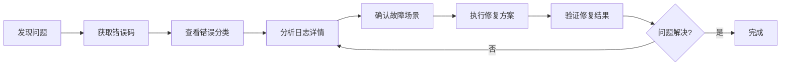
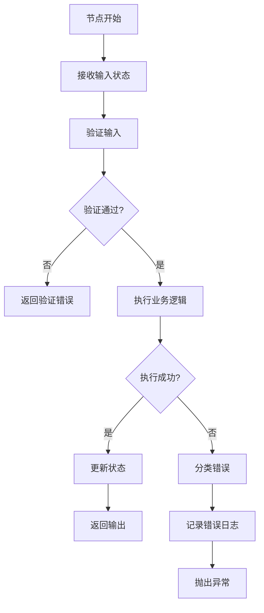

本手册为中级开发者提供系统化的故障排查指南，涵盖错误码解读、常见故障场景分析、日志分析方法和调试技巧。通过本手册，您可以快速定位问题根源并采取相应的解决措施。

## 故障排查总览

本项目采用6位错误码体系，对错误进行精确分类。故障排查应遵循"错误码定位→日志分析→场景确认→修复验证"的标准流程。



故障排查的核心工具包括：
- 错误分类系统：自动识别错误类型
- 日志系统：记录详细执行轨迹
- 堆栈追踪：定位代码问题点

Sources: [codes.py](src/utils/error/codes.py#L1-L361)

## 错误码体系解读

### 错误码结构

项目采用6位数字错误码，结构如下：

| 位数 | 含义 | 说明 |
|------|------|------|
| 第1位 | 错误大类 | 1-9，标识错误所属分类 |
| 第2-3位 | 错误子类 | 01-99，标识具体子类 |
| 第4-6位 | 具体错误 | 001-999，标识具体错误 |

### 错误大类概览

| 大类码 | 类别名称 | 常见场景 | 解决方向 |
|--------|----------|----------|----------|
| 1 | 代码错误 | 属性不存在、类型错误、语法错误 | 检查代码逻辑、参数传递 |
| 2 | 输入验证错误 | 必填字段缺失、类型不匹配 | 验证输入参数、检查Pydantic模型 |
| 3 | 外部API错误 | LLM调用失败、网络超时 | 检查API密钥、网络连接、重试机制 |
| 4 | 资源错误 | 文件不存在、S3上传失败 | 检查文件路径、存储配置 |
| 5 | 集成服务错误 | 数据库连接、第三方服务 | 检查连接配置、服务状态 |
| 6 | 业务逻辑错误 | 节点执行失败、配额不足 | 检查业务规则、资源配额 |
| 7 | 运行时错误 | 超时、内存不足 | 优化代码、增加资源 |
| 8 | 配置错误 | API Key缺失、环境变量 | 检查配置文件、环境变量 |
| 9 | 未知错误 | 无法分类的异常 | 收集详细日志、深入分析 |

Sources: [codes.py](src/utils/error/codes.py#L1-L361)

## 常见故障场景与解决方案

### 1. 输入验证错误（2xxxxx）

#### 场景1：Pydantic验证失败
- **错误码**：`201001-201005`
- **错误描述**：必填字段缺失、字段类型错误、字段值不合法
- **常见原因**：
  - 输入JSON格式不正确
  - 必填字段未提供
  - 字段类型与定义不匹配
- **排查步骤**：
  1. 检查输入JSON格式是否正确
  2. 对照GraphInput模型检查必填字段
  3. 查看验证错误详情中的字段名
- **解决方案**：
  ```python
  # 验证输入参数
  from graphs.state import GraphInput
  try:
      input_data = GraphInput(**payload)
  except ValidationError as e:
      # 打印详细错误信息
      print(e.errors())
  ```

#### 场景2：JSON解析错误
- **错误码**：`202003`
- **错误描述**：JSON解析错误
- **常见原因**：LLM返回格式不正确、手动构造JSON语法错误
- **解决方案**：
  1. 检查JSON字符串格式
  2. 增加重试或容错机制
  3. 使用JSON Schema验证

Sources: [exceptions.py](src/utils/error/exceptions.py#L143-L165)

### 2. 外部API错误（3xxxxx）

#### 场景1：LLM请求失败
- **错误码**：`301001-301009`
- **常见子场景**：
  | 错误码 | 场景 | 解决方案 |
  |--------|------|----------|
  | 301001 | 请求失败 | 检查网络连接、重试请求 |
  | 301002 | 速率限制 | 增加请求间隔、实现指数退避 |
  | 301003 | Token超限 | 减少输入长度、使用长上下文模型 |
  | 301005 | 认证失败 | 检查API Key是否正确、是否过期 |
  | 301006 | 模型不存在 | 确认模型名称、检查模型权限 |

#### 场景2：网络连接错误
- **错误码**：`305001-305007`
- **排查步骤**：
  1. 检查网络连通性：`ping api.openai.com`
  2. 检查代理配置
  3. 验证SSL证书
  4. 检查防火墙设置
- **临时解决方案**：配置超时和重试
  ```python
  from tenacity import retry, stop_after_attempt, wait_exponential
  ```

Sources: [codes.py](src/utils/error/codes.py#L79-L118)

### 3. 资源错误（4xxxxx）

#### 场景1：文件操作错误
- **错误码**：`401001-401005`
- **排查步骤**：
  1. 检查文件路径是否正确
  2. 验证文件权限
  3. 检查磁盘空间
  4. 确认文件编码格式

#### 场景2：S3存储错误
- **错误码**：`402001-402003`
- **排查步骤**：
  1. 检查S3配置（endpoint、access_key、secret_key）
  2. 验证Bucket名称和权限
  3. 检查网络连接到S3服务
  4. 查看S3服务状态

#### 场景3：媒体处理错误
- **错误码**：`403001-403008`
- **常见问题**：
  - 图片处理失败：检查图片格式、文件损坏
  - 未检测到人脸：图片质量、人脸角度
  - FFmpeg处理失败：检查FFmpeg安装、视频格式

Sources: [codes.py](src/utils/error/codes.py#L120-L141)

### 4. 业务逻辑错误（6xxxxx）

#### 场景1：工作流节点错误
- **错误码**：`601001-601003`
- **错误描述**：节点不存在、节点执行失败、图结构无效
- **排查步骤**：
  1. 查看日志中的节点名称
  2. 检查节点代码逻辑
  3. 验证节点输入输出格式
  4. 检查图结构定义

#### 场景2：配额不足
- **错误码**：`604001-604003`
- **错误描述**：资源点不足、配额超限、余额欠费
- **解决方案**：
  1. 升级套餐或充值
  2. 优化资源使用
  3. 实现资源使用监控

Sources: [codes.py](src/utils/error/codes.py#L183-L200)

### 5. 配置错误（8xxxxx）

#### 场景1：API Key配置错误
- **错误码**：`801001-801002`
- **排查步骤**：
  1. 检查环境变量配置
  2. 验证`.env`文件
  3. 确认API Key有效性
- **验证方法**：
  ```bash
  # 检查环境变量
  echo $OPENAI_API_KEY
  
  # 测试API连接
  curl https://api.openai.com/v1/models \
    -H "Authorization: Bearer $OPENAI_API_KEY"
  ```

#### 场景2：环境变量缺失
- **错误码**：`802001-802002`
- **必要环境变量**：
  - `OPENAI_API_KEY`：OpenAI API密钥
  - `S3_ACCESS_KEY`：S3存储访问密钥
  - `DATABASE_URL`：数据库连接字符串
  - `LOG_LEVEL`：日志级别

Sources: [codes.py](src/utils/error/codes.py#L219-L231)

## 日志分析方法

### 日志系统概述

项目采用结构化JSON日志，便于自动化分析。日志文件位置由环境变量`COZE_LOG_DIR`配置，默认为`/tmp/app/work/logs/bypass`。

### 关键日志字段

| 字段名 | 说明 | 用途 |
|--------|------|------|
| `timestamp` | 时间戳 | 时序分析 |
| `level` | 日志级别 | 过滤严重程度 |
| `logger` | 日志来源 | 定位模块 |
| `run_id` | 执行ID | 追踪单次请求 |
| `node_name` | 节点名称 | 定位故障节点 |
| `error_code` | 错误码 | 快速分类 |
| `traceback` | 堆栈信息 | 定位代码 |

### 日志查询技巧

#### 1. 按错误码过滤
```bash
# 查找特定错误码的日志
grep '"code": 301001' logs/app.log
```

#### 2. 按run_id追踪
```bash
# 追踪特定执行的完整日志
grep '"run_id": "abc123"' logs/app.log
```

#### 3. 按节点名称过滤
```bash
# 查看特定节点的日志
grep '"node_name": "big_five_assessment"' logs/app.log
```

#### 4. 提取错误堆栈
```bash
# 查找所有错误级别的日志
grep '"level": "ERROR"' logs/app.log
```

Sources: [config.py](src/utils/log/config.py#L1-L11), [err_trace.py](src/utils/log/err_trace.py#L1-L88)

### 核心堆栈提取

系统自动过滤噪音堆栈，仅保留业务相关的调用栈。使用`extract_core_stack()`函数获取精简的错误堆栈：

```python
from utils.log.err_trace import extract_core_stack

try:
    # 业务代码
except Exception as e:
    stack_lines = extract_core_stack(lines_num=5)
    for line in stack_lines:
        logger.error(line)
```

过滤规则自动排除以下噪音：
- Python标准库调用
- site-packages中的第三方库
- asyncio、concurrent等框架代码
- 日志系统自身的调用

Sources: [err_trace.py](src/utils/log/err_trace.py#L1-L88)

## 工作流节点故障排查

### 节点执行流程



### 各节点常见问题

| 节点名称 | 常见错误 | 排查要点 |
|----------|----------|----------|
| big_five_assessment | LLM调用失败、输出格式错误 | 检查提示词、模型配置 |
| representation_pairing | 数据格式不匹配 | 验证输入数据结构 |
| loop_scoring | 评分逻辑错误 | 检查评分算法、边界条件 |
| network_analysis | 图计算错误 | 验证网络数据完整性 |
| network_visualization | 图片生成失败 | 检查绘图库依赖 |
| job_analysis | 岗位匹配错误 | 验证岗位数据 |
| cartoon_prompt_analysis | 提示词生成失败 | 检查LLM输出格式 |
| cartoon_image_generation | 图片API调用失败 | 检查API配置、配额 |
| report_generation | 报告整合失败 | 验证各节点输出 |

Sources: [graph.py](src/graphs/graph.py#L1-L83)

### 节点调试技巧

#### 1. 单节点测试
```python
# 单独测试某个节点
from graphs.state import GlobalState
from graphs.nodes.big_five_assessment_node import big_five_assessment_node

# 构造测试输入
test_state = GlobalState(
    user_input="测试输入",
    session_id="test_session"
)

# 执行节点
result = big_five_assessment_node(test_state)
print(result)
```

#### 2. 状态快照
在关键节点添加状态快照日志：
```python
import json
logger.info(f"Node {node_name} input: {json.dumps(state.dict(), ensure_ascii=False, default=str)}")
```

## 调试工具与技巧

### 1. 使用错误分类器

系统内置`ErrorClassifier`自动分类异常，便于统一处理：

```python
from utils.error import ErrorClassifier, classify_error

classifier = ErrorClassifier()

try:
    # 业务代码
except Exception as e:
    err = classifier.classify(e, {"context": "additional info"})
    print(f"错误码: {err.code}")
    print(f"错误描述: {err.message}")
    print(f"错误类别: {err.category}")
```

### 2. 增加调试日志

使用不同日志级别记录关键信息：
```python
import logging

logger = logging.getLogger(__name__)

logger.debug("详细调试信息")
logger.info("正常执行信息")
logger.warning("警告信息")
logger.error("错误信息", exc_info=True)  # 自动包含堆栈
```

### 3. 本地复现问题

使用`local_run.sh`脚本本地复现问题：
```bash
# 使用测试输入本地运行
./scripts/local_run.sh test_input.json
```

### 4. 性能问题排查

#### 内存问题（702001）
- 使用`memory_profiler`监控内存使用
- 检查大对象是否及时释放
- 优化数据结构，避免内存泄漏

#### 超时问题（701002）
- 检查各节点执行时间
- 优化LLM调用，减少重试次数
- 考虑异步或并发处理

Sources: [exceptions.py](src/utils/error/exceptions.py#L1-L440)

## 故障排查清单

### 快速检查清单

- [ ] **错误码确认**：获取准确的6位错误码
- [ ] **日志收集**：收集相关run_id的完整日志
- [ ] **输入验证**：检查输入参数格式和内容
- [ ] **配置检查**：验证环境变量和配置文件
- [ ] **网络检查**：测试外部API连通性
- [ ] **资源检查**：确认文件、存储、数据库状态
- [ ] **依赖检查**：验证Python包版本兼容性

### 上报问题模板

当需要请求技术支持时，请提供以下信息：

```
【问题描述】
- 错误码：xxx
- 错误信息：xxx
- 发生时间：yyyy-MM-dd HH:mm:ss

【上下文信息】
- run_id：xxx
- 节点名称：xxx
- 输入参数：xxx

【环境信息】
- 操作系统：xxx
- Python版本：xxx
- 依赖版本：xxx

【日志附件】
- 相关日志片段
- 堆栈跟踪信息
```

## 进阶排查

### 1. 异步任务问题

对于`RUNTIME_ASYNC_NOT_IMPL`（703001）错误：
- 检查异步方法是否正确实现
- 确认调用方式是否使用`await`
- 验证事件循环配置

### 2. 数据库连接问题

对于数据库相关错误（503xxx）：
- 使用数据库客户端测试连接
- 检查连接池配置
- 验证SSL证书配置
- 查看数据库服务器日志

### 3. 第三方集成问题

对于飞书、微信等集成错误（501xxx、502xxx）：
- 验证凭证有效性
- 检查权限范围
- 确认Webhook配置
- 查看第三方平台状态

Sources: [codes.py](src/utils/error/codes.py#L158-L178)

## 参考文档链接

- [错误分类与处理](20-cuo-wu-fen-lei-yu-chu-li) - 了解错误系统设计
- [日志系统设计](19-ri-zhi-xi-tong-she-ji) - 日志系统详细说明
- [调试与日志分析](27-diao-shi-yu-ri-zhi-fen-xi) - 进阶调试技巧
- [常见问题解答](31-chang-jian-wen-ti-jie-da) - FAQ汇总
- [API接口文档](30-apijie-kou-wen-dang) - 接口参数说明