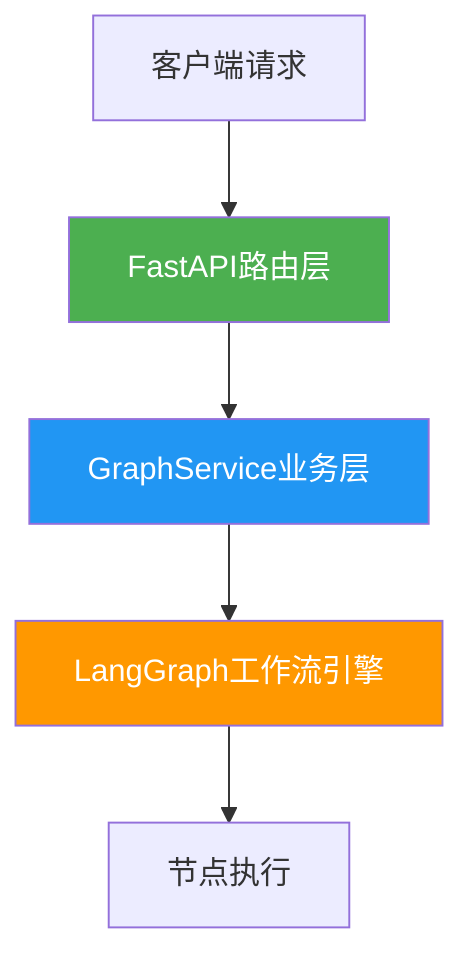
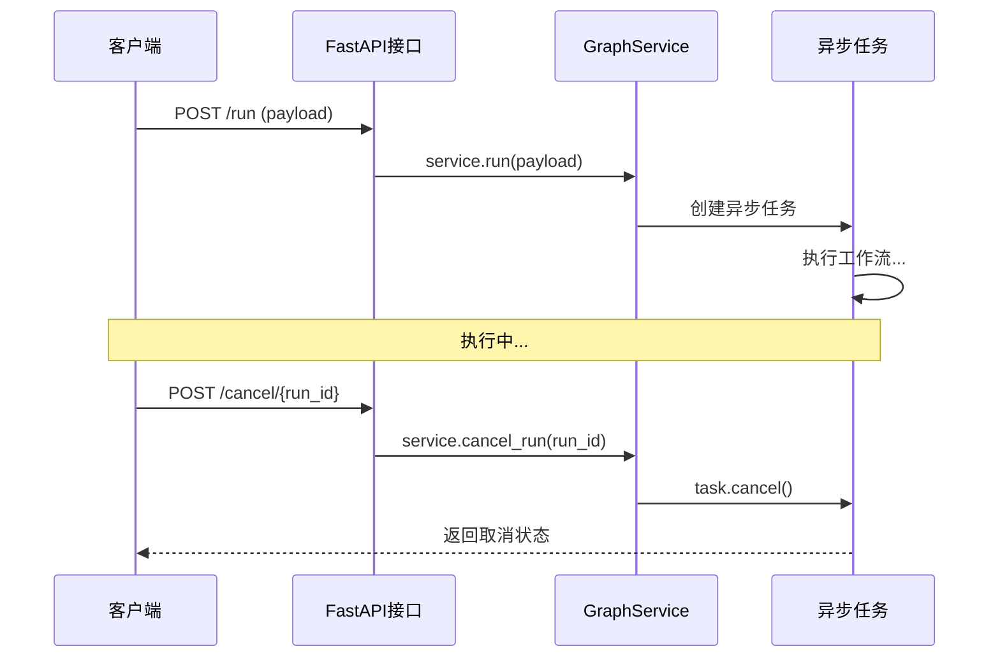

本页面详细介绍如何启动和配置本项目的HTTP服务，包括启动方式、端口配置、API接口概览等内容。面向初学者开发者，提供完整的服务启动指南。

## 服务架构概览

本项目基于 **FastAPI** + **Uvicorn** 构建HTTP服务，支持同步请求、流式SSE响应、任务取消等功能。服务启动后，可通过REST API与工作流引擎进行交互。



服务核心组件包括：
- **FastAPI应用**：负责HTTP协议处理和路由分发
- **GraphService**：封装工作流执行逻辑，提供统一调用接口
- **任务管理**：支持异步任务的取消和超时控制

Sources: [main.py](src/main.py#L63-L667)

## 启动方式

### 方式一：使用Shell脚本启动（推荐）

项目提供了专门的启动脚本 `scripts/http_run.sh`，可快速启动HTTP服务：

```bash
# 使用默认端口8000启动
bash scripts/http_run.sh

# 指定自定义端口
bash scripts/http_run.sh -p 5000
```

### 方式二：使用本地运行脚本

也可以通过通用的 `local_run.sh` 脚本启动HTTP模式：

```bash
bash scripts/local_run.sh -m http
```

### 方式三：直接Python命令启动

在开发环境中，可直接调用Python命令启动：

```bash
# 默认端口5000
python src/main.py -m http

# 指定端口
python src/main.py -m http -p 8000
```

| 启动方式 | 适用场景 | 默认端口 | 环境变量加载 |
|---------|---------|---------|-------------|
| http_run.sh | 生产环境 | 8000 | ✅ 自动加载 |
| local_run.sh | 本地测试 | 5000 | ✅ 自动加载 |
| 直接Python命令 | 开发调试 | 5000 | ❌ 需手动配置 |

Sources: [http_run.sh](scripts/http_run.sh#L1-L32), [local_run.sh](scripts/local_run.sh#L1-L76), [main.py](src/main.py#L620-L667)

## 命令行参数说明

启动HTTP服务时，支持以下命令行参数：

| 参数 | 简写 | 默认值 | 说明 |
|-----|------|-------|------|
| `--mode` | `-m` | `http` | 运行模式，启动HTTP服务时需指定为 `http` |
| `--port` | `-p` | `5000` | HTTP服务监听端口 |

**示例**：
```bash
# 在8080端口启动HTTP服务
python src/main.py -m http -p 8080
```

Sources: [main.py](src/main.py#L607-L617)

## 服务端口与环境配置

### 开发环境 vs 生产环境

服务会自动检测运行环境，应用不同的启动配置：

| 配置项 | 开发环境 | 生产环境 |
|-------|---------|---------|
| 自动重载 (reload) | ✅ 开启 | ❌ 关闭 |
| Worker进程数 | 1 | 1 |
| 日志级别 | DEBUG | INFO |

> **环境自动检测**：通过 `graph_helper.is_dev_env()` 判断当前是否为开发环境。在开发环境下，代码修改后服务会自动重启，便于调试。

Sources: [main.py](src/main.py#L620-L628)

## API接口概览

HTTP服务启动后，提供以下核心API接口：

| 接口 | 方法 | 功能说明 |
|-----|------|---------|
| `/run` | POST | 同步执行工作流，等待完成后返回结果 |
| `/stream_run` | POST | 流式执行工作流，通过SSE实时推送进度 |
| `/cancel/{run_id}` | POST | 取消指定run_id的执行任务 |
| `/node_run/{node_id}` | POST | 单独执行某个工作流节点 |
| `/v1/chat/completions` | POST | OpenAI Chat Completions 兼容接口 |
| `/health` | GET | 服务健康检查 |
| `/graph_parameter` | GET | 获取工作流输入输出Schema |

### 健康检查示例

```bash
# 检查服务是否正常运行
curl http://localhost:5000/health

# 响应示例
# {"status": "ok", "message": "Service is running"}
```

Sources: [main.py](src/main.py#L365-L583)

## 超时与取消机制

HTTP服务内置了完善的超时和取消机制：

- **默认超时时间**：900秒（15分钟）
- **取消机制**：基于 `asyncio.Task.cancel()` 实现优雅取消
- **任务追踪**：所有运行中的任务通过 `running_tasks` 字典管理，可通过 `run_id` 定位和取消



Sources: [main.py](src/main.py#L170-L222)

## 启动验证步骤

按照以下步骤验证HTTP服务是否成功启动：

1. **执行启动命令**
   ```bash
   python src/main.py -m http -p 5000
   ```

2. **查看启动日志**，确认服务正常启动：
   ```
   INFO: Start HTTP Server, Port: 5000, Workers: 1
   INFO: Uvicorn running on http://0.0.0.0:5000
   ```

3. **健康检查验证**
   ```bash
   curl http://localhost:5000/health
   ```

4. **查看API文档**（FastAPI自动生成）
   - Swagger UI: http://localhost:5000/docs
   - ReDoc: http://localhost:5000/redoc

## 常见启动问题排查

| 问题现象 | 可能原因 | 解决方法 |
|---------|---------|---------|
| 端口被占用 | 其他程序使用了相同端口 | 更换端口：`-p 5001` |
| 环境变量缺失 | LLM API密钥未配置 | 检查 `.env` 文件，参考 [环境配置与安装](2-huan-jing-pei-zhi-yu-an-zhuang) |
| 依赖包缺失 | Python包未安装 | 执行 `pip install -r requirements.txt` |
| 防火墙阻止 | 端口被防火墙拦截 | 开放对应端口或使用localhost访问 |

## 下一步

服务成功启动后，建议阅读：
- [输入参数说明](5-shu-ru-can-shu-shuo-ming) - 了解API请求的参数格式和要求
- [API接口文档](30-apijie-kou-wen-dang) - 查看完整的API接口说明
- [工作流总览](6-gong-zuo-liu-zong-lan) - 深入理解工作流执行机制