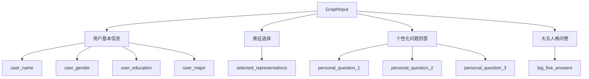

本文档详细介绍"未来自我画像"项目的各种输入参数格式、数据类型和使用规范。初学者可以通过本文了解如何构造正确的请求来调用系统功能。

## 工作流总输入参数

工作流的总输入参数由 `GraphInput` 数据模型定义，用于 `/run` 和 `/stream_run` 接口调用。这些参数是启动完整工作流所必需的基础数据。



### 输入参数列表

| 参数名 | 类型 | 必填 | 说明 | 示例值 |
|--------|------|------|------|--------|
| `user_name` | string | ✅ | 用户姓名，可为邮箱或其他唯一标识 | `"张三"` |
| `user_gender` | string | ✅ | 用户性别 | `"男"` 或 `"女"` |
| `user_education` | string | ✅ | 用户学历 | `"本科"` 或 `"硕士"` 等 |
| `user_major` | string | ❌ | 用户专业 | `"计算机科学"` |
| `selected_representations` | string[] | ✅ | 用户选择的表征列表（不超过25个） | `["创造力", "逻辑思维", "领导力", ...]` |
| `personal_question_1` | string | ✅ | 问题1：职业发展（3-5年） | `"我想成为一名技术架构师..."` |
| `personal_question_2` | string | ✅ | 问题2：知识学习（3-5年） | `"我计划学习AI和数据分析..."` |
| `personal_question_3` | string | ✅ | 问题3：生活愿景（3-5年） | `"我希望能平衡工作与生活..."` |
| `big_five_answers` | object | ❌ | 大五人格问卷回答（40题） | `{"E1": 4, "E2": 3, ...}` |

Sources: [state.py](src/graphs/state.py#L87-L111)

### JSON 请求示例

```json
{
  "user_name": "李四",
  "user_gender": "男",
  "user_education": "硕士",
  "user_major": "人工智能",
  "selected_representations": [
    "创造力",
    "逻辑思维",
    "领导力",
    "沟通能力",
    "学习能力",
    "抗压能力",
    "团队协作",
    "问题解决"
  ],
  "personal_question_1": "在3-5年内，我希望成为AI领域的技术专家，能够独立负责复杂的AI项目开发，在大模型应用方面有所建树。",
  "personal_question_2": "我计划深入学习大模型原理、强化学习和多模态技术，同时提升工程化实践能力。",
  "personal_question_3": "我希望能够在一线城市落户，有稳定的职业发展，同时保持健康的生活方式，培养业余爱好。",
  "big_five_answers": {
    "E1": 4, "E2": 3, "E3": 5, "E4": 4, "E5": 3, "E6": 4, "E7": 3, "E8": 4,
    "A1": 4, "A2": 5, "A3": 3, "A4": 4, "A5": 5, "A6": 3, "A7": 4, "A8": 5,
    "C1": 5, "C2": 4, "C3": 5, "C4": 4, "C5": 5, "C6": 4, "C7": 5, "C8": 4,
    "N1": 2, "N2": 3, "N3": 2, "N4": 3, "N5": 2, "N6": 3, "N7": 2, "N8": 3,
    "O1": 5, "O2": 5, "O3": 4, "O4": 5, "O5": 4, "O6": 5, "O7": 4, "O8": 5
  }
}
```

## 大五人格问卷参数详解

`big_five_answers` 是一个可选参数，用于提供40道大五人格问卷的答案。如果不提供，系统将通过大模型评估生成人格画像。

### 问卷结构说明

| 维度 | 题号 | 说明 |
|------|------|------|
| **外向性（Extraversion）** | E1 - E8 | 评估社交性、活力、热情 |
| **宜人性（Agreeableness）** | A1 - A8 | 评估合作性、同理心、信任 |
| **严谨性（Conscientiousness）** | C1 - C8 | 评估自律、尽责、条理性 |
| **神经质（Neuroticism）** | N1 - N8 | 评估情绪稳定性、焦虑程度 |
| **开放性（Openness）** | O1 - O8 | 评估想象力、创新性、求知欲 |

### 评分标准

采用5点量表评分：
- **1分**：完全不符合
- **2分**：比较不符合
- **3分**：一般符合
- **4分**：比较符合
- **5分**：完全符合

> 💡 **注意**：如果不填写 `big_five_answers`，系统会自动调用 LLM 根据用户填写的个性化问题和表征选择进行人格评估。两种方式二选一即可。

Sources: [state.py](src/graphs/state.py#L102-L110)

## 表征列表参考

`selected_representations` 参数需要从预定义的表征列表中选择。建议选择8-12个最能代表你未来自我的表征。

### 常用表征参考

| 类别 | 表征项 |
|------|--------|
| **认知能力** | 创造力、逻辑思维、学习能力、问题解决、批判性思维、系统思维 |
| **人际能力** | 沟通能力、领导力、团队协作、同理心、谈判能力、影响力 |
| **个人特质** | 抗压能力、适应力、自律、责任心、主动性、决断力 |
| **专业技能** | 技术专长、数据分析、项目管理、产品思维、商业洞察 |
| **价值观** | 创新精神、诚信、追求卓越、开放包容、社会责任感 |

> 📌 **提示**：完整的表征列表请参阅项目根目录下的 `表征列表.docx` 文件。

Sources: [state.py](src/graphs/state.py#L94-L95)

## API 接口调用方式

系统提供多种 API 接口用于不同场景的调用。

### 接口概览

```mermaid
flowchart LR
    A[客户端请求] --> B{调用方式}
    B -->|完整工作流| C[/run]
    B -->|流式输出| D[/stream_run]
    B -->|单节点运行| E[/node_run/{node_id}]
    B -->|OpenAI兼容| F[/v1/chat/completions]
    C --> G[GraphInput]
    D --> G
    E --> H[节点特定输入]
    F --> I[OpenAI格式]
```

### 接口参数说明

| 接口路径 | 方法 | 输入格式 | 适用场景 |
|----------|------|----------|----------|
| `/run` | POST | JSON | 同步执行完整工作流，等待全部结果返回 |
| `/stream_run` | POST | JSON | 流式输出执行过程，实时查看进度 |
| `/node_run/{node_id}` | POST | JSON | 单独运行某个节点用于调试 |
| `/cancel/{run_id}` | POST | - | 取消正在执行的任务 |
| `/v1/chat/completions` | POST | OpenAI 格式 | OpenAI API 兼容模式 |

Sources: [main.py](src/main.py#L349-L599)

### /run 接口调用示例

```bash
curl -X POST http://localhost:8000/run \
  -H "Content-Type: application/json" \
  -d '{
    "user_name": "王五",
    "user_gender": "女",
    "user_education": "本科",
    "user_major": "市场营销",
    "selected_representations": ["创造力", "沟通能力", "数据分析", "领导力"],
    "personal_question_1": "3-5年内希望成为市场总监...",
    "personal_question_2": "学习数字化营销和用户增长...",
    "personal_question_3": "平衡事业与家庭..."
  }'
```

### /stream_run 接口说明

`/stream_run` 返回 SSE（Server-Sent Events）流式响应，客户端需要支持 SSE 协议。

**响应格式示例：**
```
event: message
data: {"type": "node_start", "node": "big_five_assessment", "timestamp": "..."}

event: message
data: {"type": "node_complete", "node": "big_five_assessment", "output": {...}}

event: message
data: {"type": "end", "final_report": "...", "files": [...]}
```

Sources: [main.py](src/main.py#L445-L514)

## 单节点运行参数

通过 `/node_run/{node_id}` 接口可以单独运行工作流中的某个节点，适合调试和测试。

### 可用节点列表

| 节点ID | 输入模型 | 功能说明 |
|--------|----------|----------|
| `representation_pairing` | `RepresentationPairingInput` | 表征配对处理 |
| `single_pair_scoring` | `SinglePairScoringInput` | 单对表征评分 |
| `loop_scoring` | `LoopScoringInput` | 循环批量评分 |
| `network_analysis` | `NetworkAnalysisInput` | 网络分析计算 |
| `network_visualization` | `NetworkVisualizationInput` | 网络可视化 |
| `job_analysis` | `JobAnalysisInput` | 岗位分析 |
| `chart_generation` | `ChartGenerationInput` | 图表生成 |
| `cartoon_prompt_analysis` | `CartoonPromptAnalysisInput` | 卡通提示词分析 |
| `cartoon_image_generation` | `CartoonImageGenerationInput` | 卡通画像生成 |
| `big_five_assessment` | `BigFiveAssessmentInput` | 大五人格评估 |
| `report_generation` | `ReportGenerationInput` | 最终报告生成 |

### 单节点调用示例

调用大五人格评估节点：
```bash
curl -X POST http://localhost:8000/node_run/big_five_assessment \
  -H "Content-Type: application/json" \
  -d '{
    "user_name": "测试用户",
    "user_gender": "男",
    "user_education": "硕士",
    "selected_representations": ["创造力", "逻辑思维"],
    "personal_question_1": "想成为技术专家...",
    "personal_question_2": "深入学习AI技术...",
    "personal_question_3": "平衡工作生活..."
  }'
```

Sources: [state.py](src/graphs/state.py#L119-L318)

## 参数验证与常见错误

### 必填参数检查

以下参数为必填项，缺失将返回 `400 Bad Request` 错误：
- `user_name`
- `user_gender`
- `user_education`
- `selected_representations`
- `personal_question_1`
- `personal_question_2`
- `personal_question_3`

### 常见错误说明

| 错误类型 | 原因 | 解决方法 |
|----------|------|----------|
| Invalid JSON format | 请求体不是有效的 JSON | 检查 JSON 语法，确保引号、逗号使用正确 |
| Missing required fields | 缺少必填参数 | 检查是否所有带 `...` 的字段都已提供 |
| Selected representations too many | 选择的表征超过25个 | 减少表征数量，建议选择8-12个 |
| Invalid score value | 大五人格评分不在1-5范围内 | 确保每道题的评分都是1-5的整数 |

Sources: [main.py](src/main.py#L424-L443)

## 下一步

- 了解如何在本地运行系统：[本地运行流程](3-ben-di-yun-xing-liu-cheng)
- 启动 HTTP 服务：[HTTP服务启动](4-httpfu-wu-qi-dong)
- 查看工作流架构：[工作流总览](6-gong-zuo-liu-zong-lan)