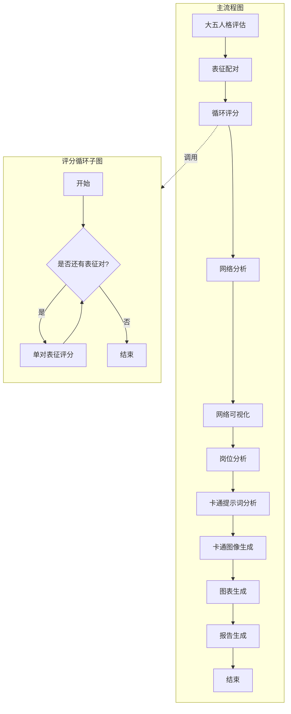
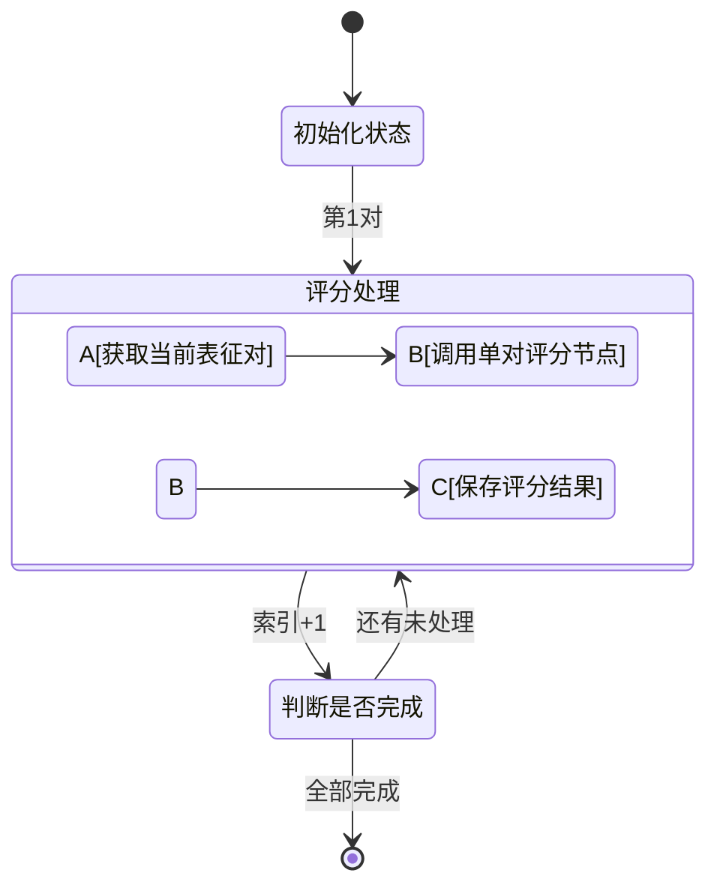
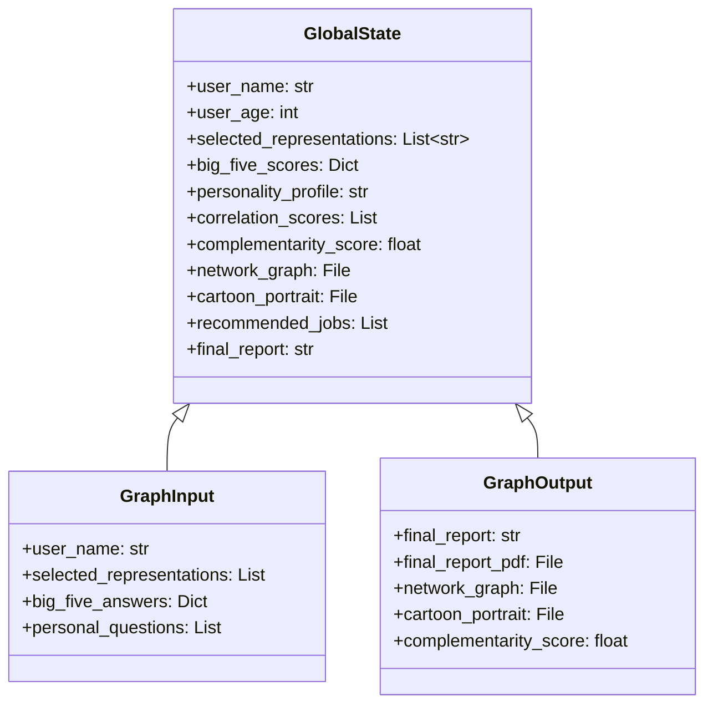

本页面详细介绍"未来自我画像"项目的核心工作流架构，包括主流程编排、节点组织方式和数据流转机制。工作流基于 LangGraph 框架构建，采用有向无环图（DAG）设计模式，实现从用户输入到最终报告生成的完整自动化流程。

Sources: [graph.py](src/graphs/graph.py#L1-L83)

## 整体架构设计

系统采用**分层图编排**架构，包含一个主流程图和一个循环子图。主流程图负责整体业务流程的线性推进，循环子图负责批量处理表征对的评分任务。

Sources: [graph.py](src/graphs/graph.py#L1-L83), [loop_graph.py](src/graphs/loop_graph.py#L1-L137)

## 五阶段工作流

整个工作流分为五个核心处理阶段，每个阶段包含多个协作节点：

| 阶段 | 主要节点 | 核心产出 | 说明 |
|------|----------|----------|------|
| **人格评估阶段** | 大五人格评估节点 | 大五人格评分、人格画像 | 基于40题问卷进行专业心理测评 |
| **网络分析阶段** | 表征配对、循环评分、网络分析、网络可视化 | 互补性/冲突性评分、网络图谱 | 构建表征间关系网络并进行量化分析 |
| **岗位分析阶段** | 岗位分析节点 | 市场趋势、推荐岗位、适配度评分 | 基于人格和表征进行职业匹配分析 |
| **形象生成阶段** | 卡通提示词分析、卡通图像生成 | 卡通风格未来自我画像 | 将抽象特质转化为可视化形象 |
| **报告整合阶段** | 图表生成、报告生成 | 完整分析报告（含PDF） | 整合所有分析结果生成最终报告 |

Sources: [graph.py](src/graphs/graph.py#L25-L68)

## 主流程节点详解

主流程图包含10个核心节点，按线性顺序执行：

```mermaid
flowchart LR
    A[big_five_assessment\n大五人格评估] --> B[representation_pairing\n表征配对]
    B --> C[loop_scoring\n循环评分]
    C --> D[network_analysis\n网络分析]
    D --> E[network_visualization\n网络可视化]
    E --> F[job_analysis\n岗位分析]
    F --> G[cartoon_prompt_analysis\n卡通提示词分析]
    G --> H[cartoon_image_generation\n卡通图像生成]
    H --> I[chart_generation\n图表生成]
    I --> J[report_generation\n报告生成]
    
    style A fill:#e1f5ff
    style C fill:#fff4e1
    style F fill:#f4e1ff
    style J fill:#e1ffe1
```

### 节点功能说明

1. **大五人格评估节点** - 接收用户的40题大五人格问卷回答，计算五个维度的得分并生成人格特质分析报告。
   
2. **表征配对节点** - 将用户选择的25个表征进行两两配对，生成可供大模型评分的文本描述。
   
3. **循环评分节点** - 调用评分循环子图，批量处理所有表征对的相关性评分。
   
4. **网络分析节点** - 基于评分结果计算表征网络的互补性和冲突性指标，生成网络结构解读。
   
5. **网络可视化节点** - 生成表征网络密度图，直观展示表征间的互补关系和冲突关系。
   
6. **岗位分析节点** - 结合人格特质和表征特征进行市场趋势分析和岗位推荐。
   
7. **卡通提示词分析节点** - 基于用户信息和职业定位生成卡通形象生成的提示词。
   
8. **卡通图像生成节点** - 调用图像生成API创建卡通风格的未来自我画像。
   
9. **图表生成节点** - 生成表征能力雷达图等辅助分析图表。
   
10. **报告生成节点** - 整合所有分析结果、图表、图像，生成完整的职业规划报告及PDF文件。

Sources: [graph.py](src/graphs/graph.py#L25-L68)

## 循环子图机制

为高效处理大量表征对（25个表征产生300对组合），系统设计了专门的**评分循环子图**：

循环子图采用**迭代处理**模式，每次处理一对表征的评分，直到所有配对处理完成。这种设计确保了：
- 评分过程的可观测性和可中断性
- 大模型调用的资源控制
- 中间结果的增量保存

Sources: [loop_graph.py](src/graphs/loop_graph.py#L1-L137)

## 数据流转模型

工作流采用**全局状态共享**机制，所有节点通过 `GlobalState` 对象传递数据。状态模型包含以下数据分类：

每个节点只访问和修改其需要的状态字段，确保了模块间的低耦合和数据的一致性。

Sources: [state.py](src/graphs/state.py#L1-L318)

## 下一步阅读

- 了解工作流的数据结构定义：[状态数据模型](7-zhuang-tai-shu-ju-mo-xing)
- 深入图编排的实现细节：[图编排机制](8-tu-bian-pai-ji-zhi)
- 开始学习第一个核心节点：[大五人格评估节点](9-da-wu-ren-ge-ping-gu-jie-dian)