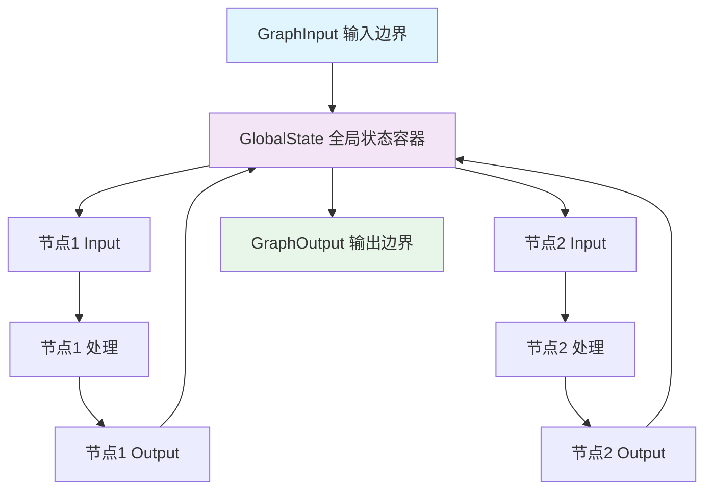
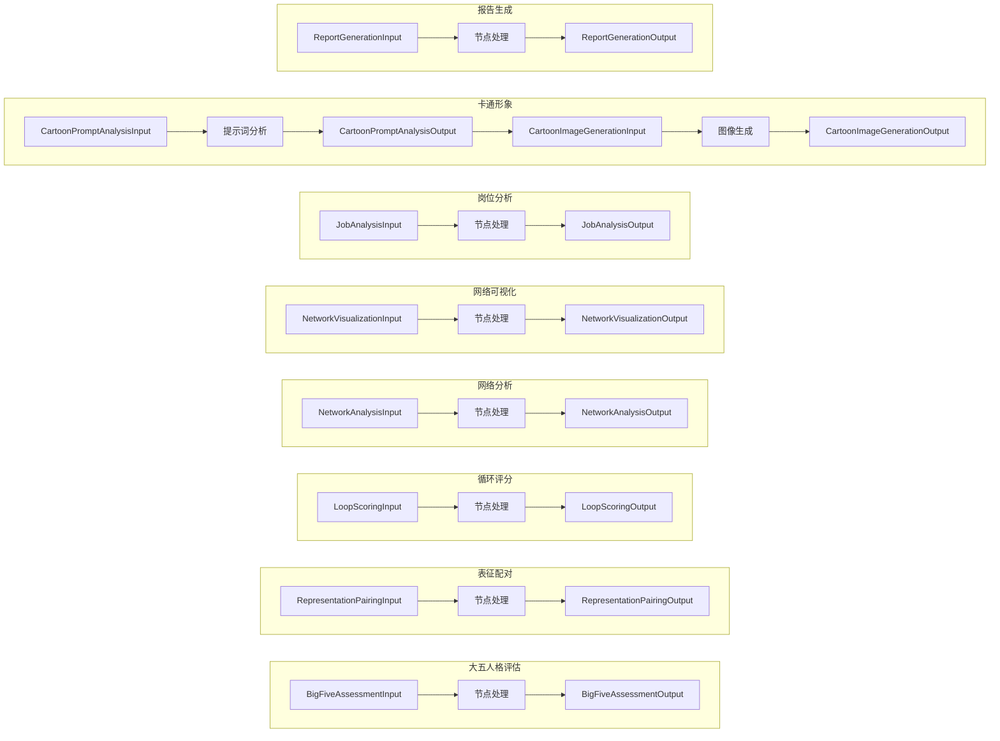
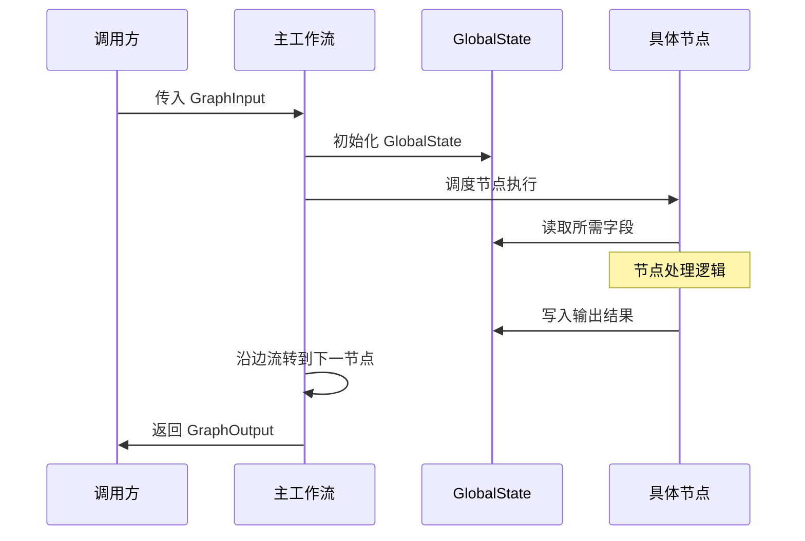

状态数据模型是未来自我画像系统的核心数据架构，定义了工作流中所有数据的结构、流转方式和类型约束。本文档详细介绍全局状态设计、图输入输出边界，以及各节点的输入输出数据契约。

## 设计概述

状态数据模型采用 **Pydantic BaseModel** 作为类型基础，确保数据验证和类型安全。整体设计遵循"全局状态共享 + 节点契约约束"的双层架构：



**核心设计原则**：
- **单一数据源**：所有节点共享一个 GlobalState 实例
- **契约式设计**：每个节点明确定义所需的输入和产生的输出
- **类型安全**：Pydantic 提供运行时类型验证
- **渐进填充**：状态随工作流执行逐步填充

Sources: [state.py](src/graphs/state.py#L1-L318)

## 全局状态（GlobalState）

GlobalState 是工作流的核心数据容器，贯穿整个执行过程。所有节点都可以读取和写入该状态。

### 状态字段分类

| 分类 | 关键字段 | 说明 |
|------|----------|------|
| **用户基本信息** | `user_name`, `user_age`, `user_gender`, `user_education`, `user_occupation`, `company_type`, `industry_type` | 用户个人资料，用于个性化分析 |
| **表征相关** | `selected_representations`, `representation_pairs`, `representation_pairs_texts` | 用户选择的未来自我表征及配对结果 |
| **人格评估** | `big_five_scores`, `personality_profile` | 大五人格评分结果和综合分析 |
| **网络分析** | `correlation_scores`, `complementarity_score`, `conflict_score`, `network_analysis_interpretation` | 表征网络分析结果 |
| **可视化资源** | `network_graph`, `conflict_graph`, `radar_chart`, `bar_chart`, `cartoon_portrait`, `label_mapping` | 生成的图表和图像文件 |
| **岗位分析** | `market_trend`, `recommended_jobs`, `job_fit_score`, `skill_gap_analysis` | 职业规划相关分析 |
| **个性化问题** | `personal_question_1`, `personal_question_2`, `personal_question_3` | 用户对三个关键问题的回答 |
| **最终产物** | `final_report` | 生成的完整报告 |

Sources: [state.py](src/graphs/state.py#L14-L66)

### File 类型说明

所有文件字段使用自定义的 `File` 类型，这是一个封装了文件元数据的包装类，支持本地文件、S3 对象存储等多种存储后端。

```python
# 示例：File 字段定义
network_graph: File = Field(default=None, description="表征网络密度图（互补性）")
```

Sources: [state.py](src/graphs/state.py#L53-L54)

## 图输入输出边界

### GraphInput：工作流输入

GraphInput 定义了启动工作流所需的全部输入参数，是整个系统的入口契约。

| 字段 | 类型 | 必填 | 说明 |
|------|------|------|------|
| `user_name` | str | ✅ | 用户姓名（可为邮箱或其他标识） |
| `user_gender` | str | ✅ | 用户性别 |
| `user_education` | str | ✅ | 用户学历 |
| `user_major` | str | ❌ | 用户专业 |
| `selected_representations` | List[str] | ✅ | 用户选择的表征列表（不超过25个） |
| `personal_question_1` | str | ✅ | 职业发展相关问题回答 |
| `personal_question_2` | str | ✅ | 知识学习相关问题回答 |
| `personal_question_3` | str | ✅ | 生活愿景相关问题回答 |
| `big_five_answers` | Dict[str, int] | ❌ | 大五人格问卷40题回答 |

**大五人格问卷格式**：
```python
big_five_answers: Dict[str, int] = {
    "N1": 4, "N2": 3, ..., "N8": 2,  # 神经质 8题
    "C1": 5, "C2": 4, ..., "C8": 3,  # 严谨性 8题
    "A1": 3, "A2": 5, ..., "A8": 4,  # 宜人性 8题
    "O1": 4, "O2": 3, ..., "O8": 5,  # 开放性 8题
    "E1": 5, "E2": 4, ..., "E8": 3   # 外向性 8题
}
```

Sources: [state.py](src/graphs/state.py#L69-L90)

### GraphOutput：工作流输出

GraphOutput 定义了工作流完成后返回的最终产物。

| 字段 | 类型 | 说明 |
|------|------|------|
| `final_report` | str | 生成的未来自我画像职业规划报告（Markdown 格式） |
| `final_report_pdf` | File | 报告 PDF 文件 |
| `network_graph` | File | 表征互补性网络密度图 |
| `conflict_graph` | File | 表征冲突性网络密度图 |
| `radar_chart` | File | 表征能力雷达图 |
| `bar_chart` | File | 岗位适配度评分柱状图 |
| `cartoon_portrait` | File | 卡通风格未来自我画像 |
| `complementarity_score` | float | 互补性评分 |
| `conflict_score` | float | 冲突性评分 |

Sources: [state.py](src/graphs/state.py#L93-L105)

## 节点输入输出契约

每个节点都定义了独立的 Input 和 Output 模型，形成明确的数据契约。

### 节点契约总览



### 关键节点契约详情

#### 1. 表征配对节点

```python
class RepresentationPairingInput:
    selected_representations: List[str]  # 用户选择的表征列表

class RepresentationPairingOutput:
    representation_pairs: List[Dict[str, str]]  # 两两配对列表
    representation_pairs_texts: List[str]       # 配对文本描述
```

Sources: [state.py](src/graphs/state.py#L108-L119)

#### 2. 评分节点（子图循环）

单对表征评分节点用于子图循环调用：

```python
class SinglePairScoringInput:
    pair_text: str   # 表征配对文本
    rep1: str        # 第一个表征
    rep2: str        # 第二个表征

class SinglePairScoringOutput:
    rep1: str                       # 第一个表征
    rep2: str                       # 第二个表征
    correlation_score: int          # 相关性评分（-2 到 +2）
```

Sources: [state.py](src/graphs/state.py#L122-L134)

#### 3. 网络分析节点

```python
class NetworkAnalysisInput:
    correlation_scores: List[Dict[str, Any]]   # 每对表征的相关性评分
    representation_pairs: List[Dict[str, str]] # 表征两两配对列表

class NetworkAnalysisOutput:
    complementarity_score: float                # 互补性评分
    conflict_score: float                       # 冲突性评分
    correlation_scores: List[Dict[str, Any]]    # 计算后的评分
    network_analysis_interpretation: str        # 网络分析解读
```

Sources: [state.py](src/graphs/state.py#L146-L158)

#### 4. 报告生成节点

报告生成节点的输入最为丰富，整合了前面所有节点的输出：

```python
class ReportGenerationInput:
    # 用户基本信息
    user_name, user_gender, user_education, user_major
    # 表征相关
    selected_representations, correlation_scores
    # 个性化问题
    personal_question_1, personal_question_2, personal_question_3
    # 网络分析
    complementarity_score, conflict_score
    # 岗位分析
    market_trend, recommended_jobs, job_fit_score, skill_gap_analysis
    # 可视化资源
    network_graph, conflict_graph, radar_chart
    bar_chart, cartoon_portrait, label_mapping
    # 人格评估
    big_five_scores
    # 网络解读
    network_analysis_interpretation
```

Sources: [state.py](src/graphs/state.py#L257-L294)

## 状态流转机制

状态在 LangGraph 工作流中的流转遵循以下规则：

1. **初始化**：工作流启动时，`GraphInput` 的字段映射到 `GlobalState` 的对应字段
2. **节点读取**：每个节点从 `GlobalState` 中提取所需字段，构造自己的 Input 对象
3. **节点写入**：节点执行完成后，Output 对象的字段被合并回 `GlobalState`
4. **传递**：状态通过图的边在节点之间传递



Sources: [graph.py](src/graphs/graph.py#L1-L83)

## 设计优势与最佳实践

| 优势 | 说明 |
|------|------|
| **类型安全** | Pydantic 在运行时验证数据类型和格式 |
| **可追溯性** | 每个字段的来源和修改路径清晰 |
| **可扩展性** | 新增字段只需在 GlobalState 中添加 |
| **解耦** | 节点通过明确的契约通信，降低耦合度 |

**开发最佳实践**：
1. 新增节点时必须定义独立的 Input/Output 模型
2. 避免直接操作 GlobalState，始终通过节点契约访问
3. 复杂数据结构使用嵌套的 Pydantic 模型而非原始字典
4. 所有字段添加清晰的 `description` 文档说明

Sources: [state.py](src/graphs/state.py#L1-L318)

## 下一步

理解状态数据模型后，建议继续阅读：
- [图编排机制](8-tu-bian-pai-ji-zhi)：了解状态如何在工作流图中流转
- [节点开发规范](25-jie-dian-kai-fa-gui-fan)：学习如何开发符合契约规范的新节点
- [大五人格评估节点](9-da-wu-ren-ge-ping-gu-jie-dian)：查看第一个节点的具体实现