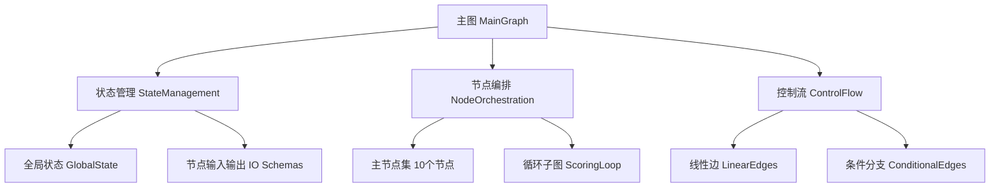
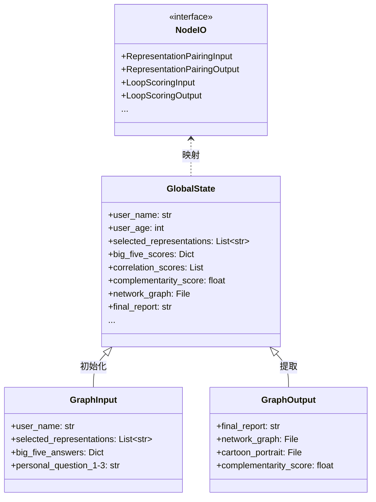
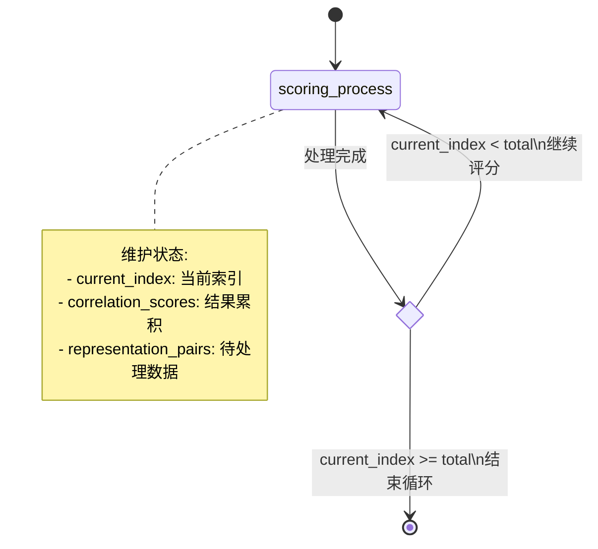

本页面详细阐述未来自我画像项目基于 **LangGraph** 构建的有状态工作流编排系统，包括主图架构、状态管理、循环子图机制以及节点编排规范。

Sources: [graph.py](src/graphs/graph.py), [state.py](src/graphs/state.py), [loop_graph.py](src/graphs/loop_graph.py)

## 核心架构概述

本项目采用 **有向无环图（DAG）** + **条件循环子图** 的双层编排架构，通过 LangGraph 框架实现节点间的状态流转与控制流管理。



**架构设计原则**：
- **强类型约束**：每个节点拥有独立的输入输出 Pydantic 模型
- **状态隔离**：全局状态与节点输入输出分离设计
- **可观测性**：节点元数据标注类型与配置路径
- **扩展性**：支持子图嵌套与条件分支组合

Sources: [graph.py](src/graphs/graph.py#L1-L83)

## 主图编排结构

主图采用线性编排模式，共包含 **10 个功能节点**，从大五人格评估开始，到最终报告生成为止，形成完整的工作流链路。

```mermaid
graph LR
    START((START)) --> A[大五人格评估节点<br/>big_five_assessment]
    A --> B[表征配对节点<br/>representation_pairing]
    B --> C[循环评分节点<br/>loop_scoring]
    C --> D[网络分析节点<br/>network_analysis]
    D --> E[网络可视化节点<br/>network_visualization]
    E --> F[岗位分析节点<br/>job_analysis]
    F --> G[卡通提示词分析<br/>cartoon_prompt_analysis]
    G --> H[卡通图像生成<br/>cartoon_image_generation]
    H --> I[图表生成<br/>chart_generation]
    I --> J[报告生成节点<br/>report_generation]
    J --> END((END))
    
    style A fill:#e1f5fe
    style C fill:#fff9c4
    style J fill:#e8f5e9
```



**节点分类表**：

| 节点类型 | 节点名称 | 配置路径 | 功能描述 |
|---------|---------|---------|---------|
| Agent 节点 | big_five_assessment | `config/big_five_assessment_llm_cfg.json` | 人格特质评估 |
| Agent 节点 | cartoon_prompt_analysis | `config/cartoon_prompt_analysis_llm_cfg.json` | 提示词分析 |
| Agent 节点 | report_generation | `config/report_generation_llm_cfg.json` | 报告整合生成 |
| 计算节点 | representation_pairing | - | 表征组合计算 |
| 计算节点 | loop_scoring | - | 批次评分处理 |
| 计算节点 | network_analysis | - | 网络指标计算 |
| 计算节点 | network_visualization | - | 网络图形渲染 |
| 计算节点 | job_analysis | - | 岗位匹配分析 |
| 计算节点 | cartoon_image_generation | - | 图像生成调用 |
| 计算节点 | chart_generation | - | 数据图表绘制 |

Sources: [graph.py](src/graphs/graph.py#L17-L83)

## 状态数据模型

状态系统采用 **三层结构** 设计，确保类型安全与数据流转的清晰性。



**状态设计要点**：

1. **全局状态 GlobalState**：承载工作流全生命周期数据，包含 6 大类共 30+ 字段
2. **图边界定义**：`GraphInput` 和 `GraphOutput` 明确工作流接口契约
3. **节点级 IO**：每个节点拥有独立的输入输出模型，实现类型安全的接口隔离

**状态字段分类**：

| 分类 | 关键字段 | 数据类型 | 流转节点 |
|-----|---------|---------|---------|
| 用户基础信息 | user_name, user_gender, user_education | str | 所有节点 |
| 表征相关 | selected_representations, representation_pairs | List | 配对 → 评分 → 分析 |
| 人格评估 | big_five_scores, personality_profile | Dict, str | 评估节点输出 |
| 网络分析 | correlation_scores, complementarity_score | List, float | 评分 → 分析 → 可视化 |
| 可视化产物 | network_graph, radar_chart, cartoon_portrait | File | 可视化节点输出 |
| 岗位分析 | market_trend, recommended_jobs | str, List | 岗位分析节点 |
| 最终产物 | final_report, final_report_pdf | str, File | 报告生成节点 |

Sources: [state.py](src/graphs/state.py#L1-L318)

## 循环子图机制

对于需要批量处理的场景（如 N 对表征评分），系统实现了 **带状态的循环子图**，通过条件边实现迭代控制。

### 循环子图架构



### 循环状态定义

子图维护独立的循环状态 `LoopState`，包含以下核心字段：

| 字段 | 类型 | 作用 |
|-----|------|------|
| `representation_pairs_texts` | `List[str]` | 待处理文本列表 |
| `representation_pairs` | `List[Dict]` | 表征配对数据 |
| `current_index` | `int` | 当前处理游标 |
| `correlation_scores` | `List[Dict]` | 评分结果累积 |

### 循环控制逻辑

条件判断函数 `has_more_pairs` 实现分支控制：

```python
def has_more_pairs(state: LoopState) -> str:
    if state.current_index < len(state.representation_pairs_texts):
        return "继续评分"
    else:
        return "结束循环"
```

条件边配置通过 `path_map` 建立返回值与节点的映射：

```python
builder.add_conditional_edges(
    source="scoring_process",
    path=has_more_pairs,
    path_map={
        "继续评分": "scoring_process",
        "结束循环": END
    }
)
```

Sources: [loop_graph.py](src/graphs/loop_graph.py#L1-L137)

## 节点编排规范

### 节点注册机制

节点通过 `add_node` 方法注册，支持元数据标注以便于运维和监控：

```python
builder.add_node(
    "big_five_assessment",
    big_five_assessment_node,
    metadata={
        "type": "agent",
        "llm_cfg": "config/big_five_assessment_llm_cfg.json"
    }
)
```

### 边连接方式

**线性边**：用于确定的流程顺序：

```python
builder.add_edge("big_five_assessment", "representation_pairing")
builder.add_edge("representation_pairing", "loop_scoring")
```

**条件边**：用于分支判断和循环控制：

```python
builder.add_conditional_edges(
    source="scoring_process",
    path=has_more_pairs,
    path_map={"继续评分": "scoring_process", "结束循环": END}
)
```

### 入口与出口配置

```python
builder.set_entry_point("big_five_assessment")  # 唯一入口
builder.add_edge("report_generation", END)      # 唯一出口
```

Sources: [graph.py](src/graphs/graph.py#L37-L82)

## 批次优化策略

在 `loop_scoring_node` 中，实现了 **批次处理优化**，将原来的单次单对调用改为每 15 组批量调用，大幅提升处理效率。

```mermaid
graph TD
    subgraph 批次处理流程
        A[接收 N 对表征] --> B[计算批次数]
        B --> C{批次循环}
        C --> D[提取批次数据]
        D --> E[构建批量提示]
        E --> F[单次 LLM 调用]
        F --> G[解析批量结果]
        G --> H[合并结果集]
        H --> C
        C -->|完成| I[返回所有评分]
    end
    
    note right of F
        优化前: N次调用
        优化后: ceil(N/15)次调用
        性能提升: ~15x
    end note
```

**批次处理核心参数**：

| 参数 | 值 | 说明 |
|-----|----|------|
| `BATCH_SIZE` | 15 | 每批处理的表征对数量 |
| `max_completion_tokens` | 2000 | 单次调用的输出令牌限制 |
| `temperature` | 0.3 | 评分任务的确定性要求 |

Sources: [loop_scoring_node.py](src/graphs/nodes/loop_scoring_node.py#L1-L154)

## 图编译与调用

### 图编译流程

```python
# 创建构建器
builder = StateGraph(GlobalState, input_schema=GraphInput, output_schema=GraphOutput)

# 注册节点和边
builder.add_node(...)
builder.add_edge(...)
builder.set_entry_point(...)

# 编译为可执行图
main_graph = builder.compile()
```

### 调用接口

编译后的图支持标准的 LangChain Runnable 接口：

```python
# 同步调用
result = main_graph.invoke(input_data, config=config)

# 流式调用
for chunk in main_graph.stream(input_data, config=config):
    process_chunk(chunk)
```

Sources: [graph.py](src/graphs/graph.py#L80-L83)

## 下一步阅读

- 了解图中各节点的具体实现，请参考 [大五人格评估节点](9-da-wu-ren-ge-ping-gu-jie-dian) 和 [表征配对与评分节点](10-biao-zheng-pei-dui-yu-ping-fen-jie-dian)
- 理解状态数据的详细定义，请参考 [状态数据模型](7-zhuang-tai-shu-ju-mo-xing)
- 学习节点开发规范，请参考 [节点开发规范](25-jie-dian-kai-fa-gui-fan)