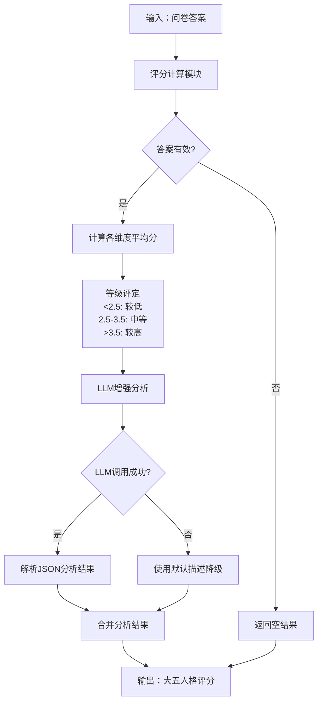
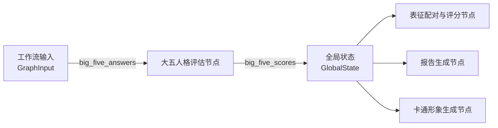

大五人格评估节点是未来自我画像系统中的核心分析模块，基于心理学领域广泛认可的大五人格模型（Big Five Personality Model），通过标准化的五点量表问卷对用户的人格特质进行量化评估。该节点负责接收用户的问卷答案，计算各维度得分，并结合大语言模型生成个性化的人格特征分析报告。

## 节点架构与工作流程

大五人格评估节点采用"评分计算 + LLM增强分析"的双层架构设计，确保评估结果既具备量化准确性，又富含语义化的特征描述。



节点的核心工作流程分为三个阶段：首先进行基础评分计算，然后尝试调用大语言模型进行增强分析，最后通过降级机制确保输出稳定性。
Sources: [big_five_assessment_node.py](src/graphs/nodes/big_five_assessment_node.py#L73-L114)

## 输入输出数据模型

### 输入模型

大五人格评估节点的输入数据包含用户基本信息、表征选择、个性化问题回答以及最关键的40题问卷答案。

| 字段 | 类型 | 必填 | 说明 |
|------|------|------|------|
| user_name | str | 是 | 用户姓名或标识 |
| user_gender | str | 是 | 用户性别 |
| user_education | str | 否 | 用户学历 |
| user_major | str | 否 | 用户专业 |
| selected_representations | List[str] | 是 | 用户选择的表征列表 |
| personal_question_1/2/3 | str | 是 | 三个个性化问题回答 |
| big_five_answers | Dict[str, int] | 否 | 40题问卷答案，键为题目编号（如N1、C1等），值为1-5分 |

**题目编号规则**：
- N1-N8：神经质维度（8题）
- C1-C8：严谨性维度（8题）
- A1-A8：宜人性维度（8题）
- O1-O8：开放性维度（8题）
- E1-E8：外向性维度（8题）

Sources: [state.py](src/graphs/state.py#L251-L264)

### 输出模型

节点输出结构化的大五人格评分结果，每个维度包含量化分数、等级评定和特征描述。

```python
{
    "外向性": {
        "score": 4.2,           # 平均分（1-5分制，保留2位小数）
        "level": "较高",         # 等级：较低/中等/较高
        "dimension_answers": [4, 5, 4, 4, 5, 4, 4, 4],  # 各题原始分数
        "description": "性格开朗活泼，喜欢社交互动..."  # 特征描述
    },
    "神经质": {...},
    "严谨性": {...},
    "开放性": {...},
    "宜人性": {...}
}
```

Sources: [state.py](src/graphs/state.py#L267-L272)

## 五维度问卷设计

大五人格评估采用经过正向化处理的五点量表，每个维度包含8道题目，覆盖该维度的核心心理特质。

### 神经质维度（N1-N8）

| 题号 | 题目内容 | 考察方向 |
|------|----------|----------|
| N1 | 我常常担心各种事情 | 广泛性焦虑 |
| N2 | 我容易感到紧张和不安 | 情绪稳定性 |
| N3 | 我经常感到沮丧或情绪低落 | 抑郁倾向 |
| N4 | 我容易因为小事而烦恼 | 情绪敏感性 |
| N5 | 我经常感到焦虑 | 焦虑水平 |
| N6 | 我容易感到悲伤或失落 | 情绪低落 |
| N7 | 我经常担心自己的健康 | 健康焦虑 |
| N8 | 我容易因为别人的评价而感到不安 | 社会评价敏感 |

### 严谨性维度（C1-C8）

| 题号 | 题目内容 | 考察方向 |
|------|----------|----------|
| C1 | 我做事情有条理，会提前规划 | 计划性 |
| C2 | 我是一个细心的人 | 细致程度 |
| C3 | 我总是按时完成任务 | 责任感 |
| C4 | 我注重细节，追求完美 | 完美主义 |
| C5 | 我言出必行，诚实守信 | 可靠性 |
| C6 | 我做事有计划，不冲动 | 自律性 |
| C7 | 我能够坚持完成困难的任务 | 坚毅性 |
| C8 | 我是一个可靠和值得信赖的人 | 可信赖度 |

### 宜人性维度（A1-A8）

| 题号 | 题目内容 | 考察方向 |
|------|----------|----------|
| A1 | 我善于与他人合作 | 合作性 |
| A2 | 我相信大多数人是善良的 | 人际信任 |
| A3 | 我乐于帮助他人 | 利他性 |
| A4 | 我善于理解他人的感受 | 同理心 |
| A5 | 我尽量避免与他人发生冲突 | 和谐导向 |
| A6 | 我信任朋友和同事 | 信任水平 |
| A7 | 我是一个有同情心的人 | 同情心 |
| A8 | 我愿意为他人做出牺牲 | 牺牲精神 |

### 开放性维度（O1-O8）

| 题号 | 题目内容 | 考察方向 |
|------|----------|----------|
| O1 | 我对新事物充满好奇 | 好奇心 |
| O2 | 我喜欢思考抽象的问题 | 抽象思维 |
| O3 | 我乐于接受新的观点和想法 | 思想开放 |
| O4 | 我喜欢尝试不同的经历 | 体验多样性 |
| O5 | 我具有丰富的想象力 | 想象力 |
| O6 | 我喜欢艺术和音乐 | 审美敏感 |
| O7 | 我善于独立思考 | 独立思考 |
| O8 | 我乐于探索未知领域 | 探索精神 |

### 外向性维度（E1-E8）

| 题号 | 题目内容 | 考察方向 |
|------|----------|----------|
| E1 | 我喜欢与人交谈 | 社交活跃度 |
| E2 | 我在社交场合中很活跃 | 社交表现 |
| E3 | 我喜欢参加聚会和活动 | 社交参与 |
| E4 | 我是一个开朗乐观的人 | 乐观程度 |
| E5 | 我喜欢成为关注的焦点 | 表现欲 |
| E6 | 我有很多朋友 | 社交广度 |
| E7 | 我精力充沛，喜欢尝试新事物 | 精力水平 |
| E8 | 我喜欢与陌生人交流 | 社交自信 |

Sources: [big_five_assessment_node.py](src/graphs/nodes/big_five_assessment_node.py#L19-L70)

## 评分算法详解

### 评分标准化流程

评分算法采用平均分计算方式，确保各维度得分具有可比性。由于所有题目已进行正向化处理，无需反向计分转换。

```python
# 算法伪代码
for dimension in [神经质, 严谨性, 宜人性, 开放性, 外向性]:
    valid_answers = 筛选该维度的有效答案（1-5分范围内）
    if valid_answers 非空:
        avg_score = sum(valid_answers) / len(valid_answers)
        level = 确定等级(<2.5: 较低, 2.5-3.5: 中等, >3.5: 较高)
        scores[dimension] = {
            "score": round(avg_score, 2),
            "level": level,
            "dimension_answers": valid_answers,
            "description": ""
        }
```

### 等级划分标准

| 得分范围 | 等级 | 含义说明 |
|----------|------|----------|
| < 2.5分 | 较低 | 该维度特质表现不明显，倾向于相反方向 |
| 2.5 - 3.5分 | 中等 | 该维度特质表现适中，处于人群平均水平 |
| > 3.5分 | 较高 | 该维度特质表现明显，具有典型特征 |

Sources: [big_five_assessment_node.py](src/graphs/nodes/big_five_assessment_node.py#L117-L159)

## LLM增强分析机制

当用户提供完整问卷答案后，节点会调用大语言模型对评分结果进行语义化增强分析，生成更具个性化的特征描述。

### Prompt构建策略

系统构建包含以下要素的分析提示：
1. 用户40题的具体得分情况
2. 明确的JSON输出格式要求
3. 严格的边界约束（仅描述问卷反映的信息，不扩展至职业、兴趣等未询问内容）

```json
{
  "外向性": {"score": 得分, "level": "等级", "description": "基于问卷的回答描述该维度特征"},
  "神经质": {"score": 得分, "level": "等级", "description": "基于问卷的回答描述该维度特征"},
  "严谨性": {"score": 得分, "level": "等级", "description": "基于问卷的回答描述该维度特征"},
  "开放性": {"score": 得分, "level": "等级", "description": "基于问卷的回答描述该维度特征"},
  "宜人性": {"score": 得分, "level": "等级", "description": "基于问卷的回答描述该维度特征"}
}
```

Sources: [big_five_assessment_node.py](src/graphs/nodes/big_five_assessment_node.py#L180-L196)

### LLM配置参数

| 参数 | 默认值 | 说明 |
|------|--------|------|
| model | doubao-seed-1-8-251228 | 使用的大语言模型 |
| temperature | 0.7 | 控制输出随机性，较低值确保分析一致性 |
| max_completion_tokens | 2000 | 最大输出令牌数 |
| thinking | disabled | 禁用思维链模式，确保直接输出JSON |

Sources: [big_five_assessment_llm_cfg.json](config/big_five_assessment_llm_cfg.json#L1-L12)

### 容错降级机制

当大语言模型调用失败（网络异常、超时、解析错误等）时，系统自动触发降级机制，使用预设的模板生成基于分数的默认描述，确保节点输出的稳定性。

| 维度 | 较低 | 中等 | 较高 |
|------|------|------|------|
| 外向性 | 在社交场合中较为内敛，更喜欢独立工作或与少数熟悉的人交流 | 在社交中表现适中，既能融入群体也享受独处 | 性格开朗活泼，喜欢社交互动，在人群中表现积极主动 |
| 神经质 | 情绪较为稳定，不易被小事困扰，能较好地应对压力 | 情绪有一定波动，在特定情况下会感到焦虑或担忧 | 对情绪变化较为敏感，容易感到紧张或担忧 |
| 严谨性 | 做事较为随性，可能不太注重细节或计划 | 有一定的责任感和条理性，会平衡计划与灵活性 | 做事认真负责，有很强的计划性和自律性 |
| 开放性 | 思维较为务实，倾向于遵循传统方法 | 对新事物有一定接受度，会在传统与创新间平衡 | 思维开放，好奇心强，喜欢探索新想法和体验 |
| 宜人性 | 在人际交往中更注重个人目标，可能较少考虑他人感受 | 能够与他人合作，但也会维护自己的立场 | 善于合作共情，重视人际和谐，愿意帮助他人 |

Sources: [big_five_assessment_node.py](src/graphs/nodes/big_five_assessment_node.py#L253-L285)

## 辅助工具函数

节点提供两个公共辅助函数，用于前端生成问卷界面和展示填写说明。

### 获取问卷题目

```python
def get_big_five_questionnaire() -> Dict[str, Dict[str, str]]
```

返回结构化的问卷题目字典，按维度分组，便于前端动态生成表单。

Sources: [big_five_assessment_node.py](src/graphs/nodes/big_five_assessment_node.py#L289-L299)

### 获取问卷说明

```python
def get_big_five_questionnaire_instructions() -> str
```

返回Markdown格式的问卷填写说明，包括评分标准、维度解释和注意事项。

Sources: [big_five_assessment_node.py](src/graphs/nodes/big_five_assessment_node.py#L303-L329)

## 与工作流集成

大五人格评估节点在整个工作流中的位置和数据流向如下：



该节点的输出结果`big_five_scores`会被存储到[全局状态](7-zhuang-tai-shu-ju-mo-xing)中，供后续的[报告生成节点](14-bao-gao-sheng-cheng-jie-dian)和[卡通形象生成节点](13-qia-tong-xing-xiang-sheng-cheng-jie-dian)使用，为人格画像的构建提供心理学基础数据。

## 下一步

在理解大五人格评估节点后，建议继续阅读：
- [表征配对与评分节点](10-biao-zheng-pei-dui-yu-ping-fen-jie-dian) - 了解如何对用户选择的表征进行相关性分析
- [状态数据模型](7-zhuang-tai-shu-ju-mo-xing) - 深入了解数据在各节点间流转的完整结构
- [报告生成节点](14-bao-gao-sheng-cheng-jie-dian) - 了解人格评估结果如何整合到最终报告中